# Introduction to Ethical Issues in Computing {.title-slide .photo-title data-state="photo-title" background-image="../assets/chicago-aerial-jane-byrne.jpg" background-size="cover"}

---

# Conocimiento and Syllabus Day {.title-slide .photo-title data-state="photo-title" background-image="../assets/blue-line-stops-better/stop01-forest-park-a.jpg" background-size="cover" data-menu-title="Week 1, Day 1"}

CS 377, Week 1, Day 1 🟦 Forest Park 🟦

---

## {.photo-only data-state="photo-only" background-image="../assets/blue-line-stops-better/stop01-forest-park-a.jpg" background-size="cover"}

---

## Agenda for Today

:::: columns
::: {.column width="55%"}
- Attendance
- Seat shuffle
- Conocimiento
- Syllabus / logistics overview
- Attitudes survey
:::

::: {.column width="40%"}

:::
::::

---

## Attendance

Let me know:
- (1) that you are here, and
- (2) something you enjoyed eating or drinking recently

---

## Visual Seat Shuffle {.embed-slide}

::: {.embed-layout}
::: {.embed-copy}
- Shuffle seats!
- Enter a seed and shuffle to assign tables
- Why do you think we do this?

[Open in a new tab](https://doethics.fun/in-progress/visual-seat-shuffle.html)
:::

::: {.embed-frame style="position:absolute;top:0;right:0;width:49%;height:100%;margin:0;border-radius:0 6px 6px 0;border:2px solid #d8d8d8;"}

<iframe
  src="https://doethics.fun/in-progress/visual-seat-shuffle.html"
  title="Visual Seat Shuffle"
  style="width:100%;height:100%;border:none;display:block;"
  data-external="1">
</iframe>

:::
:::

---

# About Me {.title-slide .section-header}

---

## A bit about me

:::: columns
::: {.column width="68%"}
::: {.incremental}
- Undergrad: Wheaton College (2016)
- Masters: University of Kentucky (2018)
- PhD: Northwestern University (2023)
- Worked at Twitter: Machine Learning Ethics, Transparency, Accountability (2021)
- Started teaching full-time in 2023
- Started at UIC in 2025
:::
:::

::: {.column width="30%"}

Placeholder

<!-- TODO: add image — "Born" / "Raised" map graphic -->
::: {.caption}
"Born" / "Raised" map graphic
:::
:::
::::

---

## A bit about me {.photo-grid-slide}

:::: columns
::: {.column width="32%" .fragment}
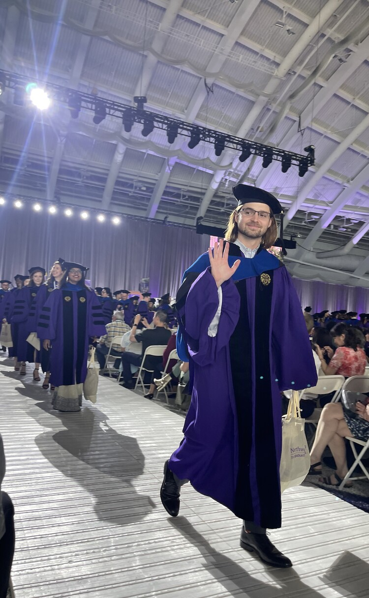

Northwestern graduation

Evanston, 2023
:::

::: {.column width="32%" .fragment}
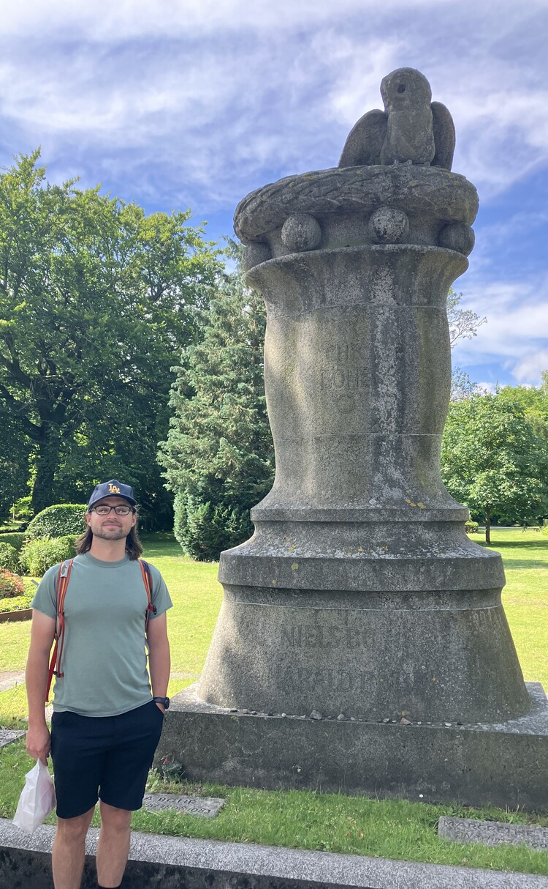

At the grave of Niels Bohr

Copenhagen, 2025
:::

::: {.column width="32%" .fragment}
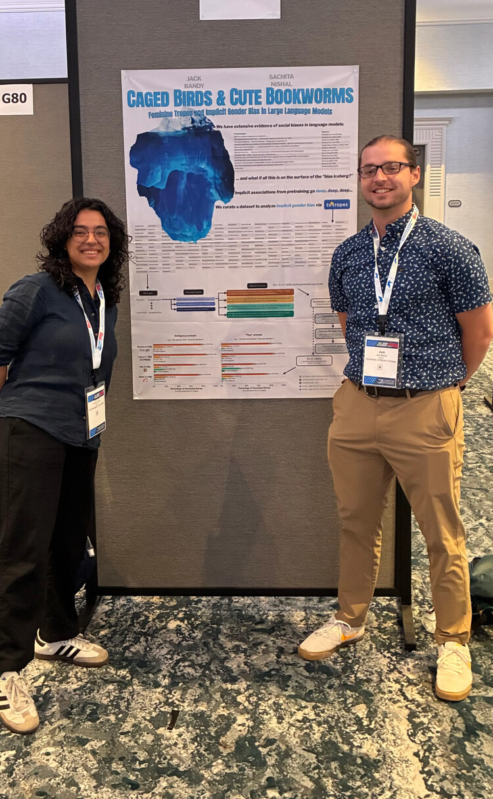

Presenting work with Sachita Nishal

San Diego, ACL 2026
:::
::::

---

# Conocimiento {.title-slide .section-header}

---

## Invitation

Turn off phones, laptops, and other distractions

---

## Conocimiento Activity

This Conocimiento is based on a version developed by leaders at San José State University as part of their HSI campus framework, ¡Somos SJSU!

---

## Conocimiento! {.quote-slide}

> It is essential that we learn who we are so we have a context for the individuals who make up our classroom community.

---

## Part 1 of 3: Identity and Background

:::: columns
::: {.column width="48%"}
::: {.incremental}
- Is there a place — or more than one place — you consider "home"?
  If so, where is it, and why? If not, why not?
- Share about your family, however you choose to define it: How big is your immediate/extended family? Were you the oldest, the youngest, only child? How did that shape you?
:::
:::

::: {.column width="48%"}
::: {.incremental}
- What do you know of your family origins? What do you want to know?
- What languages are spoken in your family? What languages do you speak? Want to speak?
- Are there family traditions, cultural practices, etc. that you value? What are they? Why?
:::
:::
::::

---

## Part 2 of 3: Educational Experiences

:::: columns
::: {.column width="48%"}
::: {.incremental}
- Where did you go to school (elementary, high school, or community college)? Share about your experiences.
- Do you have family members who have earned post-secondary degrees? How did your family shape your educational trajectory?
- What influenced your decision to go to college? Why did you choose to attend UIC?
:::
:::

::: {.column width="48%"}
::: {.incremental}
- What are your educational or career goals at the moment? How did you identify them? Have these goals changed over time?
- What do you wish your faculty knew about you, and why?
- What aspect of college has been easier than you anticipated? What is an aspect that has been harder?
:::
:::
::::

---

## Part 3 of 3: This Class

::: {.incremental}
- What does ethics mean to you?
- Have you ever studied ethics? Moral philosophy? Social justice? If so, when? What do you remember?
- Do you currently follow a "code of ethics" of any kind?
- Which topics are you especially excited to learn about?
- Anything you are nervous about?
- What else are you studying and doing this semester?
:::

---

# Syllabus & Logistics {.title-slide .section-header}

---

## Syllabus overview {.embed-slide}

::: {.embed-layout .embed-full}
::: {.embed-frame style="width:100%;height:100%;margin:0;"}
<iframe
  src="https://doethics.fun/syllabus/"
  title="Course syllabus"
  loading="lazy"
  style="width:100%;height:100%;border:none;display:block;"
  data-external="1">
</iframe>
:::

::: {.embed-overlay}
[Open in new tab](https://doethics.fun/syllabus/)
:::
:::

---

## What piques your interest? {.smaller}

:::: columns
::: {.column width="48%"}
::: {.incremental}
- Value-sensitive / culturally-sensitive design
- Labor displacement and deskilling
- Privacy (contextual integrity)
- Ethics through speculative fiction and sci-fi
- Addiction and "dark patterns" in UI design
- Economic bubbles and hype cycles in tech
- Online safety and content moderation
- Bias, discrimination, safety in AI/LLMs
:::
:::

::: {.column width="48%"}
::: {.incremental}
- Digital rights (to repair, to be forgotten, etc.)
- Microtargeting and behavioral manipulation
- Environmental costs of computing
- Facial recognition (privacy and discrimination)
- Anonymity and security for data analytics
- Monopoly power / the politics of "big tech"
- Inequality and the "digital divide"
:::
:::
::::

---

## Preview of Next Class

- More schedule details
- Warm-up discussion (what is ethics?)
- Intro to Virtue Ethics

---

## Attitudes Survey

:::: columns
::: {.column width="55%"}
- https://www.**yellkey.com/star**

You can head out once you finish the survey. See you next class!
:::

::: {.column width="40%"}
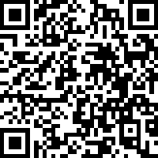
:::
::::

---

# Introduction to Virtue Ethics {.title-slide .photo-title data-state="photo-title" background-image="../assets/blue-line-stops-better/stop03-oak-park-b.jpg" background-size="cover" data-menu-title="Week 1, Day 2"}

CS 377, Week 1, Day 2 🟦 Oak Park 🟦

---

## {.photo-only data-state="photo-only" background-image="../assets/blue-line-stops-better/stop03-oak-park-b.jpg" background-size="cover"}

---

## Agenda for Today

:::: columns
::: {.column width="55%"}
- Administrivia
- More schedule details
- Warm-up discussion
- Intro to Virtue Ethics
- Group activity
:::

::: {.column width="40%"}

:::
::::

---

# Course Logistics {.title-slide .section-header}

---

## Administrivia

- Canvas check-in
  - Submission portals for all out-of-class exercises
  - Updated grades, communication
- Some exercise details may still be updated in GitHub
- Start thinking about potential books you might want to read!

---

## Schedule Overview

- Unit 1: Theories
  - 🟦 Forest Park Branch 🟦
  - Virtue, Deontology, Utilitarianism, Care
- Unit 2: Stories
  - 🟦 Milwaukee-Dearborn Subway 🟦
  - Short stories, famous case studies
- Unit 3: Applications
  - 🟦 O'Hare Branch 🟦
  - Algorithmic fairness, LLMs, data ethics, etc.

---

## Questions

Ask two or more questions (can be about logistics, schedule, content, syllabus, etc.)

---

## Invitation/reminder

Turn off phones, laptops, other distractions

---

# What Is Ethics? {.title-slide .section-header}

---

## Warm-up Discussion {.embed-slide}

::: {.embed-layout .golden-columns}
::: {.embed-copy}
- Introduce yourselves
- What comes to mind when you hear "ethics?"
- Why do you think this class is part of the CS major?
- Can your table offer a (tentative) definition of ethics?
:::

::: {.embed-frame}
<iframe
  src="../timer/index.html"
  title="CTA-style countdown timer"
  loading="lazy"
  data-external="1">
</iframe>
:::
:::

---

## A Brief Aside: What Is "Ethics"?

::: {.incremental}
- People often consider ethics as knowing "right vs. wrong"
- Right vs. wrong is one branch: **normative ethics** — prescriptive - should/shouldn't
- Other branches: applied, meta-ethics, descriptive ethics, etc.
- Etymology: from ancient Greek *ethos*, "relating to one's character"
- Morality vs. ethics
	- I still don't have a great answer! Do you?
:::

---

## Normative and Descriptive Ethics

:::: columns
::: {.column width="48%"}
### Normative

- Is it right?
- Is it wrong?
- What should be done?
- "Is this unethical?"
:::

::: {.column width="48%"}
### Descriptive

- Who is involved?
- Who is making the decision(s)?
- What are the stakes?
- What are the options?
- What are the potential outcomes?
- What decisions led to this situation?
:::
::::

---

## Why We'll Try to Avoid the Word "Ethical" in This Class

- We want more **descriptive clarity**
- "That's unethical" is too generic
- We want a story

---

## "Tell me more" {.quote-slide}

> Any question in the form "Is X right or wrong?" could benefit from another round of clarifying, story-oriented questions.
>
> — George Saunders ([via The Marginalian](https://www.themarginalian.org/2026/07/20/george-saunders-uncertainty/))

---

## "Tell me more" {.quote-slide}

> Question: "Is X good or bad?" Story: "For whom? On what day, under what conditions? Might there be some unintended consequences associated with X? Some good hidden in the bad that is X? Some bad hidden in the good that is X? Tell me more."
>
> — George Saunders ([via The Marginalian](https://www.themarginalian.org/2026/07/20/george-saunders-uncertainty/))

---

## "Core Four" Theories in This Class {.theories-grid}

<table>
<tr>
<td>
🏛

Virtue Ethics
</td>
<td>
📖

Deontological
</td>
</tr>
<tr>
<td>
📊

Utilitarian
</td>
<td>
💟

Care Ethics
</td>
</tr>
</table>

---

# Virtue Ethics {.title-slide .section-header}

---

## Mini-lecture: intro to virtue ethics 🏛

:::: columns
::: {.column width="55%"}
::: {.incremental}
- Aristotle (384–322 BCE)
- We're starting with descriptive!
- Not "what is right/wrong?" Or "what rule applies?"
- Virtue ethics: "what kind of person should I be?"
:::
:::

::: {.column width="40%"}
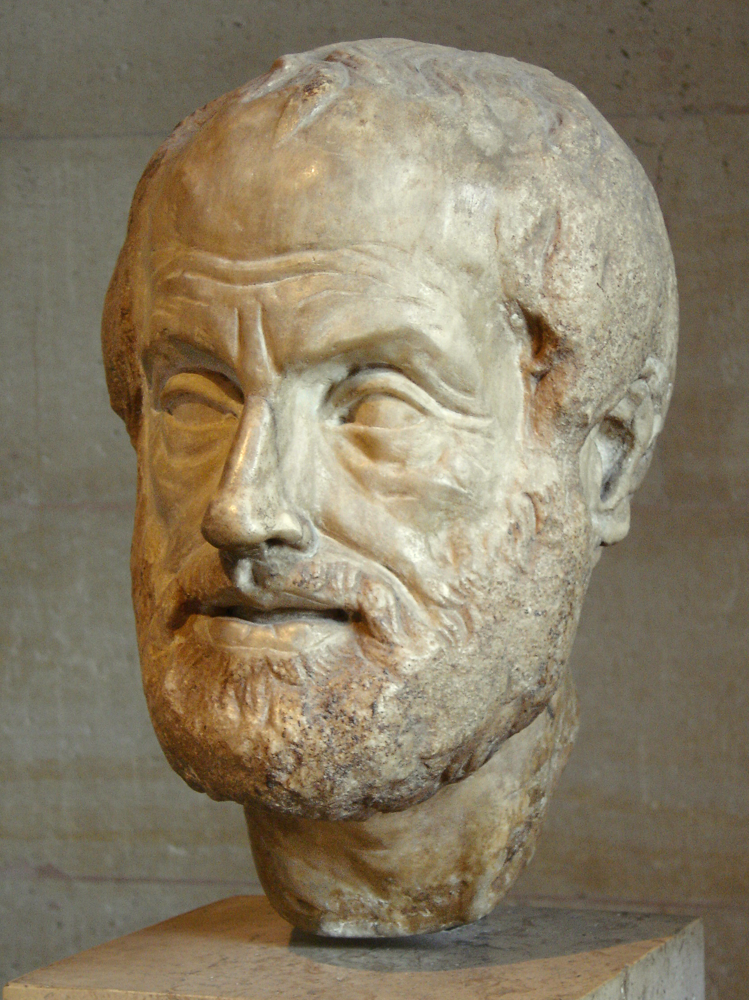

::: {.caption}
Roman marble bust, Louvre. Photo: Eric Gaba (CC BY-SA 2.5) ; [SEP, *Aristotle's Ethics*](https://plato.stanford.edu/entries/aristotle-ethics/)
:::
:::
::::

---

## A virtuous person {.quote-slide}

> A virtuous person is a morally good, excellent, or admirable person who acts and feels as they should.
>
> — The Stanford Encyclopedia of Philosophy

---

## Virtue

- "An excellent trait of character"
- Virtues are generally associated with intrinsic motivation
- Perfect virtues are rare!
  - Too little — deficiency
  - Too much — excess
- What virtues can you think of?

---

## Virtue Ethics' Origins

- Plato and Aristotle (~400 BCE)
  - *Nicomachean Ethics*
  - eudaemonia / flourishing
- Mencius and Confucius (~500 BCE)
  - harmonious society
  - virtues can be cultivated through education and self-reflection

---

## Socrates (c. 470–399 BCE) 🏛

:::: columns
::: {.column width="55%"}
::: {.incremental}
- Original question: how should one live?
- Treated virtue as a kind of *knowledge*
	- nobody does wrong on purpose, they do it out of ignorance
- Asked people about courage, piety, justice, etc., and whether they could define what they practiced
	- "Socratic method"
:::
:::

::: {.column width="40%"}
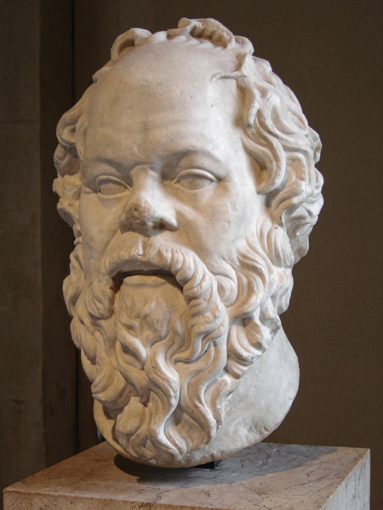

::: {.caption}
Photo: Eric Gaba (public domain); [Commons](https://commons.wikimedia.org/wiki/File:Socrates_Louvre.jpg); [SEP, *Socrates*](https://plato.stanford.edu/entries/socrates/)
:::
:::
::::

---

## Plato (c. 428–348 BCE) 🏛

:::: columns
::: {.column width="55%"}
::: {.incremental}
- Socrates' student / scribe (i.e. the dialogues)
- Four cardinal virtues: wisdom, courage, temperance, justice
- A good life: a soul with its parts in the right order
:::
:::

::: {.column width="40%"}
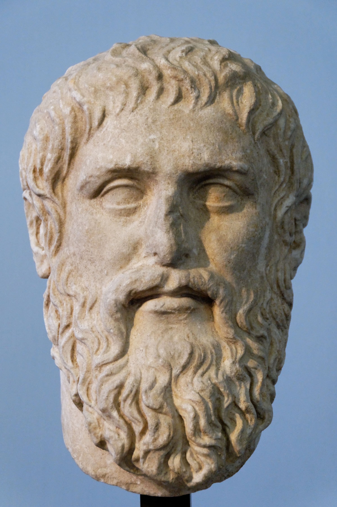

::: {.caption}
Roman copy of a Silanion bust, Capitoline Museums. Photo: Marie-Lan Nguyen (CC BY 2.5); [Commons](https://commons.wikimedia.org/wiki/File:Plato_Silanion_Musei_Capitolini_MC1377.jpg); [SEP, *Plato's Ethics*](https://plato.stanford.edu/entries/plato-ethics/)
:::
:::
::::

---

## Confucius (孔子, 551–479 BCE) {.smaller}

:::: columns
::: {.column width="55%"}
::: {.caption}
Source: [SEP, *Confucius*](https://plato.stanford.edu/entries/confucius/)
:::

::: {.incremental}
- Lots of overlap with virtue ethics, including:
- **仁 (rén)**: benevolence; in the *Analects*, "caring for others"
- **禮 (lǐ)**: ritual propriety: everyday respect that doesn't just *indicate* values, it *inculcates* them
- **義 (yì)**: righteousness: steadfastness against temptation, usually in public life
- **君子 (jūnzǐ)** (the "gentleman"): virtue is taught through anecdotes about good people
	- i.e. exemplars / role models
:::
:::

::: {.column width="40%"}
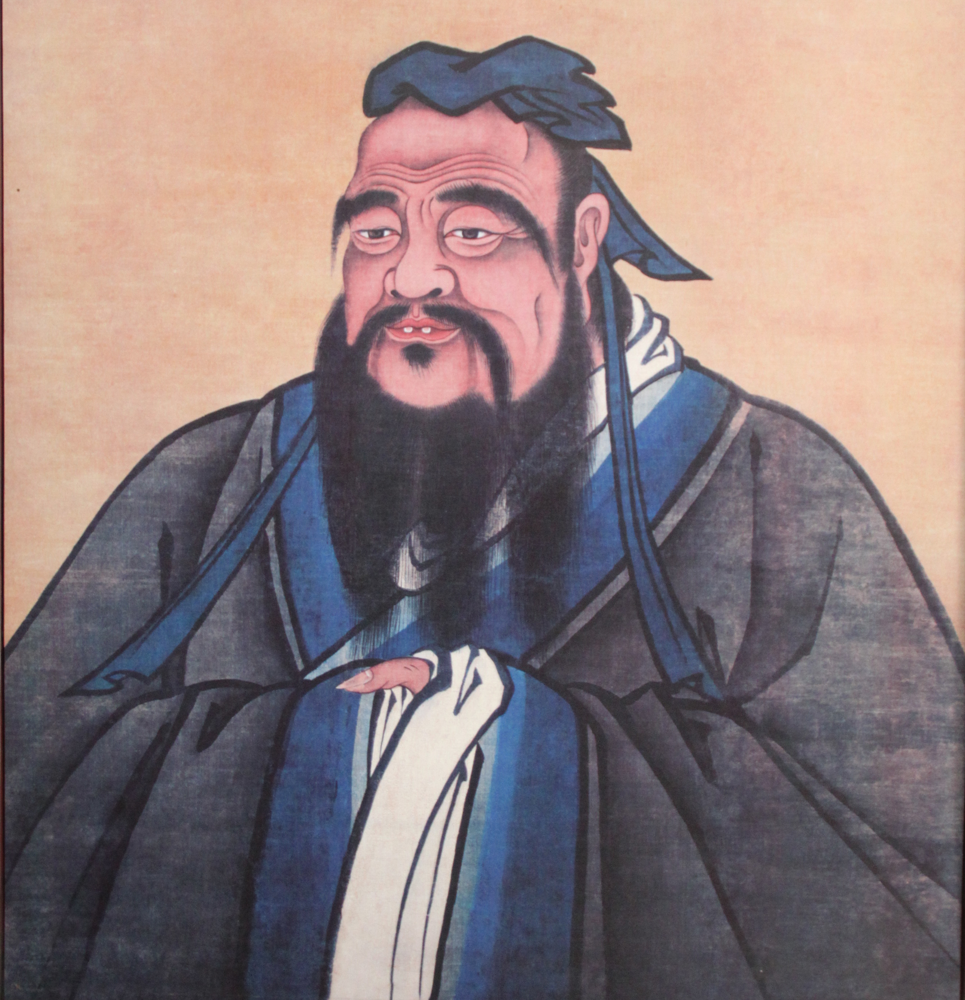

::: {.caption}
*Portrait of Confucius at Leisure*, Kong Family Mansion, Qufu (public domain); [Commons](https://commons.wikimedia.org/wiki/File:Cropped_version_of_Confucius_Portrait,_Kongzi_(Confucius)_Family_Mansion,_Qufu_(13044335945).jpg)
:::
:::
::::

---

## Confucius, continued {.smaller}

:::: columns
::: {.column width="55%"}
::: {.caption}
Sources: [SEP, *Confucius*](https://plato.stanford.edu/entries/confucius/) and [SEP, *Chinese Ethics*](https://plato.stanford.edu/entries/ethics-chinese/)
:::

::: {.incremental}
- Character is cultivated by **practice until it becomes second nature**
	- close to Aristotle's "habituation"
- the self as **relational** ("the five relationships" and virtues attached to those roles)
- "Care with distinctions"
	- concern is graduated by relationship, not impartial
- Emphasis on ethics in ordinary interactions
:::
:::

::: {.column width="40%"}
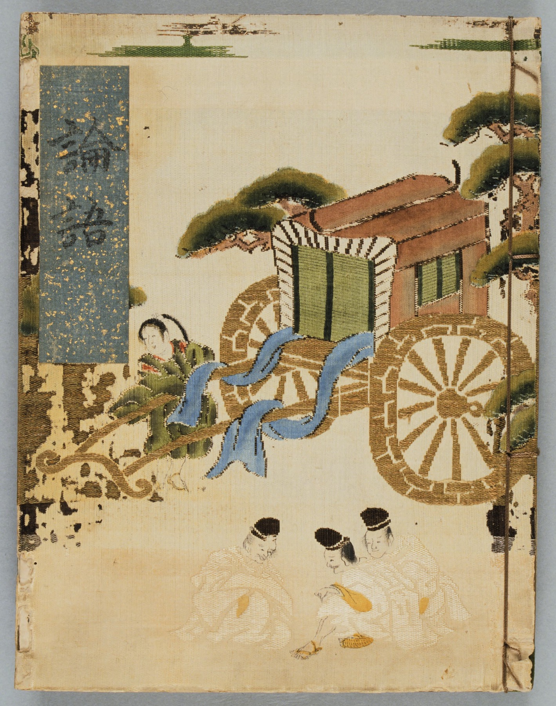

::: {.caption}
Cover of the *Rongo* (論語, *Analects*), "Tenmon version," Japan, 1533 ; [World Digital Library, item 11844](https://www.wdl.org/en/item/11844/), via [Commons](https://commons.wikimedia.org/wiki/File:The_Analects_of_Confucius_WDL11844.pdf) (public domain)
:::
:::
::::

---

## Thomas Aquinas (1225–1274) 🏛

:::: columns
::: {.column width="55%"}
::: {.incremental}
- Kept the four cardinal virtues, added faith, hope, and love
- Virtue as a *habitus*: a settled disposition that can be built over time
:::
:::

::: {.column width="40%"}

::: {.caption}
Fra Bartolomeo, c. 1510–1517; Museum of San Marco, Florence (public domain) ; [Commons](https://commons.wikimedia.org/wiki/File:Thomas_Aquinas_by_Fra_Bartolommeo.jpg) ; [SEP, *Aquinas's Moral, Political, and Legal Philosophy*](https://plato.stanford.edu/entries/aquinas-moral-political/)
:::
:::
::::

---

## Alasdair MacIntyre (1929–2025)

:::: columns
::: {.column width="55%"}
::: {.incremental}
- *After Virtue* (1981)
- Argues that we kept the vocabulary ("rights," "utility," "fairness") but lost the shared meaning and purpose
- Reiterates that virtues are learned inside **practices** and communities
:::
:::

::: {.column width="40%"}
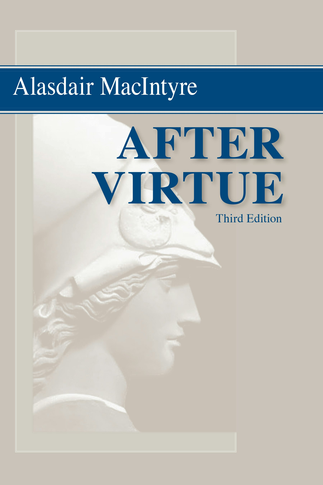

::: {.caption}
*After Virtue*, 3rd ed., [University of Notre Dame Press](https://undpress.nd.edu/9780268035044/after-virtue/), 2007 ; [SEP, *Virtue Ethics*](https://plato.stanford.edu/entries/ethics-virtue/)
:::
:::
::::

---

## A Challenge

- Alasdair MacIntyre (*After Virtue*) observed a broad decline in how much the general public cares about virtue / character
- If people no longer care about virtue, how can it be cultivated?

---

## Relevant Survey Question {.survey-question}

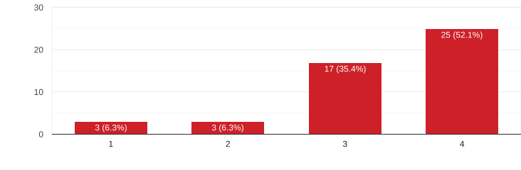

::: {.question}
"Computing itself is value-neutral: **it is what people do with the computing** that is right/wrong."
:::

---

## Relevant Survey Question {.survey-question}

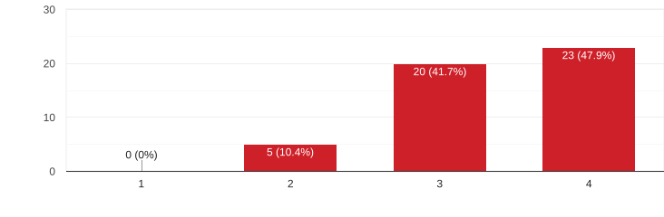

::: {.question}
"Education can improve someone's moral/ethical decision-making."
:::

---

## Relevant Survey Question {.survey-question}

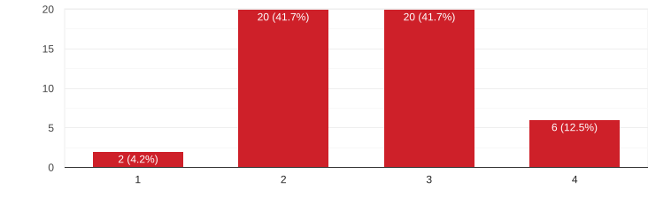

::: {.question}
"Major aspects of my moral perspective are unlikely to change at this point in time."
:::

---

## Practical Wisdom

- Understanding how to actually do the right thing
- Comes with experience / practice / **doing**

---

## Group Activity: Virtues and Vices {.embed-slide}

::: {.embed-layout .golden-columns}
::: {.embed-copy}
See handout
:::

::: {.embed-frame}
<iframe
  src="../timer/index.html"
  title="CTA-style countdown timer"
  loading="lazy"
  data-external="1">
</iframe>
:::
:::

---

## Moral Virtues {.embed-slide}

::: {.embed-layout .embed-full}
::: {.embed-frame style="width:100%;height:100%;margin:0;"}
<iframe
  src="https://en.wikipedia.org/wiki/Virtue_ethics#Moral_virtues"
  title="Moral Virtues"
  loading="lazy"
  style="width:100%;height:100%;border:none;display:block;"
  data-external="1">
</iframe>
:::

::: {.embed-overlay}
[Open in new tab](https://en.wikipedia.org/wiki/Virtue_ethics#Moral_virtues)
:::
:::

---

## First due date is next week!

See Canvas

---

## That's all for today!

See you next week!

---

# References & Credits {.sources}

1. GitHub source: <https://github.com/jackbandy/ethical-issues-in-computing-uic/blob/main/docs/slides/week1.md>.
2. Conocimiento activity adapted from a version developed by leaders at San José State University (¡Somos SJSU!). See also [UIC's Conocimiento activity guide](https://teaching.uic.edu/cate-teaching-guides/inclusive-equity-minded-teaching-practices/conocimiento-activity/).
3. Virtue ethics definition from the [Stanford Encyclopedia of Philosophy](https://plato.stanford.edu/entries/ethics-virtue/).
4. Title photo: [Jane M. Byrne Interchange](https://commons.wikimedia.org/wiki/File:Jane_M._Byrne_Interchange_4-1-22.jpg) by Sea Cow, via Wikimedia Commons, CC BY-SA 4.0.
5. Day 1 title photo: [Forest Park](https://commons.wikimedia.org/wiki/File:Forest_Park.JPG) by Zol87, via Wikimedia Commons, CC BY-SA 3.0.
6. Day 2 title photo: [Oak Park Blue Line staircase](https://commons.wikimedia.org/wiki/File:OakPark_BlueLine_Staircase.jpg) by Paul Goyette, via Wikimedia Commons, CC BY-SA 2.0.
7. Slide deck built with [Quarto](https://quarto.org/) and Reveal.js.
