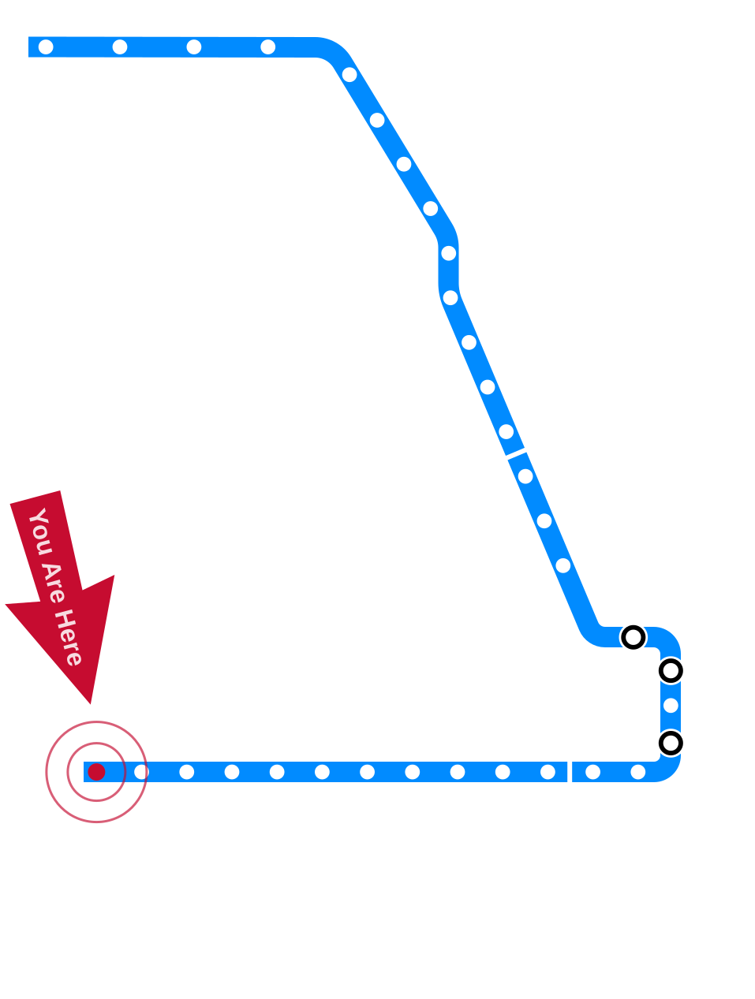
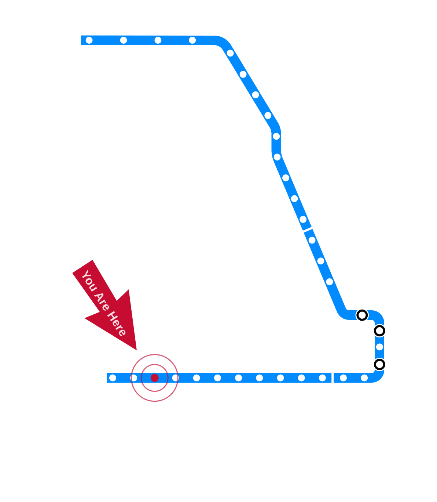

# Draft — Needs Review {.draft-notice}

> ⚠️ Auto-converted from a previous slide format. All content still needs review and editing before use in class.

---

# Introduction to Ethical Issues in Computing {.title-slide .photo-title data-state="photo-title" background-image="../assets/chicago-aerial-jane-byrne.jpg" background-size="cover"}

<!-- NOTICE: Draft from old-slides/pdf-versions/01 Day 1, Day 2.pdf. Review and edit before use. -->

CS 377 · Week 1, Day 1

---

# Topic Title Placeholder {.title-slide .photo-title data-state="photo-title" background-image="../assets/blue-line-stops-better/stop01-forest-park-a.jpg" background-size="cover"}

CS 377 · Week 1, Day 1 · 🟦 Forest Park 🟦

---

# {.photo-only data-state="photo-only" background-image="../assets/blue-line-stops-better/stop01-forest-park-a.jpg" background-size="cover"}

---

# Agenda for Today

:::: columns
::: {.column width="55%"}
- Attendance
- Conocimiento
- Syllabus overview
- Attitudes survey
:::

::: {.column width="40%"}

:::
::::

---

# Attendance

Let me know (1) you are here and (2) what you had for breakfast

---

# A bit about me

- Undergrad: Wheaton College (2016)
- Masters: University of Kentucky (2018)
- PhD: Northwestern University (2023)
- Worked at Twitter: Machine Learning Ethics, Transparency, Accountability (2021)
- Started teaching full-time in 2023
- Started at UIC in 2025

<!-- image: "Born" / "Raised" map graphic -->
- TODO: add image — *"Born" / "Raised" map graphic*

---

# A bit about me

:::: columns
::: {.column width="32%"}
Northwestern graduation

Evanston, 2023
:::

::: {.column width="32%"}
Meeting Rumman Chowdhury

New York City, 2025
:::

::: {.column width="32%"}
At the grave of Niels Bohr

Copenhagen, 2025
:::
::::

<!-- image: three photos -->
- TODO: add image — *three photos*

---

# Conocimiento! {.quote-slide}

> It is essential that we learn who we are so that we have a context
> for the individuals who make up our classroom community.

---

# Invitation

Turn off phones, laptops, and other distractions

---

# Conocimiento Activity

This Conocimiento is based on a version developed by leaders at San José
State University as part of their HSI campus framework, ¡Somos SJSU!

---

# Part 1 of 3: Identity and Background

:::: columns
::: {.column width="48%"}
- Is there a place — or more than one place — you consider "home"?
  If so, where is it, and why? If not, why not?
- Tell us about your family, however you choose to define it: How big
  was your family, including siblings and other extended family members?
  Were you the oldest, the youngest, in between, or an only child?
  How did that shape your experience?
:::

::: {.column width="48%"}
- What do you know of your family origins? Do you feel connected to
  that heritage?
- What languages are spoken in your family? What languages do you speak?
- Are there family traditions or cultural values that you hold dear?
  What are these, and why?
- Are there any social identities that are important to you?
:::
::::

---

# Part 2 of 3: Educational Experiences

:::: columns
::: {.column width="48%"}
- Where did you go to school (elementary, high school, or community college)? Briefly talk about your experience in these schools.
- Do you have family members who have earned post-secondary degrees? Whether your answer is "yes" or "no", how did that shape your educational trajectory?
- What influenced your decision to go to college? Why did you choose to attend this institution?
:::

::: {.column width="48%"}
- What are your educational or career goals at the moment? How did you identify them? Have these goals changed over time?
- What do you wish your faculty knew about you, and why?
- What aspect of college has been easier than you anticipated? What is an aspect that has been harder?
:::
::::

---

# Part 3 of 3: This Class

- What does ethics mean to you?
- Have you ever studied ethics? Moral philosophy? If so, when? What do you remember?
- Do you currently follow a "code of ethics" of any kind?
- Which topics are you especially excited to learn about?
- Anything you are nervous about?
- What else are you studying and doing this semester?

---

# Syllabus overview

---

# What piques your interest?

:::: columns
::: {.column width="48%"}
- Value-sensitive / culturally-sensitive design
- Labor displacement and deskilling
- Privacy as contextual integrity
- Ethics through speculative fiction and sci-fi
- Addiction and "dark patterns" in UI design
- Economic bubbles and hype cycles in tech
- Online safety and content moderation
- Bias, discrimination in large language models
:::

::: {.column width="48%"}
- Digital rights (to repair, to be forgotten, etc.)
- Microtargeting and behavioral manipulation
- Environmental costs of computing
- Facial recognition (privacy and discrimination)
- Anonymity and security for data analytics
- Monopoly power / the politics of "big tech"
- Inequality and the "digital divide"
:::
::::

---

# Preview of Next Class

- More schedule details
- Musical chairs
- Warm-up discussion (what is ethics?)
- Intro to Virtue Ethics

---

# Attitudes Survey

www.yellkey.com/short

You can head out once you finish the survey. See you next class!

---

# Introduction to Virtue Ethics {.title-slide}

CS 377 · Week 1, Day 2 · 🟦 Oak Park 🟦

Sit wherever you like for now (we will shuffle seats in a bit)

---

# Topic Title Placeholder {.title-slide .photo-title data-state="photo-title" background-image="../assets/blue-line-stops-better/stop03-oak-park-b.jpg" background-size="cover"}

CS 377 · Week 1, Day 2 · 🟦 Oak Park 🟦

---

# {.photo-only data-state="photo-only" background-image="../assets/blue-line-stops-better/stop03-oak-park-b.jpg" background-size="cover"}

---

# Agenda for Today

:::: columns
::: {.column width="55%"}
- Administrivia
- More schedule details
- Musical chairs
- Warm-up discussion (what is ethics?)
- Intro to Virtue Ethics
:::

::: {.column width="40%"}

:::
::::

---

# Administrivia

- I made progress on Canvas!
  - Submission portals for all out-of-class exercises
  - At-a-glance schedule
- Some exercise details still need to be updated in GitHub
- No class on Monday (holiday)
- Start thinking about potential books you might want to read!

---

# Schedule Details

- Unit 1: Ethical Theories
  - 🟦 Forest Park Branch 🟦
  - Virtue, Deontology, Utilitarianism, Care
- Unit 2: Stories
  - 🟦 Milwaukee-Dearborn Subway 🟦
  - Short stories and famous case studies
- Unit 3: Contemporary Issues
  - 🟦 O'Hare Branch 🟦
  - Algorithmic fairness, LLMs, data ethics, etc.

---

# Questions

Ask two or more questions (can be about logistics, schedule, content, syllabus, etc.)

---

# Musical chairs!

---

# 🔀 Seat Shuffle

<!-- image: room diagram — lectern "0", tables 1–8, projector screens, door -->
- TODO: add image — *room diagram — lectern "0", tables 1–8, projector screens, door*

---

# Invitation/reminder

Turn off phones, laptops, other distractions

---

# Warm-up Discussion (5min)

- What comes to mind when you hear "ethics?"
- Why do you think this class is required?
- Can your table offer a (tentative) definition of ethics?

---

# Four Theories for This Class

:::: columns
::: {.column width="24%"}
## 🏛
Virtue Ethics
:::

::: {.column width="24%"}
## 📖
Deontological
:::

::: {.column width="24%"}
## 📊
Utilitarian
:::

::: {.column width="24%"}
## 💟
Care Ethics
:::
::::

---

# Mini-lecture: intro to virtue ethics 🏛

<!-- image: opening illustration -->
- TODO: add image — *opening illustration*

---

# "Good intentions"

::: {.fragment}
A potential conundrum…
:::

<!-- image: good-intentions illustration -->
- TODO: add image — *good-intentions illustration*

---

# A virtuous person {.quote-slide}

> A virtuous person is a morally good, excellent, or admirable person
> who acts and feels as they should.
>
> — The Stanford Encyclopedia of Philosophy

---

# Virtue

- "An excellent trait of character"
- Virtues are generally associated with intrinsic motivation
- Perfect virtues are rare!
  - Too little — deficiency
  - Too much — excess
- What virtues can you think of?

---

# Virtue Ethics' Origins

- Plato and Aristotle (~400 BCE)
  - *Nicomachean Ethics*
  - eudaemonia
- Mencius and Confucius (~500 BCE)
  - harmonious society
  - virtues can be cultivated through education and self-reflection

---

# "People can change and improve their ethics" {.quote-slide}

::: {.fragment}
"I can change and improve my ethics"
:::

---

# Practical Wisdom

- Understanding how to actually do the right thing
- Comes with experience

::: {.fragment}
What virtues and/or vices are at play here?
:::

<!-- image: practical-wisdom example images (build sequence in original) -->
- TODO: add image — *practical-wisdom example images (build sequence in original)*

---

# Activity: Virtues and Vices

:::: columns
::: {.column width="58%"}
- Many times, a virtue and a vice exist on the same scale
- Small group activity
- Choose an example virtue ➡
- What would be versions of the virtue in excess or deficiency?
- Choose another and repeat 🙂
- Example: excess honesty = boastful
:::

::: {.column width="38%"}
Example virtues:

- Courage
- Ambition
- Generosity
- Patience
- Honesty
- Whimsy / Wittiness
- Friendliness
- Many more!
:::
::::

---

# "The Golden Mean"

---

# Preview of Pre-Class Reflection

---

# That's all for today!

See you next week!

---

# References & Credits {.sources}

1. Conocimiento activity adapted from a version developed by leaders at San José State University (¡Somos SJSU!). See also [UIC's Conocimiento activity guide](https://teaching.uic.edu/cate-teaching-guides/inclusive-equity-minded-teaching-practices/conocimiento-activity/).
2. Virtue ethics definition from the [Stanford Encyclopedia of Philosophy](https://plato.stanford.edu/entries/ethics-virtue/).
3. Title photo: [Jane M. Byrne Interchange](https://commons.wikimedia.org/wiki/File:Jane_M._Byrne_Interchange_4-1-22.jpg) by Sea Cow, via Wikimedia Commons, CC BY-SA 4.0.
4. Slide deck built with [Quarto](https://quarto.org/) and Reveal.js.
