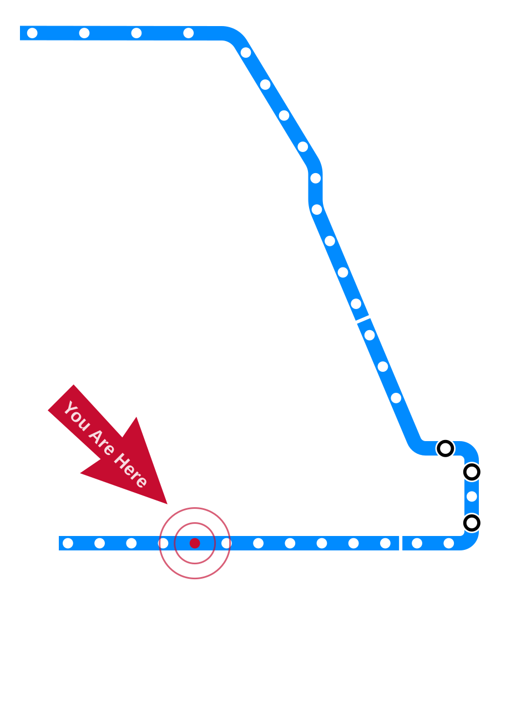
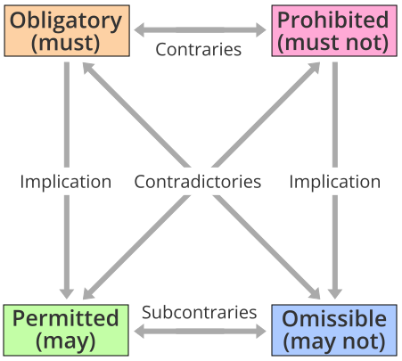
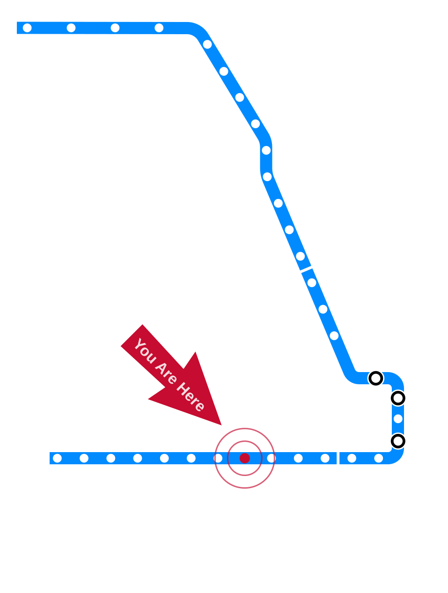

# Introduction to Deontological Ethics {.title-slide data-menu-title="Week 2, Day 1"}

CS 377, Week 2, Day 1 🟦 Cicero 🟦

---

# Introduction to Deontological Ethics {.title-slide .photo-title data-state="photo-title" background-image="../assets/blue-line-stops-better/stop05-cicero-b.jpg" background-size="cover" data-menu-title="Week 2, Day 1"}

CS 377, Week 2, Day 1 🟦 Cicero 🟦

<!-- image source: Cicero Blue Line station, April 1976, via Jeffrey Lindmark -->

---

## {.photo-only data-state="photo-only" background-image="../assets/blue-line-stops-better/stop05-cicero-b.jpg" background-size="cover"}

---

## Agenda for Today

:::: columns
::: {.column width="55%"}
- Administrivia and questions
- Shuffle seats
- Discuss exemplars
- A couple more words about virtue ethics
- Make up some rules
- Mini-lecture: Kant's deontological ethics
- Interest survey (if time)
:::

::: {.column width="40%"}

:::
::::

---

## Administrivia

- How was Canvas?
- Ideas for future reflections?
- Still polishing some GitHub materials
- Grades will trickle in

---

## Questions

Ask two or more questions (can be about virtue ethics, logistics,
instructor, content, syllabus, etc.)

---

## Musical chairs! {.embed-slide}

::: {.embed-layout}
::: {.embed-copy}
- Shuffle seats!
- Enter a seed and shuffle to assign tables
- Why do you think we do this?

[Open in a new tab](https://doethics.fun/in-progress/visual-seat-shuffle.html)
:::

::: {.embed-frame style="position:absolute;top:0;right:0;width:49%;height:100%;margin:0;border-radius:0 6px 6px 0;border:2px solid #d8d8d8;"}

<iframe
  src="https://doethics.fun/in-progress/visual-seat-shuffle.html"
  title="Visual Seat Shuffle"
  style="width:100%;height:100%;border:none;display:block;"
  data-external="1">
</iframe>

:::
:::

---

# Review: Virtue Ethics {.title-slide .section-header}

---

## Four Theories for This Class {.theories-grid}

<table>
<tr>
<td>
🏛

Virtue Ethics
</td>
<td>
📖

Deontological
</td>
</tr>
<tr>
<td>
📊

Utilitarian
</td>
<td>
💟

Care Ethics
</td>
</tr>
</table>

---

## Table Discussion: Virtue Ethics 🏛 {.embed-slide}

::: {.embed-layout .golden-columns}
::: {.embed-copy}
- Introduce yourselves!
- Who were your positive exemplars?
  - What were their virtues and how did those virtues show up?
- Negative exemplars?
  - What were their vices and how did those vices show up?
:::

::: {.embed-frame}
<iframe
  src="../timer/index.html"
  title="CTA-style countdown timer"
  loading="lazy"
  data-external="1">
</iframe>
:::
:::

---

## Virtue Ethics 🏛

- How can virtues be cultivated?

::: {.incremental}
- "Habitus"
  - Patterns of being
  - Social rituals
- Which virtues do you want to cultivate this semester?
- What does any of this have to do with technology?
:::

---

# Deontological Ethics {.title-slide .section-header}

---

## Mini-lecture: intro to deontological ethics

---

## Invitation/reminder

Turn off phones, laptops, other distractions

---

## Table discussion {.embed-slide}

::: {.embed-layout .golden-columns}
::: {.embed-copy}
What are some potential rules for the class?
(Feel free to borrow from other classes)

Write two of these potential rules on the board.
:::

::: {.embed-frame}
<iframe
  src="../timer/index.html"
  title="CTA-style countdown timer"
  loading="lazy"
  data-external="1">
</iframe>
:::
:::

---

## Right and wrong

Deontological ("there is right and wrong")

<!-- image: attitudes survey results, current and previous semester -->
- TODO: add image — *attitudes survey results, current and previous semester*

---

## Following the law

<!-- image: attitudes survey results, current and previous semester -->
- TODO: add image — *attitudes survey results, current and previous semester*

---

## Right vs. good

Deontology is primarily concerned with what is "right"
(rather than what is "good")

---

## Deontology in Brief

- Focused on duties, rights, and moral obligations (i.e. laws)
- Laws might be prohibitions or obligations
- Laws might come from different places

::: {.fragment}
- Key figures:
  - Thomas Aquinas (1225 — 1274)
    - Natural law
  - Immanuel Kant (1724 — 1804)
    - Ethical reasoning
    - Categorical imperative
:::

---

## The Categorical Imperative {.quote-slide}

> Act only in accordance with that maxim through which you can at the same time will that it become a universal law.
>
> — Immanuel Kant

---

## The Categorical Imperative {.quote-slide}

> Act as if the maxims of your action were to become through your will a universal law of nature.
>
> — Immanuel Kant

---

## Categorical Imperative Examples

::: {.incremental}
- Should I tell a lie?
  - If it were universally acceptable to lie…
  - How would we believe anyone?
- Should I park at the airport terminal to wait?
  - If everyone did this...
  - More traffic issues
:::

---

## The Right over the Good

Deontology (from Greek *deon*, "duty") judges actions by rules, not results.

::: {.incremental}
- Some actions are **required, forbidden, or permitted** in themselves
- Contrast with consequentialism: outcomes decide everything
- Deontologists prioritize **"the Right"** over **"the Good"**
- Some acts stay wrong *even when* they'd bring about good consequences
:::

---

## The Deontic Square {.figure-slide}

::: {.figure-caption}
The deontic square of opposition: every act is **obligatory**, **permitted**, **omissible**, or **prohibited**. Source: [Wikipedia, "Deontic square"](https://en.wikipedia.org/wiki/File:Deontic_square.svg)
:::

---

## Whose Perspective? {.smaller}

:::: columns
::: {.column width="48%"}
### Agent-centered

- Focused on **the agent's** own duties and intentions
- "Keep your own moral house in order"
- **Agent-relative** duties: special obligations to your own children, promises, projects
:::

::: {.column width="48%"}
### Patient-centered

- Focused on **the victim** / recipient of an action
- Rights-based
- Core right: not to be **used merely as a means** without consent
:::
::::

---

## Doing vs. Allowing {.smaller}

::: {.incremental}
- **Doing and allowing:** causing harm differs from failing to prevent it
- **Double effect:** intending a harm differs from foreseeing it as a side effect
  - Categorically forbidden to *intend* evils like killing the innocent...
  - ...even if doing so would minimize such acts overall
- Why "redirecting the trolley to kill one and save five" can feel permissible
:::

---

## Constraints, Thresholds, and a Paradox {.smaller}

::: {.incremental}
- **Constraints:** absolute prohibitions that bind even when breaking one would prevent more violations
- **Threshold deontology:** rules hold *up to a point* — dire enough stakes let consequences take over
- **The paradox of deontology:** if a violation is wrong, aren't more violations worse? Yet the rule forbids violating it to prevent others
:::

---

## Criticisms of Deontology {.smaller}

::: {.incremental}
- **Too permissive?** It can allow terrible outcomes as long as no rule is broken
- **Too demanding? / conflicting duties:** what when two duties collide?
- **The catastrophe problem:** must we follow the rule even into disaster?
- Consequentialists press: why don't rule-violations just "add up"?
:::

---

# Normative and Descriptive Ethics {.title-slide .section-header}

---

## Normative Ethics and Descriptive Ethics

:::: columns
::: {.column width="48%"}
### Normative

- Is it right?
- Is it wrong?
- What should be done?
- "Is this unethical?"
:::

::: {.column width="48%"}
### Descriptive

- Who is involved?
- Who is making the decision(s)?
- What are the stakes?
- What are the options?
- What are the potential outcomes?
- What decisions led to this situation?
:::
::::

---

# Introduction to Utilitarian Ethics {.title-slide data-menu-title="Week 2, Day 2"}

CS 377, Week 2, Day 2 🟦 Western 🟦

---

# Introduction to Utilitarian Ethics {.title-slide .photo-title data-state="photo-title" background-image="../assets/blue-line-stops-better/stop08-western-b.jpg" background-size="cover" data-menu-title="Week 2, Day 2"}

CS 377, Week 2, Day 2 🟦 Western 🟦

---

## {.photo-only data-state="photo-only" background-image="../assets/blue-line-stops-better/stop08-western-b.jpg" background-size="cover"}

---

## Agenda for Today

:::: columns
::: {.column width="55%"}
- Administrivia and questions
- Shuffle seats
- Review deontological ethics
- Transplant dilemma
- Mini-lecture: utilitarian ethics
- Trolley dilemma
:::

::: {.column width="40%"}

:::
::::

---

## Attendance / warm-up

- *Random letter via random.org*
- What's something you like that starts with the letter \_?

---

## 🔀 Seat Shuffle

- TODO

---

# Review and Warm-Up {.title-slide .section-header}

---

## Review: approaching ethical decisions based on…

- Virtue ethics
- Deontological ethics

::: {.fragment}
- Virtue ethics: would a virtuous person do this?
- Deontological ethics: does this align with rules/duties?
:::

---

## Another theory!

- Virtue ethics: character
- Deontological: duty
- Utilitarian: outcomes

---

## Organ Transplant Exercise

- See handout
- Try to consider the question from different ethical approaches
  (i.e. virtue ethics, deontological ethics…)

---

## Questions to Consider if Stuck

- How many people depend on this person for survival and/or wellbeing?
- What are the chances the transplant will be successful and last a long time?
- How many years of life could they gain from a transplant?
- What contributions do they make to their communities?

---

## Transplant Reflection

- What was that like?
- What factors did you consider?
- How confident were you?
- How did the two approaches hold up?

---

# Utilitarianism {.title-slide .section-header}

---

## Mini-lecture: intro to utilitarian ethics

---

## Consequences

<!-- image: attitudes survey results, current and previous semester -->
- TODO: add image — *attitudes survey results, current and previous semester*

---

## Social Impact

<!-- image: attitudes survey results, current and previous semester -->
- TODO: add image — *attitudes survey results, current and previous semester*

---

## Utilitarianism

- Based on the outcomes or consequences of an action
- John Stuart Mill, Jeremy Bentham
- Impartiality: "we all count the same in terms of our status as
  human beings"
- Key questions
  - Whose well-being?
  - What is being used to define good/happiness/utility?
  - When is the measure of success being taken?

---

## Different Kinds of Pleasures

- Watching a movie
- Reading a poem
- Earning an A on a final exam
- Meeting a new friend
- Attending a concert
- Scrolling on TikTok / Reels / Shorts

::: {.fragment}
Qualitative / quantitative differences in pleasures
:::

---

## Mill's Parameters of Pleasure

- intensity
- duration
- certainty or uncertainty
- propinquity or remoteness
- fecundity
- purity
- extent

---

## Happiness {.quote-slide}

> Actions are right in proportion as they tend to promote happiness, wrong as they tend to produce the reverse of happiness.
>
> — John Stuart Mill

---

## Happiness {.quote-slide}

> By happiness is intended pleasure, and the absence of pain; by  unhappiness, pain and the privation of pleasure.
>
> — John Stuart Mill

---

# Measuring Impact {.title-slide .section-header}

---

## Trolley Problem Exercise

- See handout

---

## Measuring Impact: Pain/Harms

- "X days without an accident"
- Excess deaths / covid dashboards
- Other examples?

<!-- image: factory safety sign via Chicago History Museum; covid hospitalization chart -->
- TODO: add image — *factory safety sign via Chicago History Museum; covid hospitalization chart*

---

## Measuring Impact: Utility/Happiness

- Social mobility
- Enrollment numbers
- GDP
- Other examples?

---

## Reflection Preview

Due in Canvas tomorrow at 11:59pm

---

## That's all for today!

See you next class!

---

# References & Credits {.sources}

1. GitHub source: <https://github.com/jackbandy/ethical-issues-in-computing-uic/blob/main/docs/slides/week2.md>.
2. Day 1 title photo: [Cicero (Blue) entrance](https://commons.wikimedia.org/wiki/File:Cicero_(Blue)_entrance_(51377780442).jpg) by Jacob G., via Wikimedia Commons, CC BY-SA 2.0.
3. Day 2 title photo: [Inbound track at Western (Blue — Forest Park)](https://commons.wikimedia.org/wiki/File:Inbound_track_at_Western_(Blue_-_Forest_Park),_looking_east.jpg) by Jacob G., via Wikimedia Commons, CC BY-SA 2.0.
4. Factory safety sign image via the Chicago History Museum.
5. Deontic square figure: [Deontic square](https://en.wikipedia.org/wiki/File:Deontic_square.svg) via Wikipedia. Deontology content drawn from Larry Alexander and Michael Moore, ["Deontological Ethics,"](https://plato.stanford.edu/entries/ethics-deontological/) *Stanford Encyclopedia of Philosophy*.
6. Slide deck built with [Quarto](https://quarto.org/) and Reveal.js.
