# Introduction to Deontological Ethics {.title-slide data-menu-title="Week 2, Day 1"}

CS 377, Week 2, Day 1 🟦 Cicero 🟦

---

# Introduction to Deontological Ethics {.title-slide .photo-title data-state="photo-title" background-image="../assets/blue-line-stops-better/stop05-cicero-b.jpg" background-size="cover" data-menu-title="Week 2, Day 1"}

CS 377, Week 2, Day 1 🟦 Cicero 🟦

<!-- image source: Cicero Blue Line station, April 1976, via Jeffrey Lindmark -->

---

## {.photo-only data-state="photo-only" background-image="../assets/blue-line-stops-better/stop05-cicero-b.jpg" background-size="cover"}

---

## Agenda for Today

:::: columns
::: {.column width="55%"}
- Administrivia and questions
- Shuffle seats
- Discuss exemplars
- A couple more words about virtue ethics
- Make up some rules
- Mini-lecture: deontological ethics
:::

::: {.column width="40%"}

:::
::::

---

## Administrivia

- Grades will trickle in through Canvas
- "Selfie with books" due tomorrow, 11:59pm!
- Reflections coming soon!
- Canvas questions?
- Book questions?

---

## 👀 Initial survey analysis {.figure-slide .framed-figure}

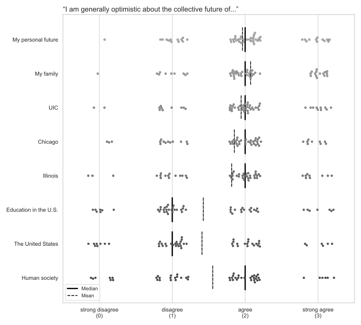

::: {.figure-caption}
Responses to "I am generally optimistic about the collective future of…", CS 377 attitudes survey, Fall 2026, n≈54.
:::

---

## Musical chairs! {.embed-slide}

::: {.embed-layout}
::: {.embed-copy}
- Shuffle seats!
- Enter a seed and shuffle

[Open in a new tab](https://doethics.fun/in-progress/visual-seat-shuffle.html)
:::

::: {.embed-frame style="position:absolute;top:0;right:0;bottom:52px;width:38%;margin:0;border-radius:0 6px 6px 0;border:2px solid #d8d8d8;"}
<iframe
  src="../in-progress/visual-seat-shuffle.html"
  title="Visual Seat Shuffle"
  data-external="1">
</iframe>
:::
:::

---

# Review: Virtue Ethics {.title-slide .section-header}

---

## Four Theories for This Class {.theories-grid}

<table>
<tr>
<td>
🏛

Virtue Ethics
</td>
<td>
📖

Deontological
</td>
</tr>
<tr>
<td>
📊

Utilitarian
</td>
<td>
💟

Care Ethics
</td>
</tr>
</table>

---

## Warm-Up Discussion: Virtue Ethics 🏛 {.embed-slide}

::: {.embed-layout .golden-columns}
::: {.embed-copy}
- Introduce yourselves!
- Who were your positive exemplars?
  - What were their virtues and how did those virtues show up?
- Negative exemplars?
  - What were their vices and how did those vices show up?
:::

::: {.embed-frame}
<iframe
  src="../timer/index.html"
  title="CTA-style countdown timer"
  loading="lazy"
  data-external="1">
</iframe>
:::
:::

---

## Virtue Ethics 🏛

- How can virtues be cultivated?

::: {.incremental}
- "Habitus"
  - Patterns of being
  - Social rituals
  - Conditioning
- What does any of this have to do with technology?
:::

---

# Basics of Deontological ethics {.title-slide .section-header}

---

## Invitation/reminder

Turn off phones, laptops, other distractions

---

## Table discussion {.embed-slide}

::: {.embed-layout .golden-columns}
::: {.embed-copy}
- What are some potential rules for this class, CS 377?
- Feel free to borrow from other classes!
- Try to write down ten rules at your table.
- Then choose two or three of your "best" rules and write them on the board.
:::

::: {.embed-frame}
<iframe
  src="../timer/index.html"
  title="CTA-style countdown timer"
  loading="lazy"
  data-external="1">
</iframe>
:::
:::

---

## Relevant Survey Question {.figure-slide .framed-figure}

::: {.figure-caption}
CS 377 attitudes survey, Fall 2026, n≈50.
:::

---

## Relevant Survey Question {.figure-slide .framed-figure}

::: {.figure-caption}
CS 377 attitudes survey, Fall 2026, n≈50.
:::

---

## Deontology in Brief

::: {.source-top}
[SEP, *Deontological Ethics*](https://plato.stanford.edu/entries/ethics-deontological/)
:::

:::: columns
::: {.column width="58%"}
- Focused on duties, rights, moral obligations (i.e. laws)
- Laws might be prohibitions or obligations
- Laws might come from different places
- What is "right" vs what is "good"
- Key figure: Immanuel Kant (1724 — 1804)

:::

::: {.column .portrait-solo width="38%"}

::: {.caption}
Kant ([unknown artist, c. 1790](https://commons.wikimedia.org/wiki/File:Immanuel_Kant_%28painted_portrait%29.jpg)), public domain
:::
:::
::::

---

## The Categorical Imperative {.quote-slide}

> Act only in accordance with that maxim through which you can at the same time will that it become a universal law.
>
> — Immanuel Kant

---

## The Categorical Imperative {.quote-slide}

> Act as if the maxims of your action were to become through your will a universal law of nature.
>
> — Immanuel Kant

---

## Categorical Imperative Examples {.smaller}

::: {.source-top}
[SEP, *Deontological Ethics*](https://plato.stanford.edu/entries/ethics-deontological/)
:::

:::: columns
::: {.column width="52%"}
::: {.incremental}
- Should I park at the airport terminal to wait?
  - If everyone did this...
  - More traffic issues?
- Should I tell a lie?
  - If it were universally acceptable to lie...
  - How would we believe anyone?
:::
:::

::: {.column width="44%"}

::: {.caption}
Arrivals pickup and departures drop-off at O'Hare. Photo: [AlphaBeta135](https://commons.wikimedia.org/wiki/File:O%27Hare_Airport_traffic_to_I-190_%28March_2024%29.jpg), CC BY 4.0
:::
:::
::::

---

## The Right over the Good

::: {.source-top}
[SEP, *Deontological Ethics*](https://plato.stanford.edu/entries/ethics-deontological/)
:::

Deontology (from Greek *deon*, "duty")

::: {.incremental}
- Some actions are **required, forbidden, or permitted**
- Deontologists prioritize **"the Right"** over **"the Good"**
- Some acts stay wrong *even when* those actions might bring about good consequences
- (We will contrast with consequentialism, focused on outcomes)
:::

---

## "She Would Do Her Duty" {.figure-slide}

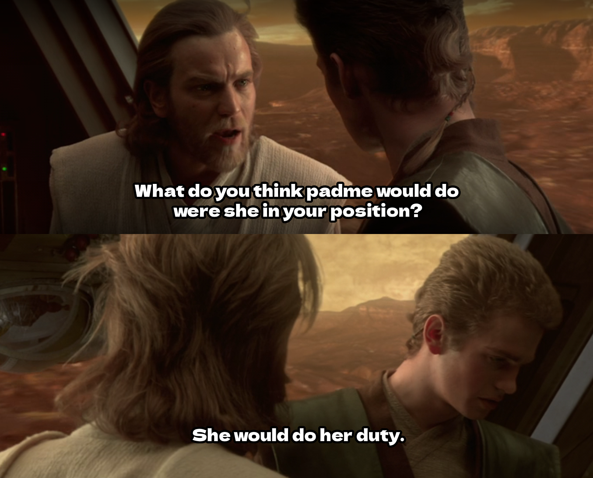

::: {.figure-caption}
From *Star Wars: Episode II — Attack of the Clones* (2002), dir. George Lucas.
:::

---

## The Deontic Square {.figure-slide}

::: {.source-top}
[SEP, *Deontological Ethics*](https://plato.stanford.edu/entries/ethics-deontological/)
:::

::: {.figure-caption}
The deontic square: every act is **obligatory**, **permitted**, **omissible**, or **prohibited**. Source: [Wikipedia, "Deontic square"](https://en.wikipedia.org/wiki/File:Deontic_square.svg)
:::

---

# Distinctions Within Deontology {.title-slide .section-header}

---

## Perspective

::: {.source-top}
[SEP, *Deontological Ethics*](https://plato.stanford.edu/entries/ethics-deontological/)
:::

:::: columns
::: {.column width="45%"}
### Agent-centered

- Focused on the "agent's" own duties and intentions
	- Agent is a human :-)
- "Keep your own moral house in order"
- **Agent-relative** duties: e.g. obligations to your own children, promises, projects
:::

::: {.column width="48%"}
### Patient-centered

- Focused on the "victim"
	- i.e. the recipient of an action
- Rights-based (the duty to protect others' rights)
- Core right: to not be used as a means to an end
:::
::::

---

## "Every Right, and Every Responsibility" {.smaller .figure-pair}

:::: columns
::: {.column width="48%"}
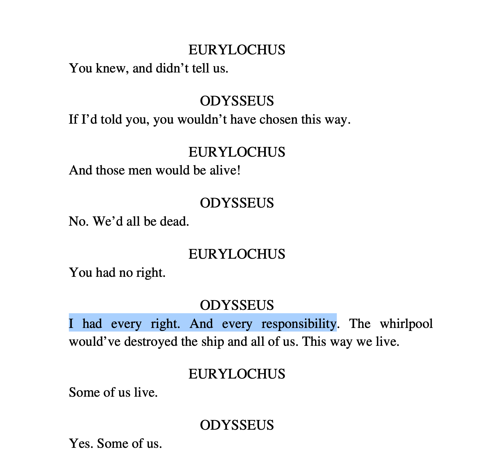

::: {.caption}
Screenplay excerpt from [The Odyssey (2026)](https://archive.org/details/odyssey-nolan-screenplay/page/n3/mode/2up).
:::
:::

::: {.column width="48%"}
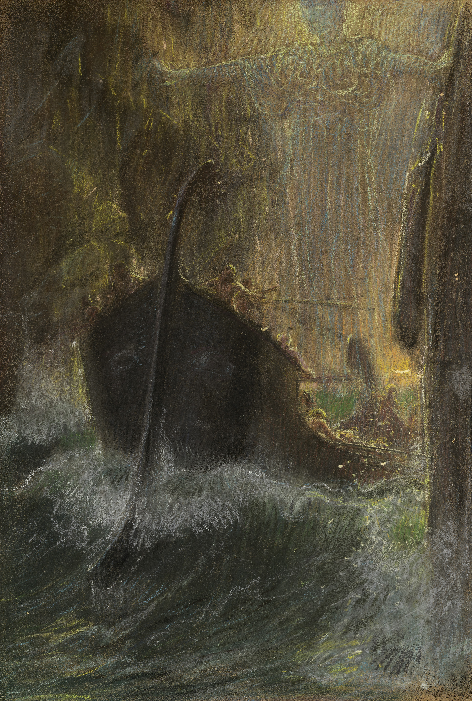

::: {.caption}
Adolf Hirémy-Hirschl, *Zwischen Skylla und Charybdis* (c. 1910). Via [Wikimedia Commons](https://commons.wikimedia.org/wiki/File:Adolf_Hiremy-Hirschl_-_Zwischen_Skylla_und_Charybdis.jpg), CC BY-SA 4.0
:::
:::
::::

---

## Causing and Allowing

::: {.source-top}
[SEP, *Deontological Ethics*](https://plato.stanford.edu/entries/ethics-deontological/)
:::

::: {.incremental}
- Also called "doing vs. allowing harm"
- **Double effect:** intending a harm differs from foreseeing it as a side effect
  - Categorically forbidden to *intend* evils like killing the innocent...
  - ...even if doing so would reduce total killing!
- **Causing vs. omitting**
- **Causing vs. allowing**
- **Causing vs. enabling**
- **Causing vs. redirecting** 
- **Causing vs. accelerating**
:::

---

## Misc. {.smaller}

::: {.source-top}
[SEP, *Deontological Ethics*](https://plato.stanford.edu/entries/ethics-deontological/)
:::

::: {.incremental}
- **Constraints:** absolute prohibitions (even when breaking it could prevent more violations)
- **Threshold deontology:** rules hold up to a point, so if the consequences are dire enough, forget about the rules
	- Difficult part: what is the exact threshold?
- **Alleged paradox of deontology:** if one violation is wrong, aren't more violations worse?
:::

---

## Alleged Paradox of Deontology {.quote-slide}

> If respecting Mary's and Susan's rights is as important morally as is protecting John's rights, then why isn't violating John's rights permissible (or even obligatory) when doing so is necessary to protect Mary's and Susan's rights from being violated?
>
> — [SEP, *Deontological Ethics*](https://plato.stanford.edu/entries/ethics-deontological/)

---

## Relevant Survey Question {.figure-slide .framed-figure}

::: {.figure-caption}
CS 377 attitudes survey, Fall 2026, n≈50.
:::

---

## Relevant Survey Question {.figure-slide .framed-figure}

::: {.figure-caption}
CS 377 attitudes survey, Fall 2026, n≈50.
:::

---

## Relevant Survey Question {.figure-slide .framed-figure}

::: {.figure-caption}
CS 377 attitudes survey, Fall 2026, n≈50.
:::

---

## Dilemma: Murderer at the Door {.embed-slide}

::: {.embed-layout .golden-columns}
::: {.embed-frame}
<iframe
  src="https://doethics.fun/dilemmas/deontological-inquiring-murderer/"
  title="Dilemma: Murderer at the Door"
  loading="lazy"
  data-external="1">
</iframe>
:::

::: {.embed-frame}
<iframe
  src="../timer/index.html"
  title="CTA-style countdown timer"
  loading="lazy"
  data-external="1">
</iframe>
:::

::: {.embed-overlay}
[Open in new tab](https://doethics.fun/dilemmas/deontological-inquiring-murderer/)
:::
:::

---

# Criticisms of Deontology {.title-slide .section-header}

---

## Criticisms of Deontology

::: {.source-top}
[SEP, *Deontological Ethics*](https://plato.stanford.edu/entries/ethics-deontological/)
:::

:::: columns
::: {.column width="58%"}
::: {.incremental}
- **Too permissive?** Allows any outcome as long as no rule is broken
- **Conflicting duties:** what if two duties collide?
- **The catastrophe problem:** will we follow the rule even into disaster?
- **The murderer at the door:** Benjamin Constant: must you tell the truth to a killer asking where your friend is hiding?
:::
:::

::: {.column width="38%"}

::: {.caption}
Benjamin Constant, by Lina Vallier, 1847, public domain ; [Commons](https://commons.wikimedia.org/wiki/File:Henri-Benjamin_Constant_de_Rebecque.png)
:::
:::
::::

---

# Reminder: Normative and Descriptive Ethics {.title-slide .section-header}

---

## Reminder: Normative Ethics and Descriptive Ethics

:::: columns
::: {.column width="40%"}
### Normative

- Is it right?
- Is it wrong?
- What should be done?
- "Is this unethical?"
:::

::: {.column width="55%"}
### Descriptive

- Who is involved?
- Who is making the decision(s)?
- What are the stakes?
- What are the options?
- What are the potential outcomes?
- What decisions led to this situation?
:::
::::

---

## Questions? {.theories-grid}

<table>
<tr>
<td>
🏛

Virtue Ethics
</td>
<td>
📖

Deontological
</td>
</tr>
<tr>
<td>
📊

Utilitarian
</td>
<td>
💟

Care Ethics
</td>
</tr>
</table>

---

## That's all for today!

- Your "selfie with books" is due Tuesday, 11:59pm
- See you next class!

---

# Introduction to Utilitarian Ethics {.title-slide data-menu-title="Week 2, Day 2"}

CS 377, Week 2, Day 2 🟦 Western 🟦

---

# Introduction to Utilitarian Ethics {.title-slide .photo-title data-state="photo-title" background-image="../assets/blue-line-stops-better/stop08-western-b.jpg" background-size="cover" data-menu-title="Week 2, Day 2"}

CS 377, Week 2, Day 2 🟦 Western 🟦

---

## {.photo-only data-state="photo-only" background-image="../assets/blue-line-stops-better/stop08-western-b.jpg" background-size="cover"}

---

## Agenda for Today

:::: columns
::: {.column width="55%"}
- Administrivia and questions
- Trolley problem exercise
- Trolley problem debrief
- Mini-lecture: utilitarian ethics
- Measuring pain and harm
- Prisoner's dilemma (if time)
:::

::: {.column width="40%"}

:::
::::

---

## Attendance / warm-up {.embed-slide}

::: {.embed-layout .golden-columns}
::: {.embed-copy}
- *Random letter via random.org*
- What's something you like that starts with the letter \_?
- Bentham would want to know how *much* you like it
- Mill would want to know what *kind* of liking it is
:::

::: {.embed-frame}
::: {.random-letter}
::: {.random-letter-display role="status" aria-live="polite" data-placeholder="Press “Draw” for a random letter."}
:::

<button type="button" class="random-letter-button">Draw</button> 

:::
:::
:::

---

# Review and Warm-Up {.title-slide .section-header}

---

## Review: approaching ethical decisions based on… {.smaller}

:::: columns
::: {.column width="55%"}
- Virtue ethics
- Deontological ethics

::: {.fragment}
- Virtue ethics: would a virtuous person do this?
- Deontological ethics: does this align with rules/duties?
:::
:::

::: {.column .portrait-pair width="40%"}

::: {.caption}
Aristotle ([Eric Gaba](https://commons.wikimedia.org/wiki/File:Aristoteles_Louvre.jpg), CC BY-SA 2.5)
:::
:::
::::

---

## Another theory! {.smaller}

:::: columns
::: {.column width="55%"}
- Virtue ethics: character
- Deontological: duty
- Utilitarian: outcomes

::: {.fragment}
- Jeremy Bentham (1748 — 1832) and John Stuart Mill (1806 — 1873)
:::
:::

::: {.column .portrait-pair width="40%"}
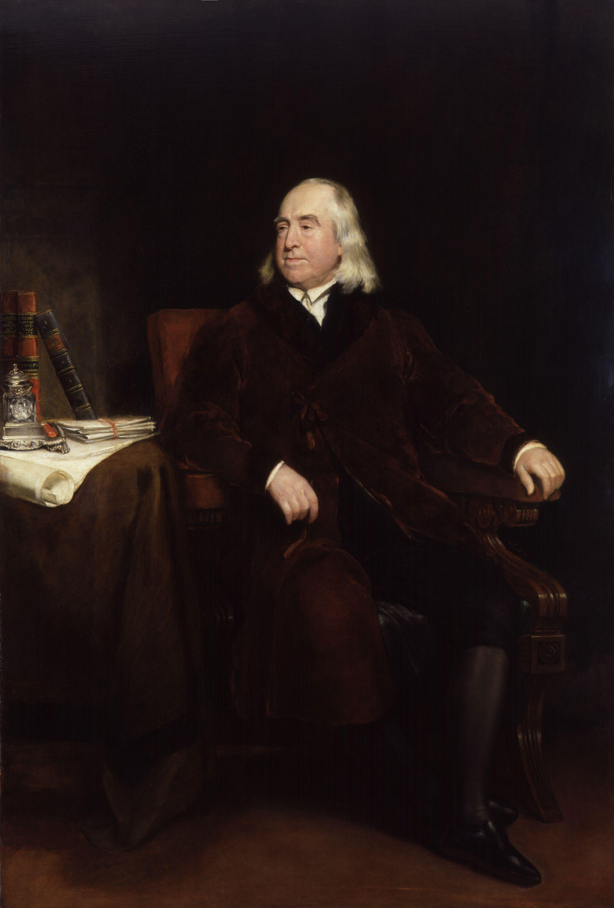

::: {.caption}
Bentham ([Henry William Pickersgill, 1829](https://commons.wikimedia.org/wiki/File:Jeremy_Bentham_by_Henry_William_Pickersgill.jpg)), public domain
:::
:::
::::

---

# The Trolley Problem {.title-slide .section-header}

---

## Trolley Problem Exercise {.embed-slide}

::: {.embed-layout .golden-columns}
::: {.embed-copy}
- See handout
:::

::: {.embed-frame}
<iframe
  src="../timer/index.html"
  title="CTA-style countdown timer"
  loading="lazy"
  data-external="1">
</iframe>
:::
:::

---

# Trolley Problem Debrief {.title-slide .section-header}

---

## The Two Cases {.smaller .figure-pair}

:::: columns
::: {.column width="48%"}
### Switch

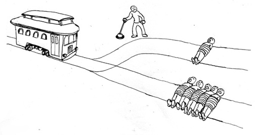

::: {.caption}
Pull the lever to redirect the trolley onto a side track, killing one instead of five.
:::
:::

::: {.column width="48%"}
### Footbridge

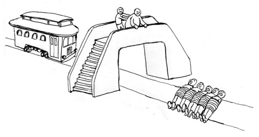

::: {.caption}
Push the man to stop the trolley, saving the five others.
:::
:::
::::

::: {.caption}
Drawings by [Jesse Prinz](http://subcortex.com/pictures/); wording after [Chad Vance](https://rintintin.colorado.edu/~vancecd/phil3160/trolley.pdf).
:::

---

## What Most People Say {.quote-slide}

> 90% of people say that you SHOULD kill the one in Switch (by pulling the lever), while 90–95% of people say that you SHOULD NOT kill the one in Footbridge — though the results are the same. In each case, the option is to kill 1, or let 5 die. What explains our difference of intuition in these two cases?
>
> — [Chad Vance, *The Trolley Problem*](https://rintintin.colorado.edu/~vancecd/phil3160/trolley.pdf)

---

## Where the Trolley Comes From {.smaller}

::: {.source-top}
[Naylor, "The Moral of the Trolley Problem" (1988)](https://doi.org/10.2307/2108017)
[Clark, "Sacrificing One to Save Many" (1995)](https://www.jstor.org/stable/24354077)
:::

:::: columns
::: {.column width="55%"}
- **Philippa Foot**, 1967: the original "driver of a runaway tram" case
- **Judith Jarvis Thomson**
	- names the "trolley problem"
	- adds the footbridge
:::

::: {.column width="40%"}
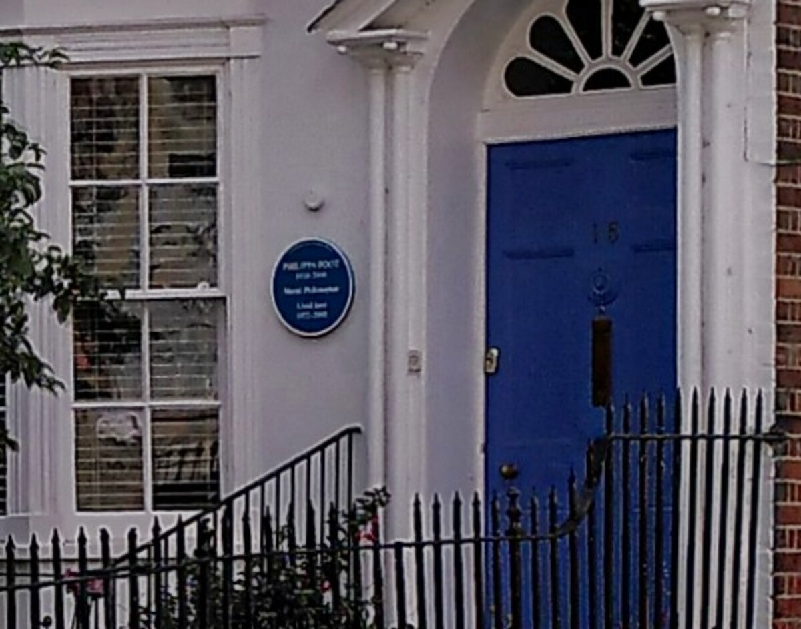

::: {.caption}
Blue plaque at 15 Walton Street, Oxford, where Philippa Foot lived from 1972 to 2010. Photo: [A J Paxton](https://commons.wikimedia.org/wiki/File:15_Walton_Street,_Oxford,_with_blue_plaque_to_Philippa_Foot_-_geograph.org.uk_-_8084209.jpg), CC BY-SA 2.0 (cropped)
:::
:::
::::

---

# Utilitarianism {.title-slide .section-header}

---

## Consequences {.figure-slide .framed-figure}

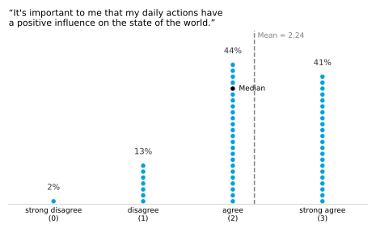

::: {.figure-caption}
"It's important to me that my daily actions have a positive impact." CS 377 attitudes survey, Fall 2026, n≈50.
:::

---

## Social Impact {.figure-slide .framed-figure}

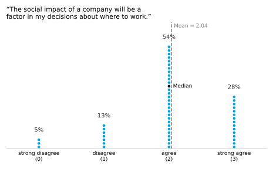

::: {.figure-caption}
"The social impact of a company will be a factor in my decision about where to work." CS 377 attitudes survey, Fall 2026, n≈50.
:::

---

## Utilitarianism {.smaller}

::: {.source-top}
[SEP, *The History of Utilitarianism*](https://plato.stanford.edu/entries/utilitarianism-history/)
:::

:::: columns
::: {.column width="55%"}
- Based on the outcomes or consequences of an action
- John Stuart Mill, Jeremy Bentham
- Impartiality: "we all count the same in terms of our status as human beings"
- Key questions
  - Whose well-being?
  - What is being used to define good/happiness/utility?
  - When is the measure of success being taken?
:::

::: {.column .portrait-solo width="40%"}

::: {.caption}
Bentham by [Henry William Pickersgill](https://commons.wikimedia.org/wiki/File:Jeremy_Bentham_by_Henry_William_Pickersgill.jpg), exhibited 1829, public domain
:::
:::
::::

---

## Two Sovereign Masters {.quote-slide}

> Nature has placed mankind under the governance of two sovereign masters, *pain* and *pleasure*. It is for them alone to point out what we ought to do...
>
> — Jeremy Bentham, *An Introduction to the Principles of Morals and Legislation* (1789), ch. I

---

## Bentham's Background {.smaller}

:::: columns
::: {.column width="52%"}
::: {.incremental}
- Bentham was a social reformer first, working on prisons, punishment, law, animal welfare
- The Panopticon (1791): a prison laid out so that one watcher could observe everyone
	- No one could tell exactly when they were watched
- Efficiency of surveillance as a *utility* argument
:::
:::

::: {.column width="44%"}
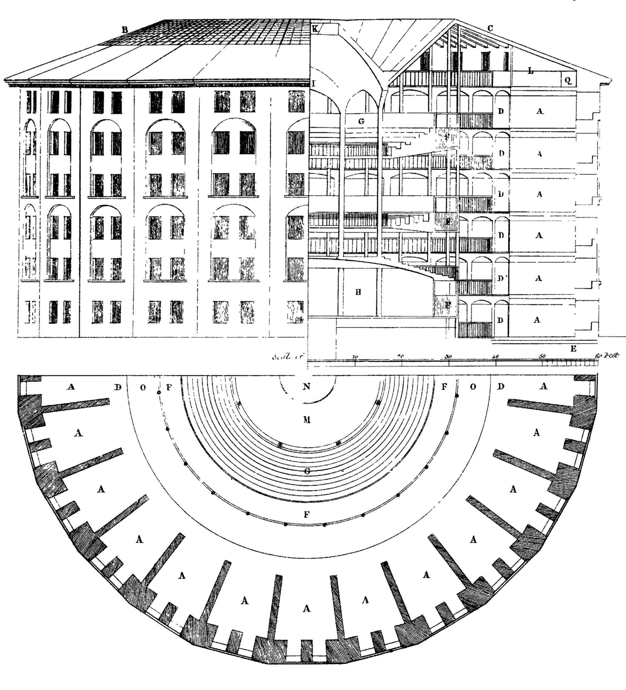

::: {.caption}
Plan of the Panopticon, from *The Works of Jeremy Bentham* vol. IV (1843). Via [Wikimedia Commons](https://commons.wikimedia.org/wiki/File:Panopticon.jpg), public domain
:::
:::
::::

---

## The Felicific Calculus {.quote-slide}

> Sum up all the values of all the pleasures on the one side, and those of all the pains on the other. The balance, if it be on the side of pleasure, will give the good tendency of the act upon the whole.
>
> — Jeremy Bentham, *Principles of Morals and Legislation* (1789), ch. IV

---

## Bentham's Parameters of Pleasure {.smaller}

::: {.source-top}
Bentham, *Principles of Morals and Legislation*, ch. IV, via [SEP, *The History of Utilitarianism*](https://plato.stanford.edu/entries/utilitarianism-history/)
:::

:::: columns
::: {.column width="52%"}
- intensity — how strong
- duration — how long it lasts
- certainty or uncertainty — how likely
- propinquity or remoteness — how soon
- fecundity — chance of leading to more of the same
- purity — chance of *not* leading to the opposite
- extent — **how many people**
:::

::: {.column width="44%"}
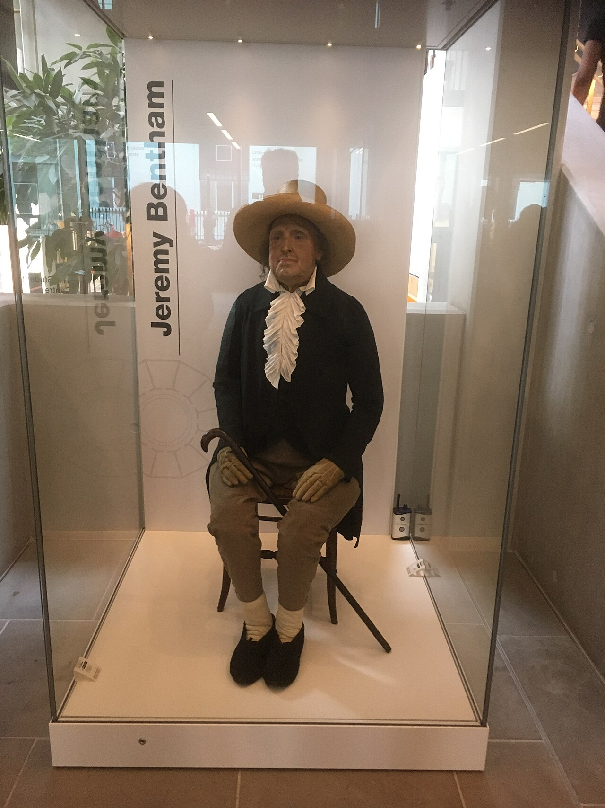

::: {.caption}
Bentham's "Auto-Icon" — his preserved body, per his will — at UCL. Photo: [Philip Stevens](https://commons.wikimedia.org/wiki/File:Jeremy_Bentham_Auto-Icon_2020.jpg), CC BY-SA 4.0
:::
:::
::::

---

## Different Kinds of Pleasures {.smaller}

:::: columns
::: {.column width="48%"}
- Watching a movie
- Reading a poem
- Earning an A on a final exam
- Meeting a new friend
- Attending a concert
- Scrolling on TikTok / Reels / Shorts
:::

::: {.column width="48%"}
- Sleeping in on a Saturday
- Eating a really good taco
- Finally getting the code to compile
- Getting reactions in the group chat
- Playing a video game with friends
- Walking around in good weather
:::
::::

::: {.fragment}
Qualitative / quantitative differences in pleasures
:::

---

## Higher and Lower Pleasures {.quote-slide}

> It is better to be a human being dissatisfied than a pig satisfied; better to be Socrates dissatisfied than a fool satisfied.
>
> — John Stuart Mill, *Utilitarianism* (1863), ch. II

---

## Mill's Amendment {.smaller}

::: {.source-top}
[SEP, *The History of Utilitarianism*](https://plato.stanford.edu/entries/utilitarianism-history/)
:::

:::: columns
::: {.column width="55%"}
::: {.incremental}
- Bentham: pleasures differ only in **quantity**
	- e.g. an oyster living a very long time could, in principle, beat a human life
	- Critics called this a "swine morality"
- Mill: pleasures also differ in **kind**
	- can judge if you have experienced both
:::
:::

::: {.column .portrait-solo width="40%"}
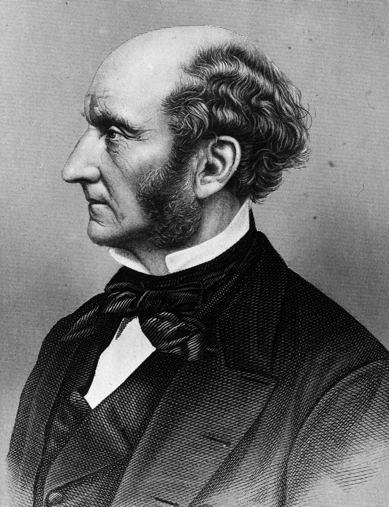

::: {.caption}
Mill, [19th-century photogravure](https://commons.wikimedia.org/wiki/File:JohnStuartMill.jpg), public domain
:::
:::
::::

---

## Happiness {.quote-slide}

> Actions are right in proportion as they tend to promote happiness, wrong as they tend to produce the reverse of happiness.
>
> — John Stuart Mill, *Utilitarianism* (1863), ch. II

---

## Happiness {.quote-slide}

> By happiness is intended pleasure, and the absence of pain; by unhappiness, pain, and the privation of pleasure.
>
> — John Stuart Mill, *Utilitarianism* (1863), ch. II

---

## Absolute Impartiality {.smaller}

:::: columns
::: {.column width="55%"}
::: {.incremental}
- If everybody counts for one, distance does not discount anyone
- **Peter Singer** (1972): a drowning child in front of you and a preventable death overseas are the same moral fact
- In this way, utilitarianism can be demanding
:::
:::

::: {.column .portrait-solo width="40%"}
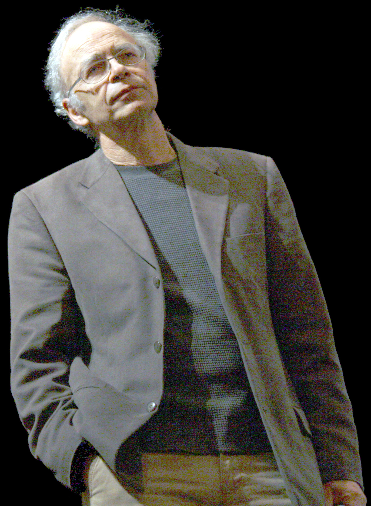

::: {.caption}
Peter Singer. Photo: [Bbsrock](https://commons.wikimedia.org/wiki/File:Peter_Singer_(philosopher).jpg), CC BY-SA 3.0
:::
:::
::::

---

# Measuring Impact {.title-slide .section-header}

---

## Measuring Impact: Pain/Harms {.smaller}

:::: columns
::: {.column width="48%"}
- "X days without an accident"
- Excess deaths / covid dashboards
- Injury rates, recall counts, near-miss reports
- Other examples?
:::

::: {.column width="48%"}
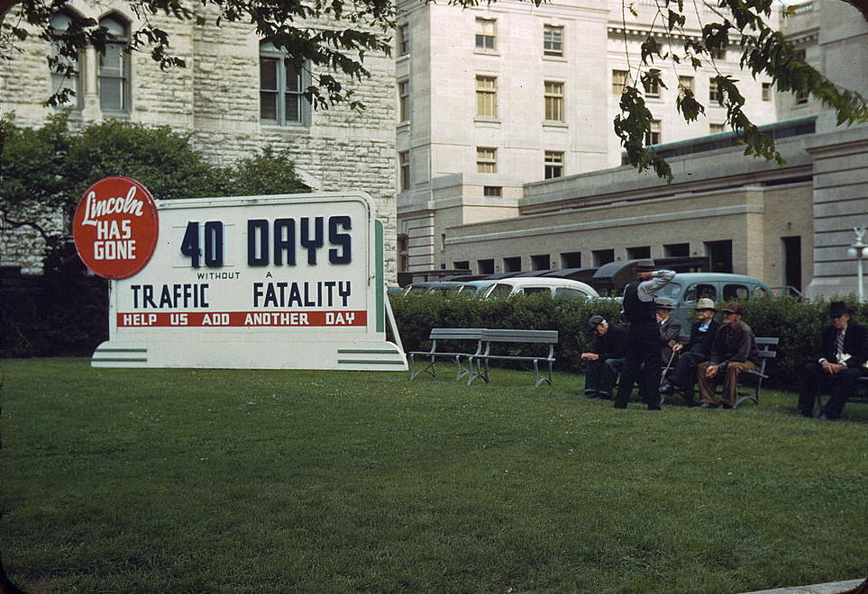

::: {.caption}
"Lincoln has gone 40 DAYS without a traffic fatality." John Vachon, 1942; [FSA/OWI, Library of Congress](https://commons.wikimedia.org/wiki/File:40_days_Lincoln,_Nebraska.jpg), public domain
:::
:::
::::

---

## Measuring Impact: Utility/Happiness {.smaller}

:::: columns
::: {.column width="48%"}
- Social mobility
- Enrollment numbers
- GDP
- Life expectancy ("QALYs")
- Daily active users, watch time
- Other examples?
:::

::: {.column width="48%"}
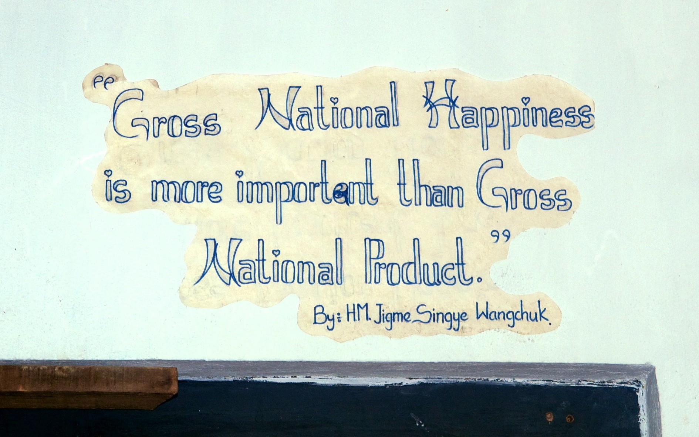

::: {.caption}
"Gross National Happiness is more important than Gross National Product" — Thimphu, Bhutan. Photo: [Mario Biondi](https://commons.wikimedia.org/wiki/File:Bhutan_Gross_National_Happiness.jpg), public domain
:::
:::
::::

---

## Measure of Utility? {.figure-slide}

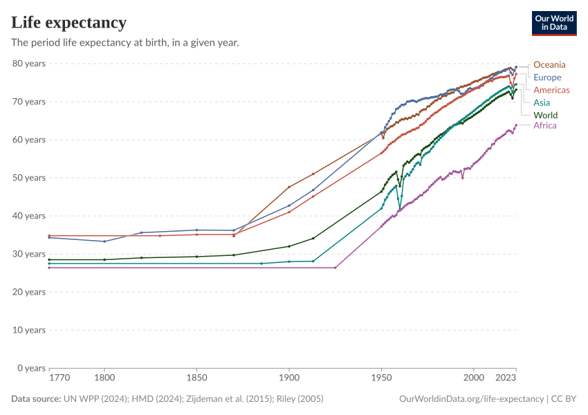

::: {.figure-caption}
Life expectancy by world region, 1770–2023. [Max Roser / Our World in Data](https://commons.wikimedia.org/wiki/File:Life_expectancy_by_world_region_since_1770,_OWID.svg), CC BY 4.0.
:::

---

## A Tyranny of Metrics? {.smaller}

::: {.incremental}
- Every measure is a **proxy**:
- "When a measure becomes a target, it ceases to be a good measure"
	- (Goodhart's law)
- "Whose well-being? defined how? measured when?"
:::

---

# The Prisoner's Dilemma {.title-slide .section-header}

---

## The Prisoner's Dilemma {.smaller}

::: {.source-top}
[SEP, *Prisoner's Dilemma*](https://plato.stanford.edu/entries/prisoner-dilemma/)
[doethics.fun/dilemmas/utilitarian-prisoners-dilemma](https://doethics.fun/dilemmas/utilitarian-prisoners-dilemma/)
:::

You and your accomplice are in separate cells. Neither of you learns what the other said until both have decided.

|                     | **Friend stays silent**  | **Friend testifies** |
| ------------------- | ------------------------ | -------------------- |
| **You stay silent** | 1 year each              | You: 10 yrs / them: free |
| **You testify**     | You: free / them: 10 yrs | 8 years each   |

---

## Dilemma: The Prisoner's Dilemma {.embed-slide}

::: {.embed-layout .golden-columns}
::: {.embed-frame}
<iframe
  src="https://doethics.fun/dilemmas/utilitarian-prisoners-dilemma/"
  title="Dilemma: The Prisoner's Dilemma"
  loading="lazy"
  data-external="1">
</iframe>
:::

::: {.embed-frame}
<iframe
  src="../timer/index.html"
  title="CTA-style countdown timer"
  loading="lazy"
  data-external="1">
</iframe>
:::

::: {.embed-overlay}
[Open in new tab](https://doethics.fun/dilemmas/utilitarian-prisoners-dilemma/)
:::
:::

---

## Utilitarian Approach to the Prisoner's Dilemma

:::: columns
::: {.column width="55%"}
::: {.incremental}
- Testifying is better for you, regardless of what the other person does
- Both of you reasoning that way lands on 8 years each, when 1 each was available
- **Robert Axelrod (1984):** play it repeatedly and cooperation can win — "tit for tat" was the shortest program entered in his tournament
:::
:::

::: {.column .portrait-solo width="40%"}
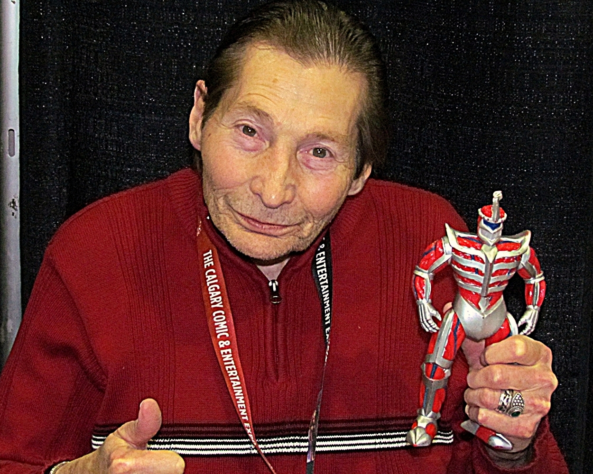

::: {.caption}
Robert Axelrod, 2012. Photo: [5of7](https://commons.wikimedia.org/wiki/File:Robert_Axelrod_2012.jpg), CC BY-SA 2.0
:::
:::
::::

---

## Reflection Preview

TBD

---

## That's all for today!

See you next class!

---

# Appendix: The Transplant Case {.title-slide .section-header .no-index}

---

## Organ Transplant Exercise {.smaller}

:::: columns
::: {.column width="52%"}
- See handout
- Try to consider the question from different ethical approaches
  (i.e. virtue ethics, deontological ethics…)
:::

::: {.column width="44%"}

::: {.caption}
Operating room, Aravind Eye Hospital. Photo: [Itsagoodlife](https://commons.wikimedia.org/wiki/File:12_Operating_Room_Aravind.jpg), CC BY-SA 4.0
:::
:::
::::

---

## Questions to Consider if Stuck

- How many people depend on this person for survival and/or wellbeing?
- What are the chances the transplant will be successful and last a long time?
- How many years of life could they gain from a transplant?
- What contributions do they make to their communities?

---

## Transplant Reflection

- What was that like?
- What factors did you consider?
- How confident were you?
- How did the two approaches hold up?

---

## The Transplant Case {.smaller}

::: {.source-top}
[doethics.fun/dilemmas/utilitarian-ethics-transplant](https://doethics.fun/dilemmas/utilitarian-ethics-transplant/)
:::

A surgeon has five patients, each needing a different organ, each of whom will die without it. A healthy young traveler comes in for a routine checkup, and turns out to be compatible with all five. If the traveler were to disappear, no one would suspect the surgeon.

::: {.fragment}
The arithmetic is the same as Footbridge: one dies, five live. Almost nobody accepts it.
:::

---

## The Transplant Case in Real Life {.quote-slide}

> Dr. Hootan C. Roozrokh, a transplant surgeon from Stanford, is being charged with ordering the removal of a life-supporting ventilator and prescribing excessive and improper doses of drugs, apparently in an attempt to hasten the death of a disabled and brain damaged man named Ruben Navarro in order to retrieve his organs sooner.
>
> — [S. Matthew Liao, *The Transplant Case in Real Life* (2008)](https://blog.uehiro.ox.ac.uk/2008/02/the-transplant-case-in-real-life/)

---

## What the Real Case Adds {.smaller}

::: {.source-top}
[S. Matthew Liao, *The Transplant Case in Real Life*](https://blog.uehiro.ox.ac.uk/2008/02/the-transplant-case-in-real-life/)
:::

::: {.incremental}
- Navarro was not healthy and was, by most accounts, near death — an *easier* case than Foot's, for a consequentialist
- His mother had consented to donation, but not to **hastening** his death
- Her words afterward: "He didn't deserve to be like that, to go that way… He died without dignity and sympathy and without respect."
- The organs were never successfully retrieved. Would success have made it more permissible?
:::

---

# References & Credits {.sources}

1. GitHub source: <https://github.com/jackbandy/ethical-issues-in-computing-uic/blob/main/docs/slides/week2.md>.
2. Day 1 title photo: [Cicero (Blue) entrance](https://commons.wikimedia.org/wiki/File:Cicero_(Blue)_entrance_(51377780442).jpg) by Jacob G., via Wikimedia Commons, CC BY-SA 2.0.
3. Day 2 title photo: [Inbound track at Western (Blue — Forest Park)](https://commons.wikimedia.org/wiki/File:Inbound_track_at_Western_(Blue_-_Forest_Park),_looking_east.jpg) by Jacob G., via Wikimedia Commons, CC BY-SA 2.0.
4. Safety-counter photo: ["Lincoln has gone 40 days without a traffic fatality"](https://commons.wikimedia.org/wiki/File:40_days_Lincoln,_Nebraska.jpg) by John Vachon, 1942 (FSA/OWI, Library of Congress), public domain.
5. Deontic square figure: [Deontic square](https://en.wikipedia.org/wiki/File:Deontic_square.svg) via Wikipedia. Deontology content drawn from Larry Alexander and Michael Moore, ["Deontological Ethics,"](https://plato.stanford.edu/entries/ethics-deontological/) *Stanford Encyclopedia of Philosophy*.
6. O'Hare terminal roadway photo: ["O'Hare Airport traffic to I-190"](https://commons.wikimedia.org/wiki/File:O%27Hare_Airport_traffic_to_I-190_%28March_2024%29.jpg) by AlphaBeta135, via Wikimedia Commons, CC BY 4.0.
7. Portraits: Thomas Aquinas by [Fra Bartolomeo](https://commons.wikimedia.org/wiki/File:Thomas_Aquinas_by_Fra_Bartolommeo.jpg), Immanuel Kant by an [unknown artist](https://commons.wikimedia.org/wiki/File:Immanuel_Kant_%28painted_portrait%29.jpg), and Benjamin Constant by [Lina Vallier](https://commons.wikimedia.org/wiki/File:Henri-Benjamin_Constant_de_Rebecque.png), all public domain via Wikimedia Commons.
8. Murderer-at-the-door dilemma: [doethics.fun/dilemmas/deontological-inquiring-murderer](https://doethics.fun/dilemmas/deontological-inquiring-murderer/), drawing on Kant, "On a Supposed Right to Lie from Benevolent Motives" (1797) and Benjamin Constant, "On Political Reactions" (1797).
9. Odyssey screenplay excerpt (`odyssey-rights.png`): source TBD.
10. Charybdis painting: Adolf Hirémy-Hirschl, ["Zwischen Skylla und Charybdis"](https://commons.wikimedia.org/wiki/File:Adolf_Hiremy-Hirschl_-_Zwischen_Skylla_und_Charybdis.jpg) (c. 1910), via Wikimedia Commons, CC BY-SA 4.0.
11. Duty still: *Star Wars: Episode II — Attack of the Clones* (2002), dir. George Lucas, Lucasfilm. Used for classroom commentary.
12. Trolley problem: drawings by [Jesse Prinz](http://subcortex.com/pictures/); case wording and the Switch/Footbridge/bomber discussion from [Chad Vance, *The Trolley Problem*](https://rintintin.colorado.edu/~vancecd/phil3160/trolley.pdf) (PHIL 3160, CU Boulder). Origins in Philippa Foot (1967) and Judith Jarvis Thomson (1976, 1985); see also Margery Bedford Naylor, ["The Moral of the Trolley Problem,"](https://doi.org/10.2307/2108017) *Philosophy and Phenomenological Research* 48, no. 4 (1988): 711, and Michael Clark, ["Sacrificing One to Save Many,"](https://www.jstor.org/stable/24354077) via JSTOR. More variations: ["Absurd Trolley Problems"](https://neal.fun/absurd-trolley-problems/) by Neal Agarwal.
13. Utilitarianism content drawn from Julia Driver, ["The History of Utilitarianism,"](https://plato.stanford.edu/entries/utilitarianism-history/) *Stanford Encyclopedia of Philosophy*.
14. Bentham quotations from *An Introduction to the Principles of Morals and Legislation* (1789), chs. I, IV, and XVII n. 122, via the [Library of Economics and Liberty](https://www.econlib.org/library/Bentham/bnthPML.html). Mill quotations from *Utilitarianism* (1863), chs. II and V, via [Project Gutenberg](https://www.gutenberg.org/ebooks/11224).
15. Philippa Foot blue plaque, 15 Walton Street, Oxford: [photo](https://commons.wikimedia.org/wiki/File:15_Walton_Street,_Oxford,_with_blue_plaque_to_Philippa_Foot_-_geograph.org.uk_-_8084209.jpg) by A J Paxton, via Wikimedia Commons, CC BY-SA 2.0 (cropped).
16. Bentham imagery: [Panopticon plan](https://commons.wikimedia.org/wiki/File:Panopticon.jpg) from *The Works of Jeremy Bentham* vol. IV (1843), public domain; [Auto-Icon at UCL](https://commons.wikimedia.org/wiki/File:Jeremy_Bentham_Auto-Icon_2020.jpg) by Philip Stevens, CC BY-SA 4.0. Portraits of [Bentham](https://commons.wikimedia.org/wiki/File:Jeremy_Bentham_by_Henry_William_Pickersgill.jpg) (Henry William Pickersgill, 1829) and [Mill](https://commons.wikimedia.org/wiki/File:JohnStuartMill.jpg), public domain; [Peter Singer](https://commons.wikimedia.org/wiki/File:Peter_Singer_(philosopher).jpg) by Bbsrock, CC BY-SA 3.0; [Robert Axelrod](https://commons.wikimedia.org/wiki/File:Robert_Axelrod_2012.jpg) by 5of7, CC BY-SA 2.0. Mill's *Utilitarianism* [1863 title page](https://commons.wikimedia.org/wiki/File:Utilitarianism_-_Mill_-_1863.djvu), public domain.
17. Measuring-impact images: ["Gross National Happiness is more important than Gross National Product," Thimphu](https://commons.wikimedia.org/wiki/File:Bhutan_Gross_National_Happiness.jpg), photo by Mario Biondi, public domain; [life expectancy by world region, 1770–2023](https://commons.wikimedia.org/wiki/File:Life_expectancy_by_world_region_since_1770,_OWID.svg) by Max Roser / Our World in Data, CC BY 4.0.
18. Prisoner's dilemma: [doethics.fun/dilemmas/utilitarian-prisoners-dilemma](https://doethics.fun/dilemmas/utilitarian-prisoners-dilemma/), after Steven Kuhn, ["Prisoner's Dilemma,"](https://plato.stanford.edu/entries/prisoner-dilemma/) *Stanford Encyclopedia of Philosophy*, and Robert Axelrod, *The Evolution of Cooperation* (1984).
19. Transplant case (appendix): [doethics.fun/dilemmas/utilitarian-ethics-transplant](https://doethics.fun/dilemmas/utilitarian-ethics-transplant/), after Philippa Foot and Judith Jarvis Thomson; real-life case and the Navarro quotations from S. Matthew Liao, ["The Transplant Case in Real Life,"](https://blog.uehiro.ox.ac.uk/2008/02/the-transplant-case-in-real-life/) Practical Ethics (Oxford Uehiro Centre), 2008. [Operating room photo](https://commons.wikimedia.org/wiki/File:12_Operating_Room_Aravind.jpg) by Itsagoodlife, CC BY-SA 4.0.
20. Attendance warm-up letter drawn live from [random.org/strings](https://www.random.org/strings/?num=1&len=1&upperalpha=on&unique=on&format=plain&rnd=new).
21. Slide deck built with [Quarto](https://quarto.org/) and Reveal.js.
