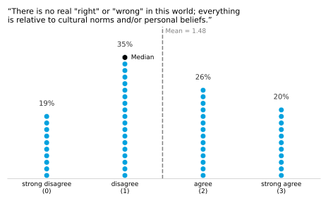
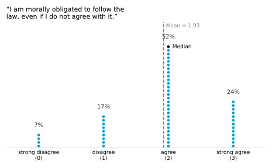
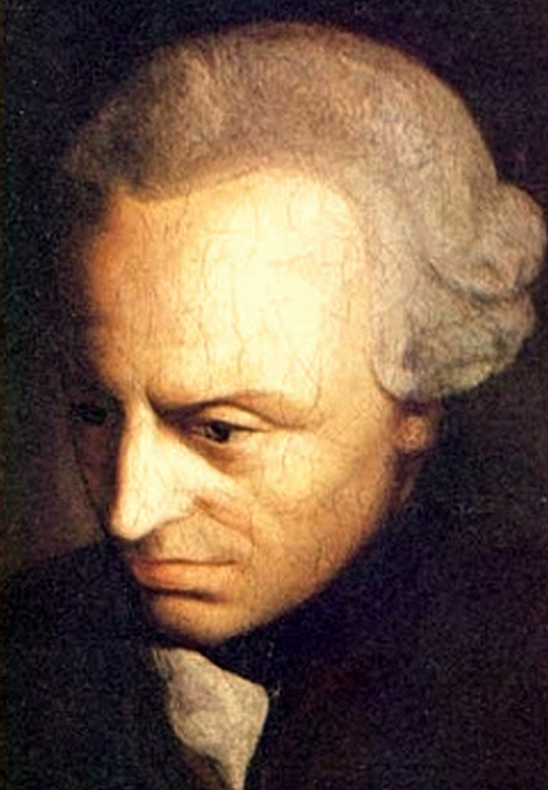
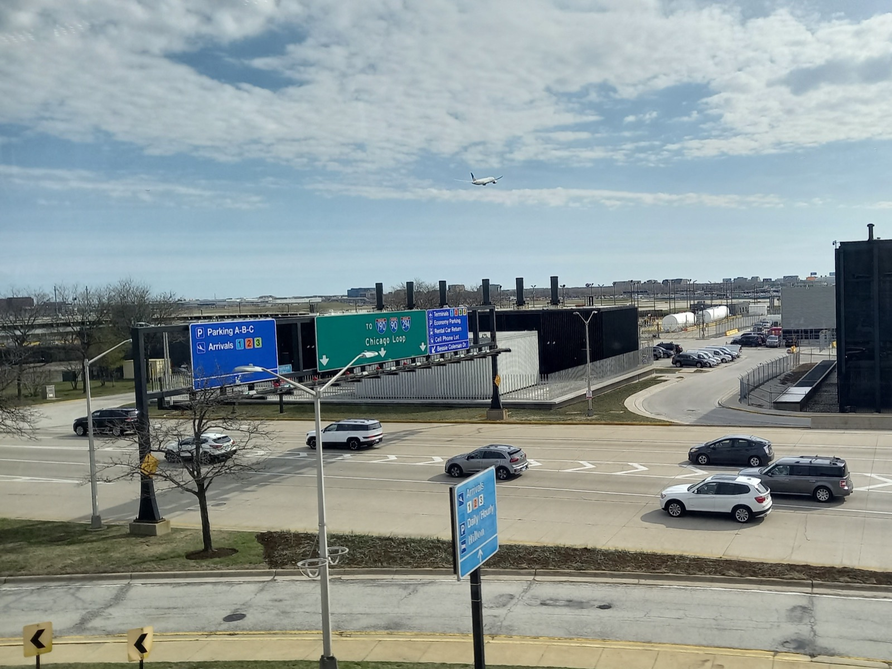
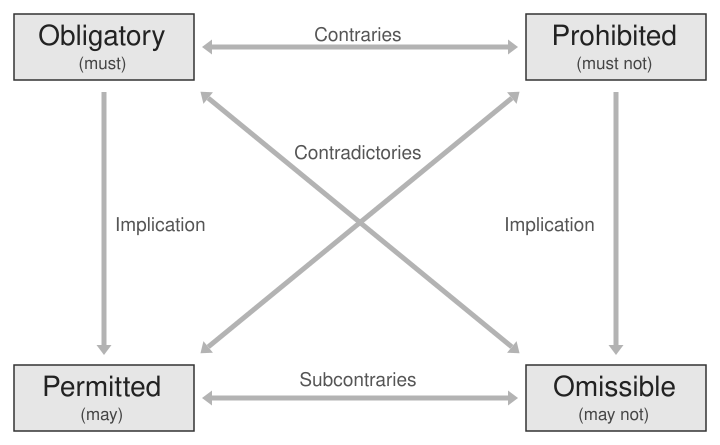
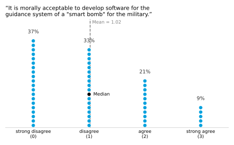
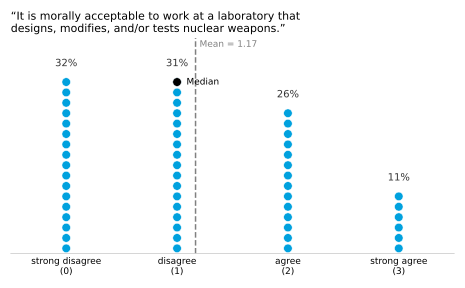
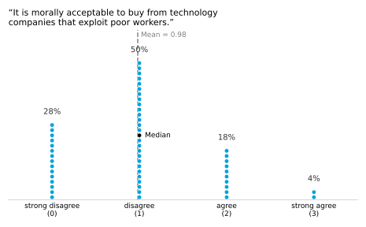
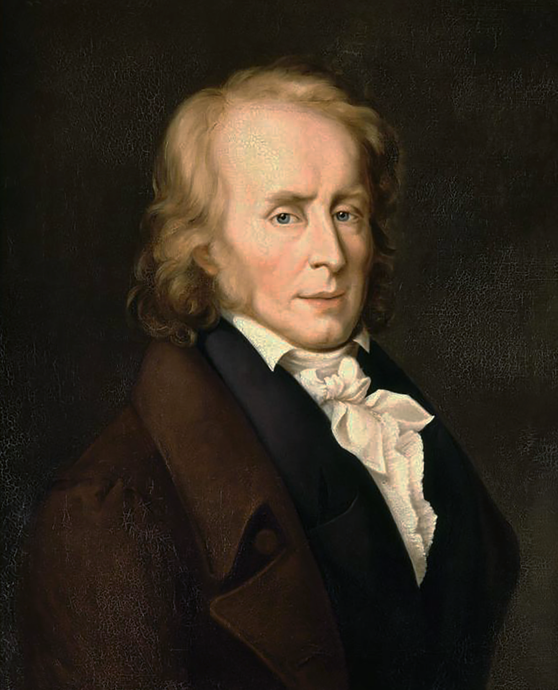

# Introduction to Deontological Ethics {.title-slide data-menu-title="Week 2, Day 1"}

CS 377, Week 2, Day 1 🟦 Cicero 🟦

---

# Introduction to Deontological Ethics {.title-slide .photo-title data-state="photo-title" background-image="../assets/blue-line-stops-better/stop05-cicero-b.jpg" background-size="cover" data-menu-title="Week 2, Day 1"}

CS 377, Week 2, Day 1 🟦 Cicero 🟦

<!-- image source: Cicero Blue Line station, April 1976, via Jeffrey Lindmark -->

---

## {.photo-only data-state="photo-only" background-image="../assets/blue-line-stops-better/stop05-cicero-b.jpg" background-size="cover"}

---

## Agenda for Today

:::: columns
::: {.column width="55%"}
- Administrivia and questions
- Shuffle seats
- Discuss exemplars
- A couple more words about virtue ethics
- Make up some rules
- Mini-lecture: deontological ethics
:::

::: {.column width="40%"}

:::
::::

---

## Administrivia

- Grades will trickle in through Canvas
- Reflections coming soon!
- Canvas questions?
- Book questions?

---

## Musical chairs! {.embed-slide}

::: {.embed-layout}
::: {.embed-copy}
- Shuffle seats!
- Enter a seed and shuffle to assign tables

[Open in a new tab](https://doethics.fun/in-progress/visual-seat-shuffle.html)
:::

::: {.embed-frame style="position:absolute;top:0;right:0;bottom:52px;width:38%;margin:0;border-radius:0 6px 6px 0;border:2px solid #d8d8d8;"}
<iframe
  src="../in-progress/visual-seat-shuffle.html"
  title="Visual Seat Shuffle"
  data-external="1">
</iframe>
:::
:::

---

# Review: Virtue Ethics {.title-slide .section-header}

---

## Four Theories for This Class {.theories-grid}

<table>
<tr>
<td>
🏛

Virtue Ethics
</td>
<td>
📖

Deontological
</td>
</tr>
<tr>
<td>
📊

Utilitarian
</td>
<td>
💟

Care Ethics
</td>
</tr>
</table>

---

## Warm-Up Discussion: Virtue Ethics 🏛 {.embed-slide}

::: {.embed-layout .golden-columns}
::: {.embed-copy}
- Introduce yourselves!
- Who were your positive exemplars?
  - What were their virtues and how did those virtues show up?
- Negative exemplars?
  - What were their vices and how did those vices show up?
:::

::: {.embed-frame}
<iframe
  src="../timer/index.html"
  title="CTA-style countdown timer"
  loading="lazy"
  data-external="1">
</iframe>
:::
:::

---

## Virtue Ethics 🏛

- How can virtues be cultivated?

::: {.incremental}
- "Habitus"
  - Patterns of being
  - Social rituals
  - Conditioning
- What does any of this have to do with technology?
:::

---

# Fundamentals of Deontology {.title-slide .section-header}

---

## Invitation/reminder

Turn off phones, laptops, other distractions

---

## Table discussion {.embed-slide}

::: {.embed-layout .golden-columns}
::: {.embed-copy}
- What are some potential rules for this class, CS 377?
- Feel free to borrow from other classes!
- Try to write down ten rules at your table.
- Then choose two or three of your "best" rules and write them on the board.
:::

::: {.embed-frame}
<iframe
  src="../timer/index.html"
  title="CTA-style countdown timer"
  loading="lazy"
  data-external="1">
</iframe>
:::
:::

---

## Relevant Survey Question {.figure-slide .framed-figure}

::: {.figure-caption}
CS 377 attitudes survey, Fall 2026, n≈50.
:::

---

## Relevant Survey Question {.figure-slide .framed-figure}

::: {.figure-caption}
CS 377 attitudes survey, Fall 2026, n≈50.
:::

---

## Deontology in Brief

::: {.source-top}
[SEP, *Deontological Ethics*](https://plato.stanford.edu/entries/ethics-deontological/)
:::

:::: columns
::: {.column width="58%"}
- Focused on duties, rights, and moral obligations (i.e. laws)
- Laws might be prohibitions or obligations
- Laws might come from different places
- What is "right" vs what is "good"

::: {.fragment}
- Key figures:
  - Thomas Aquinas (1225 — 1274)
    - Natural law
  - Immanuel Kant (1724 — 1804)
    - Ethical reasoning
    - Categorical imperative
:::
:::

::: {.column .portrait-pair width="38%"}

::: {.caption}
Kant ([unknown artist, c. 1790](https://commons.wikimedia.org/wiki/File:Immanuel_Kant_%28painted_portrait%29.jpg)), public domain
:::
:::
::::

---

## The Categorical Imperative {.quote-slide}

> Act only in accordance with that maxim through which you can at the same time will that it become a universal law.
>
> — Immanuel Kant

---

## The Categorical Imperative {.quote-slide}

> Act as if the maxims of your action were to become through your will a universal law of nature.
>
> — Immanuel Kant

---

## Categorical Imperative Examples {.smaller}

::: {.source-top}
[SEP, *Deontological Ethics*](https://plato.stanford.edu/entries/ethics-deontological/)
:::

:::: columns
::: {.column width="52%"}
::: {.incremental}
- Should I tell a lie?
  - If it were universally acceptable to lie…
  - How would we believe anyone?
- Should I park at the airport terminal to wait?
  - If everyone did this...
  - More traffic issues?
:::
:::

::: {.column width="44%"}

::: {.caption}
Arrivals pickup and departures drop-off at O'Hare. Photo: [AlphaBeta135](https://commons.wikimedia.org/wiki/File:O%27Hare_Airport_traffic_to_I-190_%28March_2024%29.jpg), CC BY 4.0
:::
:::
::::

---

## The Right over the Good

::: {.source-top}
[SEP, *Deontological Ethics*](https://plato.stanford.edu/entries/ethics-deontological/)
:::

Deontology (from Greek *deon*, "duty")

::: {.incremental}
- Some actions are **required, forbidden, or permitted**
- Deontologists prioritize **"the Right"** over **"the Good"**
- Some acts stay wrong *even when* those actions might bring about good consequences
- (We will contrast with consequentialism, focused on outcomes)
:::

---

## The Deontic Square {.figure-slide}

::: {.source-top}
[SEP, *Deontological Ethics*](https://plato.stanford.edu/entries/ethics-deontological/)
:::

::: {.figure-caption}
The deontic square of opposition: every act is **obligatory**, **permitted**, **omissible**, or **prohibited**. Source: [Wikipedia, "Deontic square"](https://en.wikipedia.org/wiki/File:Deontic_square.svg)
:::

---

# Distinctions Within Deontology {.title-slide .section-header}

---

## Perspective

::: {.source-top}
[SEP, *Deontological Ethics*](https://plato.stanford.edu/entries/ethics-deontological/)
:::

:::: columns
::: {.column width="45%"}
### Agent-centered

- Focused on the "agent's" own duties and intentions
	- Agent is a human, not an LLM
- "Keep your own moral house in order"
- **Agent-relative** duties: e.g. obligations to your own children, promises, projects
:::

::: {.column width="48%"}
### Patient-centered

- Focused on the "victim"
	- i.e. the recipient of an action
- Rights-based (the duty to protect others' rights)
- Core right not to be used as a means to an end
	- Esp. without consent
:::
::::

---

## Causing and Allowing

::: {.source-top}
[SEP, *Deontological Ethics*](https://plato.stanford.edu/entries/ethics-deontological/)
:::

::: {.incremental}
- Also called "doing vs. allowing harm"
- **Double effect:** intending a harm differs from foreseeing it as a side effect
  - Categorically forbidden to *intend* evils like killing the innocent...
  - ...even if doing so would reduce total killing!
- **Causing vs. omitting**
- **Causing vs. allowing**
- **Causing vs. enabling**
- **Causing vs. redirecting** 
- **Causing vs. accelerating**
:::

---

## Misc. {.smaller}

::: {.source-top}
[SEP, *Deontological Ethics*](https://plato.stanford.edu/entries/ethics-deontological/)
:::

::: {.incremental}
- **Constraints:** absolute prohibitions (even when breaking it could prevent more violations)
- **Threshold deontology:** rules hold up to a point, so if the consequences are dire enough, forget about the rules
	- Difficult part: what is the exact threshold?
- **Alleged paradox of deontology:** if one violation is wrong, aren't more violations worse?
:::

---

## Alleged Paradox of Deontology {.quote-slide}

> If respecting Mary's and Susan's rights is as important morally as is protecting John's rights, then why isn't violating John's rights permissible (or even obligatory) when doing so is necessary to protect Mary's and Susan's rights from being violated?
>
> — [SEP, *Deontological Ethics*](https://plato.stanford.edu/entries/ethics-deontological/)

---

## Relevant Survey Question {.figure-slide .framed-figure}

::: {.figure-caption}
CS 377 attitudes survey, Fall 2026, n≈50.
:::

---

## Relevant Survey Question {.figure-slide .framed-figure}

::: {.figure-caption}
CS 377 attitudes survey, Fall 2026, n≈50.
:::

---

## Relevant Survey Question {.figure-slide .framed-figure}

::: {.figure-caption}
CS 377 attitudes survey, Fall 2026, n≈50.
:::

---

## Dilemma: Murderer at the Door {.embed-slide}

::: {.embed-layout .embed-full}
::: {.embed-frame style="width:100%;height:100%;margin:0;"}
<iframe
  src="https://doethics.fun/dilemmas/deontological-inquiring-murderer/"
  title="Dilemma: Murderer at the Door"
  loading="lazy"
  style="width:100%;height:100%;border:none;display:block;"
  data-external="1">
</iframe>
:::

::: {.embed-overlay}
[Open in new tab](https://doethics.fun/dilemmas/deontological-inquiring-murderer/)
:::
:::

---

# Criticisms of Deontology {.title-slide .section-header}

---

## Criticisms of Deontology

::: {.source-top}
[SEP, *Deontological Ethics*](https://plato.stanford.edu/entries/ethics-deontological/)
:::

:::: columns
::: {.column width="58%"}
::: {.incremental}
- **Too permissive?** Allows any outcome as long as no rule is broken
- **Conflicting duties:** what if two duties collide?
- **The catastrophe problem:** will we follow the rule even into disaster?
- **The murderer at the door:** Benjamin Constant asked Kant — must you tell the truth to a killer asking where your friend is hiding?
:::
:::

::: {.column width="38%"}

::: {.caption}
Benjamin Constant, by Lina Vallier, 1847, public domain ; [Commons](https://commons.wikimedia.org/wiki/File:Henri-Benjamin_Constant_de_Rebecque.png)
:::
:::
::::

---

# Normative and Descriptive Ethics {.title-slide .section-header}

---

## Reminder: Normative Ethics and Descriptive Ethics

:::: columns
::: {.column width="40%"}
### Normative

- Is it right?
- Is it wrong?
- What should be done?
- "Is this unethical?"
:::

::: {.column width="55%"}
### Descriptive

- Who is involved?
- Who is making the decision(s)?
- What are the stakes?
- What are the options?
- What are the potential outcomes?
- What decisions led to this situation?
:::
::::

---

## Questions? {.theories-grid}

<table>
<tr>
<td>
🏛

Virtue Ethics
</td>
<td>
📖

Deontological
</td>
</tr>
<tr>
<td>
📊

Utilitarian
</td>
<td>
💟

Care Ethics
</td>
</tr>
</table>

---

## That's all for today!

- Your "selfie with books" is due Tuesday, 11:59pm
- See you next class!

---

# Introduction to Utilitarian Ethics {.title-slide data-menu-title="Week 2, Day 2"}

CS 377, Week 2, Day 2 🟦 Western 🟦

---

# Introduction to Utilitarian Ethics {.title-slide .photo-title data-state="photo-title" background-image="../assets/blue-line-stops-better/stop08-western-b.jpg" background-size="cover" data-menu-title="Week 2, Day 2"}

CS 377, Week 2, Day 2 🟦 Western 🟦

---

## {.photo-only data-state="photo-only" background-image="../assets/blue-line-stops-better/stop08-western-b.jpg" background-size="cover"}

---

## Agenda for Today

:::: columns
::: {.column width="55%"}
- Administrivia and questions
- Shuffle seats
- Review deontological ethics
- Transplant dilemma
- Mini-lecture: utilitarian ethics
- Trolley dilemma
:::

::: {.column width="40%"}

:::
::::

---

## Attendance / warm-up

- *Random letter via random.org*
- What's something you like that starts with the letter \_?

---

## 🔀 Seat Shuffle

- TODO

---

# Review and Warm-Up {.title-slide .section-header}

---

## Review: approaching ethical decisions based on…

- Virtue ethics
- Deontological ethics

::: {.fragment}
- Virtue ethics: would a virtuous person do this?
- Deontological ethics: does this align with rules/duties?
:::

---

## Another theory!

- Virtue ethics: character
- Deontological: duty
- Utilitarian: outcomes

---

## Organ Transplant Exercise

- See handout
- Try to consider the question from different ethical approaches
  (i.e. virtue ethics, deontological ethics…)

---

## Questions to Consider if Stuck

- How many people depend on this person for survival and/or wellbeing?
- What are the chances the transplant will be successful and last a long time?
- How many years of life could they gain from a transplant?
- What contributions do they make to their communities?

---

## Transplant Reflection

- What was that like?
- What factors did you consider?
- How confident were you?
- How did the two approaches hold up?

---

# Utilitarianism {.title-slide .section-header}

---

## Mini-lecture: intro to utilitarian ethics

---

## Consequences

<!-- image: attitudes survey results, current and previous semester -->
- TODO: add image — *attitudes survey results, current and previous semester*

---

## Social Impact

<!-- image: attitudes survey results, current and previous semester -->
- TODO: add image — *attitudes survey results, current and previous semester*

---

## Utilitarianism

- Based on the outcomes or consequences of an action
- John Stuart Mill, Jeremy Bentham
- Impartiality: "we all count the same in terms of our status as
  human beings"
- Key questions
  - Whose well-being?
  - What is being used to define good/happiness/utility?
  - When is the measure of success being taken?

---

## Different Kinds of Pleasures

- Watching a movie
- Reading a poem
- Earning an A on a final exam
- Meeting a new friend
- Attending a concert
- Scrolling on TikTok / Reels / Shorts

::: {.fragment}
Qualitative / quantitative differences in pleasures
:::

---

## Mill's Parameters of Pleasure

- intensity
- duration
- certainty or uncertainty
- propinquity or remoteness
- fecundity
- purity
- extent

---

## Happiness {.quote-slide}

> Actions are right in proportion as they tend to promote happiness, wrong as they tend to produce the reverse of happiness.
>
> — John Stuart Mill

---

## Happiness {.quote-slide}

> By happiness is intended pleasure, and the absence of pain; by  unhappiness, pain and the privation of pleasure.
>
> — John Stuart Mill

---

# Measuring Impact {.title-slide .section-header}

---

## Trolley Problem Exercise

- See handout

---

## Measuring Impact: Pain/Harms

- "X days without an accident"
- Excess deaths / covid dashboards
- Other examples?

<!-- image: factory safety sign via Chicago History Museum; covid hospitalization chart -->
- TODO: add image — *factory safety sign via Chicago History Museum; covid hospitalization chart*

---

## Measuring Impact: Utility/Happiness

- Social mobility
- Enrollment numbers
- GDP
- Other examples?

---

## Reflection Preview

Due in Canvas tomorrow at 11:59pm

---

## That's all for today!

See you next class!

---

# References & Credits {.sources}

1. GitHub source: <https://github.com/jackbandy/ethical-issues-in-computing-uic/blob/main/docs/slides/week2.md>.
2. Day 1 title photo: [Cicero (Blue) entrance](https://commons.wikimedia.org/wiki/File:Cicero_(Blue)_entrance_(51377780442).jpg) by Jacob G., via Wikimedia Commons, CC BY-SA 2.0.
3. Day 2 title photo: [Inbound track at Western (Blue — Forest Park)](https://commons.wikimedia.org/wiki/File:Inbound_track_at_Western_(Blue_-_Forest_Park),_looking_east.jpg) by Jacob G., via Wikimedia Commons, CC BY-SA 2.0.
4. Factory safety sign image via the Chicago History Museum.
5. Deontic square figure: [Deontic square](https://en.wikipedia.org/wiki/File:Deontic_square.svg) via Wikipedia. Deontology content drawn from Larry Alexander and Michael Moore, ["Deontological Ethics,"](https://plato.stanford.edu/entries/ethics-deontological/) *Stanford Encyclopedia of Philosophy*.
6. O'Hare terminal roadway photo: ["O'Hare Airport traffic to I-190"](https://commons.wikimedia.org/wiki/File:O%27Hare_Airport_traffic_to_I-190_%28March_2024%29.jpg) by AlphaBeta135, via Wikimedia Commons, CC BY 4.0.
7. Portraits: Thomas Aquinas by [Fra Bartolomeo](https://commons.wikimedia.org/wiki/File:Thomas_Aquinas_by_Fra_Bartolommeo.jpg), Immanuel Kant by an [unknown artist](https://commons.wikimedia.org/wiki/File:Immanuel_Kant_%28painted_portrait%29.jpg), and Benjamin Constant by [Lina Vallier](https://commons.wikimedia.org/wiki/File:Henri-Benjamin_Constant_de_Rebecque.png), all public domain via Wikimedia Commons.
8. Murderer-at-the-door dilemma: [doethics.fun/dilemmas/deontological-inquiring-murderer](https://doethics.fun/dilemmas/deontological-inquiring-murderer/), drawing on Kant, "On a Supposed Right to Lie from Benevolent Motives" (1797) and Benjamin Constant, "On Political Reactions" (1797).
9. Slide deck built with [Quarto](https://quarto.org/) and Reveal.js.
