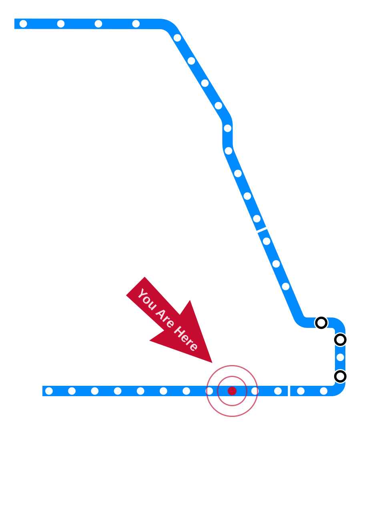
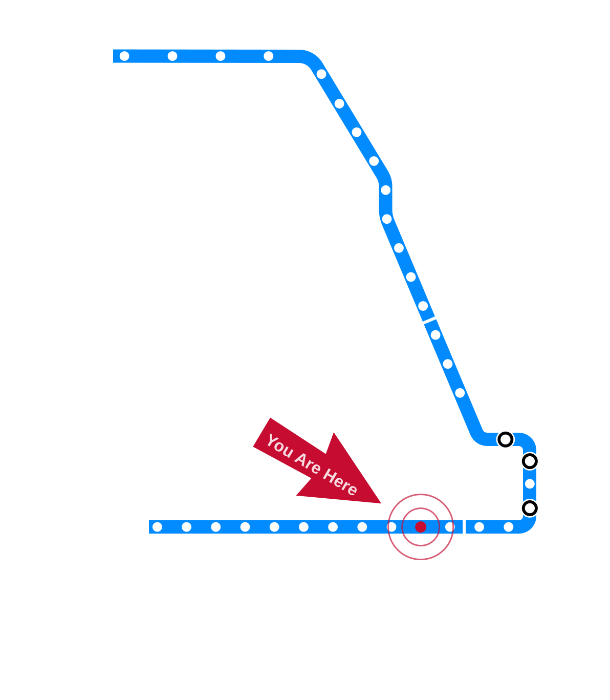

# Introduction to Care Ethics {.title-slide}

<!-- NOTICE: Draft from old-slides/pdf-versions/05 Care Ethics.pdf and 06 Theory Review.pdf. Review and edit before use. -->

CS 377, Week 3, Day 1 🟦 Illinois Medical District 🟦

---

# Introduction to Care Ethics {.title-slide .photo-title data-state="photo-title" background-image="../assets/blue-line-stops-better/stop09-illinois-medical-district-b.jpg" background-size="cover"}

CS 377, Week 3, Day 1 🟦 Illinois Medical District 🟦

<!-- image source: Illinois Medical District station, via exp.com -->

---

## {.photo-only data-state="photo-only" background-image="../assets/blue-line-stops-better/stop09-illinois-medical-district-b.jpg" background-size="cover"}

---

## Agenda for Today

:::: columns
::: {.column width="55%"}
- Administrivia and questions
- Meet our TA!
- Shuffle seats
- Trolley Problems
- Why read a book?
- Mini-lecture: Care ethics
:::

::: {.column width="40%"}

:::
::::

---

## Meet our TA!

---

## Attendance

- What is something you are looking forward to?

---

## 🔀 Seat Shuffle

- TK

---

# Trolley Problems Debrief {.title-slide .section-header}

---

## Table Discussion: Share your trolley problem(s)!

- Describe the dilemma.
- What was your inspiration?
- What would you choose?
- What is a potential name for the dilemma?
- Share definitions of happiness and its opposite (if time)

---

## Student trolley problems

TK

---

## Trolley Breakdown

- What do you think of this dilemma?
- Have you seen or encountered any similar real-world dilemmas?
- Why do you think the trolley imagery has persisted?

<!-- image: street trolley photo, credit Aaron Henkin / WYPR -->
- TODO: add image — *street trolley photo, credit Aaron Henkin / WYPR*

---

# Choosing a Book {.title-slide .section-header}

---

## Brief aside: "Why Read a Book?"

---

## "Why read a book?"

::: {.incremental}
- Reason #1: Feed and follow your curiosity
- Reason #2: Get used to self-directed learning
- Reason #3: Learn from human experts
- Reason #4: Escape in-depth
:::

---

## Table Discussion: Which book will you read?

- Any specific topics you are looking for?
- Any genre you are drawn to? (i.e. biography, essays, memoir,
  non-fiction, sci-fi, etc.)
- Recommendations for others?
- Any concerns about making a selection by Sunday?

---

# Introduction to Care Ethics {.title-slide .section-header}

---

## Mini-lecture: introduction to care ethics

---

## Care {.quote-slide}

> A species of activity that includes everything we do to maintain, contain, and repair our world so we can live in it as well as possible.
>
> — Joan Tronto and Bernice Fischer

::: {.fragment}
our bodies, our selves, our environment
:::

---

## Two psychologists

:::: columns
::: {.column width="48%"}
## Erik Erikson
:::

::: {.column width="48%"}
## Lawrence Kohlberg
:::
::::

<!-- image: portraits of Erikson and Kohlberg -->
- TODO: add image — *portraits of Erikson and Kohlberg*

---

# Kohlberg and Gilligan {.title-slide .section-header}

---

## Kohlberg's stages of moral development

- TK - Heinz dilemma

---

## Common Considerations in the Heinz Dilemma

- "He would be breaking the law"
- "Steal the drug and accept the consequences (prison)"
- "Would this upset his friends and/or his family?"
- "Take the drug and save an innocent life; there should be no
  consequences in a just society"
- Others?

<!-- image: Heinz dilemma illustration via RebelMango on YouTube -->
- TODO: add image — *Heinz dilemma illustration via RebelMango on YouTube*

---

## Kohlberg's stages

::: {.incremental}
- Preconventional stages: external motivations, punishment, obedience,
  self-interest
  - Stage 1: Punishment and Obedience Orientation
    ("It depends on who he knows on the police force.")
  - Stage 2: Instrumental-Relativist Orientation
    ("If his wife is nice and pretty, he should do it.")
- Conventional stages: some internalization, approval of others,
  law and order
  - Stage 3: Good Boy, Nice Girl
    ("He should do it because he loves his wife.")
  - Stage 4: Law and Order Orientation
    ("Saving a human life is more important than protecting property.")
- Postconventional stages
  - Stage 5: Social Contract Orientation
    ("Society has a right to insure its own survival.")
  - Stage 6: Universal Ethical Principles
    ("Human life has supreme inherent value.")
:::

<!-- image: Kohlberg stages pyramid diagram (built up across three slides
     in the original) -->
- TODO: add image — *Kohlberg stages pyramid diagram (built up across three slides
     in the original)*

---

## Gilligan's PhD Advisors

:::: columns
::: {.column width="48%"}
## Erik Erikson
:::

::: {.column width="48%"}
## Lawrence Kohlberg
:::
::::

---

## Table Discussion: the Porcupine and the Moles

- See handout

---

## The Porcupine and the Moles

- Gilligan found that Kohlberg's theory did not explain all responses
  to the Heinz Dilemma
- Some children focused on the fractured relationships
- Similar case for the porcupine and the moles
  - Creative proposals for keeping all parties content

---

## Carol Gilligan

- Received her PhD in psychology in 1964 from Harvard
- Started at UChicago
- Wanted to study draft resistors
  - Richard Nixon changed draft laws in 1973
- Continued focus on children's moral development
- Briefly left academia for dance

<!-- image: photo by Sasha Arutyunova / New York Times / Redux / eyevine -->
- TODO: add image — *photo by Sasha Arutyunova / New York Times / Redux / eyevine*

---

# What Is Care? {.title-slide .section-header}

---

## What is care, exactly?

- A practice, a value, a disposition, or a virtue?

---

## First do no harm {.quote-slide}

> First do no harm. Then do what's best for the patient.
>
> — Samira in *The Pitt* (TV Series), 5:00pm, Season 1

---

## What is care, exactly?

- A practice, a value, a disposition, or a virtue?
- Yes
- Joan Tronto proposed four "elements" of care

::: {.incremental}
1. Attentiveness — noticing others' needs, recognizing vulnerability
2. Responsibility — accepting duty, deciding to act to meet a need
3. Competence — skill/knowledge in delivering care, meeting needs
   successfully
4. Responsiveness — considering the recipient's perspective, adjusting
   if needed
:::

---

## Contributors to Ethics of Care

<!-- image: photo collage of care ethics contributors -->
- TODO: add image — *photo collage of care ethics contributors*

---

## Reminders

- Book selection due Sunday, 11:59pm
- Care ethics reflection due Sunday, 11:59pm
- Next week
  - review ethics theories
  - "Food in your feed" exercise

---

## That's all for today!

See you next class!

---

# Review Theories of Ethics {.title-slide}

CS 377, Week 3, Day 2 🟦 Racine 🟦

---

# Review of Ethical Theories {.title-slide .photo-title data-state="photo-title" background-image="../assets/blue-line-stops-better/stop10-racine-a.jpg" background-size="cover"}

CS 377, Week 3, Day 2 🟦 Racine 🟦

<!-- image source: view of Blue Line station house, circa 1970. Image: CTA via jlkarch.com -->

---

## {.photo-only data-state="photo-only" background-image="../assets/blue-line-stops-better/stop10-racine-a.jpg" background-size="cover"}

---

## Agenda for Today

:::: columns
::: {.column width="55%"}
- Administrivia and questions
- Shuffle seats
- Conclude care ethics
- Book selection check-in
- Review ethical frameworks
- Sample of other ethical theories
:::

::: {.column width="40%"}

:::
::::

---

## Attendance

- On a scale of 0 (exhausted) to 5 (exhilarated), how much energy do you have today?

---

## 🔀 Seat Shuffle

<!-- image: room diagram — tables 1–8, projector screens, door -->
- TODO: add image — *room diagram — tables 1–8, projector screens, door*

---

## Invitation/reminder

Turn off phones, laptops, other distractions

---

# Concluding Care Ethics {.title-slide .section-header}

---

## Concluding Care Ethics

---

## Book Selection

- To receive full credit answer the following six questions in the
  Canvas text box:
  - Which book did you choose?
  - Who wrote the book?
  - How long is the book?
  - How did you learn about the book?
  - What is one thing you want to learn from reading this book?
  - Give two additional reasons why this book seems interesting to you.

---

## Table Discussion: Share your book selection!

- Which book did you choose? Who is the author?
- How did you find it?
- What made you choose it?
- Have you started it? How do you like it so far?

---

# Four Theories of Ethics {.title-slide .section-header}

---

## Four Theories / Approaches to Ethics

:::: columns
::: {.column width="24%"}
## 🏛
Virtue Ethics
:::

::: {.column width="24%"}
## 📖
Deontological
:::

::: {.column width="24%"}
## 📊
Utilitarian
:::

::: {.column width="24%"}
## 💟
Care Ethics
:::
::::

---

## Connect the dots…

- William David Ross contended there are seven duties that determine what is right:

| Duty | Description |
|---|---|
| Fidelity | Keep promises and tell the truth |
| Reparation | Make amends for wrongful acts |
| Gratitude | Return kindness to those who give |
| Non-injury | Do not hurt others |
| Beneficence | Promote the aggregate good |
| Self-improvement | Improve your own condition |
| Justice | Distribute benefits and burdens equitably |

---

## Many flavors of each theory

:::: columns
::: {.column width="48%"}
## 📖 Deontological

- Agent-centered, patient-centered
- Act deontology, rule deontology
- Duty-based, rights-based
- Divine command
- Monistic, pluralistic
- Perfect duties, imperfect duties
:::

::: {.column width="48%"}
## 📊 Utilitarian

- Act utilitarian, rule utilitarian
- Hedonistic, preference, or objectivist
- Maximizing, satisficing, or scalar
- Objective, expectational
- "Negative utilitarianism" (harm reduction)
:::
::::

---

## Many flavors of each theory

:::: columns
::: {.column width="48%"}
## 🏛 Virtue Ethics

- Agent-based (focus on traits)
- Exemplarist (focus on saints or heroes)
- Perfectionistic, target-centered
- Care-based virtue ethics
- Universal, cross-cultural, relativistic
:::

::: {.column width="48%"}
## 💟 Care Ethics

- Psychological or philosophical focus
- Maternal, political, global
- Micro-relational, institutional, structural
- Feminist or generalized
:::
::::

---

## More than Four!

- Communitarianism
  - Common good, social lives
- Responsibility ethics
  - Individual accountability
- The "capability approach"
  - Opportunities for achieving practical values (e.g. health)
- Ubuntu ethics
- Others you know of?
- Other questions?

---

# Media Diary Exercise {.title-slide .section-header}

---

## Food in your Feed (Media Diary)

- Due tomorrow night
- Intended to be enjoyable!
- 20 data points and a few reflective questions
- Submit a PDF or a link to an online document (e.g. Google doc,
  GitHub repository)

<!-- image: food-in-your-feed worksheet preview -->
- TODO: add image — *food-in-your-feed worksheet preview*

---

## That's all for today!

See you next class!

---

# References & Credits {.sources}

1. GitHub source: <https://github.com/jackbandy/ethical-issues-in-computing-uic/blob/main/docs/slides/week3.md>.
2. Day 1 title photo: [Illinois Medical District CTA, view of Rush University Medical Center](https://commons.wikimedia.org/wiki/File:Illinois_Medical_District_CTA_view_of_Rush_University_Medical_Center.jpg) by Zol87, via Wikimedia Commons, CC BY 3.0.
3. Day 2 title photo: [Racine CTA](https://commons.wikimedia.org/wiki/File:Racine_CTA_080216.jpg) by JeremyA, via Wikimedia Commons, CC BY-SA 3.0.
4. Street trolley photo credit Aaron Henkin / WYPR.
5. Kohlberg stages illustration via RebelMango on YouTube.
6. Carol Gilligan photo by Sasha Arutyunova / New York Times / Redux / eyevine.
7. Slide deck built with [Quarto](https://quarto.org/) and Reveal.js.
