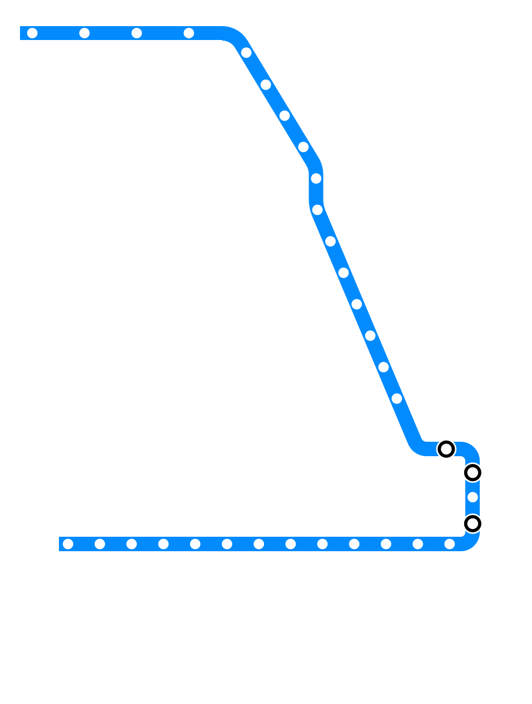
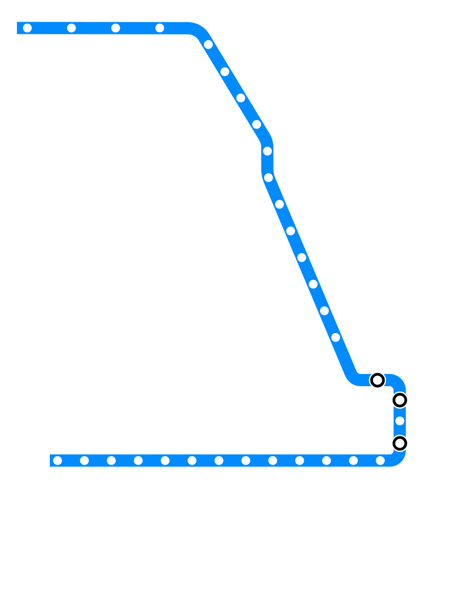

# Draft — Needs Review {.draft-notice}

> ⚠️ Auto-converted from a previous slide format. All content still needs review and editing before use in class.

---

# Content Moderation and Intro to Privacy {.title-slide}

<!-- NOTICE: Draft from old-slides/pdf-versions/07b Moderating Feeds.pdf, 08 Privacy Fundamentals.pdf, and 08 Rights.pdf. Review and edit before use. -->

CS 377 · Week 5, Day 1 · 🟦 Clinton 🟦

---

# Topic Title Placeholder {.title-slide .photo-title data-state="photo-title" background-image="../assets/blue-line-stops/stop12-clinton-a.jpg" background-size="cover"}

CS 377 · Week 5, Day 1 · 🟦 Clinton 🟦

<!-- image source: Clinton station, via Jim Parker on Flickr -->

---

# Administrivia

:::: columns
::: {.column width="55%"}
- Canvas updates and upcoming deadlines
- Questions from last class?
- Reminders
:::

::: {.column width="40%"}

:::
::::

---

# Agenda for Today

:::: columns
::: {.column width="55%"}
- Administrivia / Schedule / Questions
- Shuffle seats
- Notes on Unit 2
- Mini-lecture: content moderation
- Intro to privacy
- Preview short story ("Here and Now")
:::

::: {.column width="40%"}

:::
::::

---

# Notes on Unit 2

<!-- image: Unit 2 overview / structure slide -->
- TODO: add image — *Unit 2 overview / structure slide*

---

# Clinton Connection

<!-- image: Clinton station connection photo 1 -->
- TODO: add image — *Clinton station connection photo 1*

---

# Clinton Connection

<!-- image: Clinton station connection photo 2 -->
- TODO: add image — *Clinton station connection photo 2*

---

# Clinton Connection

<!-- image: Clinton station connection photo 3 -->
- TODO: add image — *Clinton station connection photo 3*

---

# Clinton Connection

<!-- image: Clinton station connection photo 4 -->
- TODO: add image — *Clinton station connection photo 4*

---

# 🔀 Seat Shuffle

<!-- image: room diagram — lectern "0", tables 1–8, projector screens, door -->
- TODO: add image — *room diagram — lectern "0", tables 1–8, projector screens, door*

---

# Table Discussion: Book Check-in

- How is your book coming along?
- How much have you read?
- What have you learned so far?
- How long do you think it will take to complete?
- What's your plan to read the rest?
- Presentation ideas?

---

# Mini-lecture: Content Moderation

---

# Generic Feed System Architecture (Recap)

::: {.incremental}
1. **Moderation** — remove policy-violating items
2. **Candidate generation** — select high-potential items
3. **Ranking** — score candidates for this user and context
4. **Re-ranking** — apply ancillary goals
:::

<!-- image: pipeline diagram (Georgetown/KGI, March 2025) -->
- TODO: add image — *pipeline diagram (Georgetown/KGI, March 2025)*

---

# Free Speech

<!-- image: First Amendment text -->
- TODO: add image — *First Amendment text*

---

# Free Speech

- **First Amendment:** "Congress shall make no law…abridging the freedom of speech, or of the press"
- **Section 230 (Communications Decency Act):** "It is the policy of the United States… to encourage the development of technologies which maximize user control over what information is received by individuals…who use the Internet…"

---

# What Is Content Moderation?

<!-- image: content moderation framing diagram -->
- TODO: add image — *content moderation framing diagram*

---

# What Is Content Moderation? {.quote-slide}

> "Moderation is, in many ways, the commodity that platforms offer."
>
> — Tarleton Gillespie, *Custodians of the Internet*

---

# Platform Moderation at Scale

:::: columns
::: {.column width="48%"}
**Meta** (~Facebook + Instagram)

- ~15,000 content moderators (per NYT)
- ~1 per 330,000 active users
- ~40,000 workers in trust and safety (2024 hearing)
:::

::: {.column width="48%"}
**TikTok**

- Claims 40,000 workers in global trust and safety
- Focus on "minor safety"
- ~81% automated deletions

**YouTube**

- Estimated 7,000–10,000 moderators
- 9.5 million videos removed in Q4 2024
- 842.8 million comments removed ("spam, scams, misleading content")
:::
::::

---

# Moderation Labor at OpenAI

- Moderators label and filter toxic and/or explicit text for model training
- Violence, hate speech, explicit material
- Larger projects in 2021–2022

<!-- image: reporting on OpenAI content moderation labor -->
- TODO: add image — *reporting on OpenAI content moderation labor*

---

# Marginal Content at Twitter

<!-- image: Twitter internal moderation documentation example -->
- TODO: add image — *Twitter internal moderation documentation example*

---

# Example: "The Terror of War" (1972)

<!-- image: Kim Phúc photo by Nick Ut — note: this contains graphic war violence and is a famous content moderation test case -->
- TODO: add image — *Kim Phúc photo by Nick Ut — note: this contains graphic war violence and is a famous content moderation test case*

---

# Example: The Terror of War {.quote-slide}

> "Napalm is very powerful, but faith, forgiveness, and love are much more powerful.
> We would not have war at all if everyone could learn how to live with true love,
> hope, and forgiveness."
>
> — Kim Phúc, NPR interview (2008)

::: {.fragment}
> "The only thing more powerful than hate is love."
>
> — Benito Antonio Martínez Ocasio (Bad Bunny)
:::

---

# Example: "Credible Violence"

<!-- image: excerpt from Facebook's internal rulebook (The Guardian, 2017) showing the "credible violence" policy category -->
- TODO: add image — *excerpt from Facebook's internal rulebook (The Guardian, 2017) showing the "credible violence" policy category*

*Source: Nick Hopkins, "Facebook's internal rulebook on sex, terrorism and violence," The Guardian (2017)*

---

# Ethical Questions in Content Moderation

:::: columns
::: {.column width="48%"}
**Design questions**

- Who writes the rules?
- How are edge cases handled?
- What appeals processes exist?
- Who decides what is "newsworthy"?
:::

::: {.column width="48%"}
**Outcome questions**

- Who bears the burden of moderation labor?
- Which communities are most affected by errors?
- What is the cost of over- vs. under-moderation?
- Whose speech is protected? Whose is suppressed?
:::
::::

---

# Thoughts or Questions on Algorithmic Feeds?

---

# Intro to Privacy

---

# Table Discussion: What Is Privacy?

- What comes to mind when you think of privacy?
- What are some examples of privacy controls?
- What are examples of privacy violations?
- Can you propose a definition of privacy?

---

# Defining Privacy

- Often conceptualized as a **right**
- Often associated with protection, security, safety
- In celebrity / paparazzi context: "the right to be left alone"
- Framework we will explore: **contextual integrity**
  - "Appropriate flows of information"
  - Subject, sender, and receiver

---

# Contextual Integrity Preview

<!-- image: contextual integrity diagram (subject, sender, receiver, data category, transmission principles) -->
- TODO: add image — *contextual integrity diagram (subject, sender, receiver, data category, transmission principles)*

---

# Short Story Preview: "Here and Now"

- Written by Ken Liu
- Main character is Aaron
- Centers around an app that facilitates anonymous requests for "information" of any kind
- Made by Centillion, Inc.
- Web link in GitHub; PDF in Canvas
- **Read before next Monday**

---

# That's all for today! See you Wednesday!

---

# Privacy as Contextual Integrity {.title-slide}

CS 377 · Week 5, Day 2 · 🟦 LaSalle 🟦

---

# Topic Title Placeholder {.title-slide .photo-title data-state="photo-title" background-image="../assets/blue-line-stops/stop13-lasalle-a.jpg" background-size="cover"}

CS 377 · Week 5, Day 2 · 🟦 LaSalle 🟦

<!-- image source: LaSalle station, photo by Cragin Spring -->

---

# Administrivia

:::: columns
::: {.column width="55%"}
- Canvas updates and upcoming deadlines
- Read "Here and Now" — complete discussion by Sunday at 11:59pm
- Reminders
:::

::: {.column width="40%"}

:::
::::

---

# Agenda for Today

:::: columns
::: {.column width="55%"}
- Shuffle seats
- Preview "online account biopsy" exercise
- Mini-lecture: contextual integrity
- Privacy policy demo
- Privacy policy exercise
- Digital rights and proposed laws
:::

::: {.column width="40%"}

:::
::::

---

# 🔀 Seat Shuffle

<!-- image: room diagram — lectern "0", tables 1–8, projector screens, door -->
- TODO: add image — *room diagram — lectern "0", tables 1–8, projector screens, door*

---

# Online Account Biopsy

- Introduce yourselves at your table
- Discuss which app or website you want to use
- Find the "request my data" option in the app
- This will be used for your "online account biopsy" exercise
- Should only take ~5 minutes

---

# Mini-lecture: Privacy as Contextual Integrity

---

# Perspectives on Privacy

- **Control over information** — analogous to property rights, managing "data boundaries"
- **Adherence to rules** (contextual norms)
- Something else?

---

# Contextual Integrity

- Privacy as **appropriate data flows**
- Beyond binary (e.g. public/private)
- Appropriateness depends on **specific contexts**
- Contexts are governed by **norms** (also called expectations)
- Theorized by **Helen Nissenbaum**
  - University of the Witwatersrand → M.A. and PhD from Stanford
  - Privacy = appropriate flows; appropriateness depends on context; contexts are governed by norms

---

# Contextual Integrity: The Five-Tuple Model

<!-- image: contextual integrity improved figure (Nathan Malkin) -->
- TODO: add image — *contextual integrity improved figure (Nathan Malkin)*

- **(subject, sender, recipient, information type, transmission principle)**

| Element | Description |
|---|---|
| Subject | The individual the information is about |
| Sender | Person/entity sending the information |
| Recipient | Person/entity receiving the information |
| Type | Category of information |
| Principle | Conditions or constraints for sharing |

*From Nathan Malkin, "Contextual Integrity, Explained: A More Usable Privacy Definition"*

---

# Data Types

Information about a data subject can be varied:

- Health information
- Biometric data
- Relationships
- Location history
- Employment history
- Financial / purchasing history
- Espoused viewpoints

---

# Common Transmission Principles

- Existence of a warrant / court order
- Consent of the subject (or parent/guardian if minor)
- Reciprocity
- Authority / legal entitlement
- Chatham House rule
- Mandatory disclosure
- Confidentiality
- Commercial benefit

---

# Example: Student Grades (1)

Dr. Bandy is offered $100 from a marketing corporation seeking email addresses and grades from all students in CS 377.

- Sender? Recipient? Subject? Data type? Principle? Purpose?

---

# Example: Student Grades (2)

Dr. Bandy is approached by the chair of the CS department, who requests recent grades for CS 377.

- Sender? Recipient? Subject? Data type? Principle? Purpose?

---

# Example: Job Interviews

In job interviews, interviewers are not allowed to ask candidates about their religious practices.

- Sender? Recipient? Subject? Data type? Principle? Purpose?

---

# Example: Raine v. OpenAI

- Ongoing lawsuit (filed August 2025) by parents of Adam Raine
- OpenAI: *"We are currently not referring self-harm cases to law enforcement to respect people's privacy given the uniquely private nature of ChatGPT interactions"*
- Chat logs later shared by family
- Transmission principles at issue: parental/guardian consent, legal compulsion, "greater good"

---

# Group Exercise: Privacy Policies

- See handout — choose a company:
  - YouTube, Snapchat, TikTok, Anthropic, Amazon, Instagram, Google, Reddit, Facebook, LinkedIn, Apple, others
- Analyze their privacy policy using contextual integrity
- You can leave once you turn in your completed sheet

---

# ChatGPT / OpenAI Policy: What's Collected

- Name, contact information, date of birth
- Prompts, files, images
- Contact data (if shared)
- Log data (via direct input, third-party data, inference)

---

# ChatGPT / OpenAI Policy: Third Parties

- "trusted security and safety partners"
- "advertisers and other data partners" (e.g. info about purchases from advertisers)
- "To assist in meeting business operations needs"

---

# ChatGPT / OpenAI Policy: Location Data

- "General area" based on IP address
- More precise GPS info for other services
- Purposes: "protect your account by detecting unusual login activity" and "to provide more accurate responses"

---

# ChatGPT / OpenAI Policy: Retention

- Temporary chats automatically deleted within 30 days
- Other info retained until deletion
- *"In some cases, we need to retain Personal Data for longer even after you delete it, for example because we are legally required to, to address fraud and abuse, for security reasons, or for financial record-keeping purposes"*

---

# ChatGPT / OpenAI Policy: Length

- About 3,000 words; 5–6 pages
- Seems to have stayed about the same length over time

---

# Warm-up Discussion: What Are Rights?

- What comes to mind when you hear the word "rights"?
- What are some examples of rights you have?
- What are some rights you want to have, but are unsure whether you have?
- What are some examples of "human rights"?
- Where do these rights come from?
- What is a privilege compared to a right?

---

# Eleanor Roosevelt and the UDHR

<!-- image: Eleanor Roosevelt holding the English language version of the Universal Declaration of Human Rights, November 1949 -->
- TODO: add image — *Eleanor Roosevelt holding the English language version of the Universal Declaration of Human Rights, November 1949*

---

# Eleanor Roosevelt on the UDHR {.quote-slide}

> "It is not a treaty; it is not an international agreement. It is not and does not purport
> to be a statement of law or of legal obligation. It is a declaration of basic principles
> of human rights and freedoms, to be stamped with the approval of the General Assembly
> by formal vote of its members, and to serve as a common standard of achievement for
> all peoples of all nations."
>
> — Eleanor Roosevelt

---

# From 1949 to 2022

<!-- image: UDHR 1949 → AI Bill of Rights 2022 comparison -->
- TODO: add image — *UDHR 1949 → AI Bill of Rights 2022 comparison*

---

# Blueprint for an "AI Bill of Rights"

- Office of Science and Technology Policy (2022)
- "Intended to support the development of policies and practices that protect civil rights and promote democratic values in the building, deployment, and governance of automated systems"

---

# Activity: Proposed Digital Rights

Review each proposed right — strengths? Weaknesses? Examples where it would come into play?

::: {.incremental}
- A: "You should be protected from unsafe or ineffective systems."
- B: "You should not face discrimination by algorithms and systems should be used and designed in an equitable way."
- C: "You should be protected from abusive data practices via built-in protections and you should have agency over how data about you is used."
- D: "You should know that an automated system is being used and understand how and why it contributes to outcomes that impact you."
- E: "You should be able to opt out, where appropriate, and have access to a person who can quickly consider and remedy problems you encounter."
- F: "You should have the ability to request deletion of your personal data and digital traces from automated systems and databases."
- G: "You should have the right to repair, modify, and maintain automated systems that you own or that significantly impact your daily life."
:::

---

# That's all for today!

See you next week!

---

# References & Credits {.sources}

1. Tarleton Gillespie, [*Custodians of the Internet*](https://tarletongillespie.org/Gillespie_CUSTODIANS_print.pdf) (2018).
2. Tarleton Gillespie, ["Content Moderation, AI, and the Question of Scale"](https://doi.org/10.1177/2053951720943234), *Big Data & Society* (2020).
3. Nick Hopkins, ["Facebook's internal rulebook on sex, terrorism and violence"](https://www.theguardian.com/news/2017/may/21/revealed-facebook-internal-rulebook-sex-terrorism-violence), *The Guardian* (2017).
4. Nathan Malkin, ["Contextual Integrity, Explained"](https://doi.org/10.1109/MSEC.2022.3201585), *IEEE Security & Privacy* (2022).
5. White House OSTP, [Blueprint for an AI Bill of Rights](https://www.whitehouse.gov/ostp/ai-bill-of-rights/) (2022).
6. Schaffner et al., ["Community Guidelines Make this the Best Party on the Internet"](https://doi.org/10.1145/3613904.3642333), *CHI 2024*.
7. Eleanor Roosevelt with UDHR photo, 1949, via Wikimedia Commons.
8. Slide deck built with [Quarto](https://quarto.org/) and Reveal.js.
