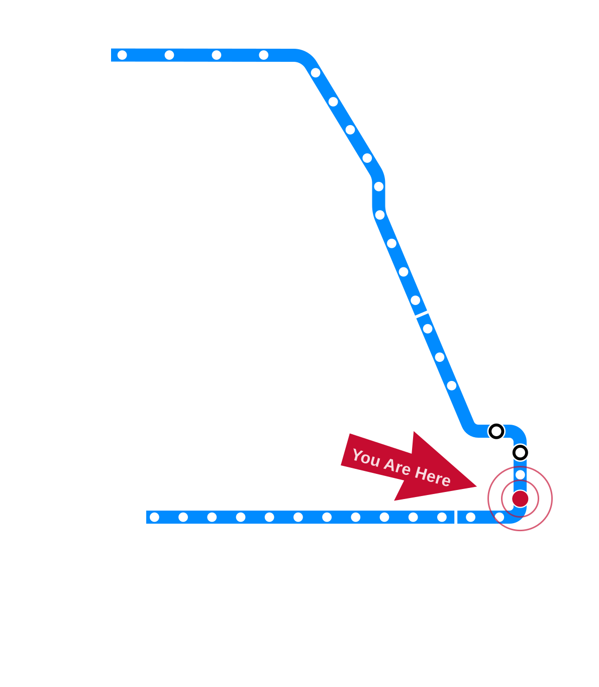

# Draft — Needs Review {.draft-notice}

> ⚠️ Auto-converted from a previous slide format. All content still needs review and editing before use in class.

---

# Privacy, Continued {.title-slide}

<!-- NOTICE: Draft from old-slides/pdf-versions/09 Here and Now.pdf, 11 Privacy in Data.pdf, and 12 Privacy and Power.pdf. Review and edit before use. -->

CS 377, Week 6, Day 1 🟦 Jackson 🟦

---

# Topic Title Placeholder {.title-slide .photo-title data-state="photo-title" background-image="../assets/blue-line-stops-better/stop14-jackson-c.jpg" background-size="cover"}

CS 377, Week 6, Day 1 🟦 Jackson 🟦

---

## {.photo-only data-state="photo-only" background-image="../assets/blue-line-stops-better/stop14-jackson-c.jpg" background-size="cover"}

---

## Administrivia

:::: columns
::: {.column width="55%"}
- Asynchronous class Wednesday
- Food in your Feed — some reflections still missing
- Canvas updates and upcoming deadlines
:::

::: {.column width="40%"}

:::
::::

---

## Agenda for Today

:::: columns
::: {.column width="55%"}
- Upcoming due dates
- Why short stories?
- Discuss "Here and Now"
- Preview "Message in a Bottle"
:::

::: {.column width="40%"}

:::
::::

---

## Invitation

Turn off phones, laptops, other distractions

---

## Upcoming Exercises

:::: columns
::: {.column width="48%"}
**Account Biopsy** (due Friday, 11:59pm)

- Use the data you requested last week (best if csv / json)
- Plan some questions and plots
- (Instructor used Python, pandas, seaborn, and Claude Code)
- Turn in your top findings and a brief meta-reflection
:::

::: {.column width="48%"}
**Scrap Doll** (due Friday, 11:59pm)

- What is captured by the trace data from the "biopsy?"
- Create that essence in the form of a physical doll
- Materials: yarn, tape, tin foil, bags, wire, cardboard, etc.
- Turn in a picture of it
- Bring it to class on Monday (if you can)!
:::
::::

---

# The Account Biopsy and the Doll {.title-slide .section-header}

---

## Account Biopsy: Example Analyses

<!-- image: example student account biopsy analyses (anonymized) — placeholder for instructor to add -->
- TODO: add image — *example student account biopsy analyses (anonymized) — placeholder for instructor to add*

---

## The Doll: A Conceptual Model

<!-- image: Generic Model → Early Model → Detailed Model progression -->
- TODO: add image — *Generic Model → Early Model → Detailed Model progression*

---

## What Goes Into the Doll?

- **Generic model** — demographic info, account type
- **Early model** — posting patterns, topics
- **Detailed / fine-tuned model** — specific behaviors, preferences, relationships

<!-- image: doll examples via krokotak.com, etsy, pinterest -->
- TODO: add image — *doll examples via krokotak.com, etsy, pinterest*

---

## Doll Examples

<!-- image: mamapapabubba.com doll example -->
- TODO: add image — *mamapapabubba.com doll example*

---

## Doll Examples from Class

<!-- image: examples from prior semesters (GitHub) -->
- TODO: add image — *examples from prior semesters (GitHub)*

---

# Why Short Stories? {.title-slide .section-header}

---

## Mini-lecture: Why Short Stories?

---

## Why Short Stories?

::: {.incremental}
- **Defamiliarization** — detach from preconceptions, expose your assumptions
- **Address recognizable human situations and problems** — explore them in terms of unfamiliar settings or technology
- **Normative + descriptive analysis** — both "is it right?" and "who is affected?"
- **It can be fun!**
:::

*Burton, Goldsmith, & Mattei (2018). "How to teach computer ethics through science fiction." CACM.*

---

## Some Examples of Sci-Fi Ethics Cases

<!-- image: examples of sci-fi/ethics short stories and novels used in ethics courses -->
- TODO: add image — *examples of sci-fi/ethics short stories and novels used in ethics courses*

---

## Normative and Descriptive Ethics

:::: columns
::: {.column width="48%"}
## Normative

- Is it right?
- Is it wrong?
- What should be done?
- "Is this unethical?"
:::

::: {.column width="48%"}
## Descriptive

- Who is involved?
- Who is making the decision(s)?
- What are the stakes?
- What are the options?
- What are the potential outcomes?
- What decisions led to this situation?
:::
::::

---

# "Here and Now" {.title-slide .section-header}

---

## "Here and Now"

---

## Table Questions: Characters in "Here and Now"

- What do we know about Aaron?
  - What does he enjoy? How do you know?
  - What does he want? What are his goals?
  - What are his relationships?
- How are Lucas and Aaron similar? Different?
- What other characters did you notice?

---

## Table Questions: The App in "Here and Now"

- Would you use Tilly Here-and-Now? Explain.
- Which use cases seemed comfortable or innocuous?
- Which use cases made you feel uncomfortable?
- What do you think of Centillion?

---

## Connecting "Here and Now" to Privacy

- What data does Centillion collect about users?
- Apply contextual integrity: sender, recipient, subject, data type, transmission principle
- Is this an appropriate information flow within the social context?

---

## Preview: "Message in a Bottle"

- Written by Nalo Hopkinson
- Central character is Greg
- Addresses challenges of utilitarian ethics
- Longer than the first story!
- Read by Sunday — complete reflection before Monday's class

---

## No Class Meeting Wednesday!

Dr. Bandy is in St. Louis for [SIGCSE 2026](https://sigcse2026.sigcse.org).

Three things due soon — see Canvas for details!

---

## That's all for today!

See you next week!

---

# Asynchronous Class {.title-slide}

CS 377, Week 6, Day 2 🟦 Monroe 🟦

---

# Topic Title Placeholder {.title-slide .photo-title data-state="photo-title" background-image="../assets/blue-line-stops/stop15-monroe-a.jpg" background-size="cover"}

CS 377, Week 6, Day 2 🟦 Monroe 🟦

---

## {.photo-only data-state="photo-only" background-image="../assets/blue-line-stops/stop15-monroe-a.jpg" background-size="cover"}

---

## No In-Person Class Today

Dr. Bandy is at [SIGCSE 2026](https://sigcse2026.sigcse.org) in St. Louis.

Complete the asynchronous work in Canvas by the due date.

---

# De-Anonymization {.title-slide .section-header}

---

## Privacy in Data (Async Content)

The following slides are provided as a reference for the asynchronous content on privacy in data analysis. We will return to k-anonymity and de-anonymization in a future class.

---

## Latanya Sweeney

- Faculty at Harvard; PhD from MIT (2001)
- Public Interest Tech Lab; Data Privacy Lab
- Known for:
  - K-anonymity
  - De-anonymization research
  - Algorithmic bias research

---

## De-Anonymization: Census Data (1997) {.quote-slide}

> "For twenty dollars I purchased the voter registration list for
> Cambridge Massachusetts and received the information on two diskettes."
>
> — Latanya Sweeney (2000)

---

## De-Anonymization: Hospital Data {.quote-slide}

> "Most states (44 of 50 or 88%) collect hospital discharge data.
> Many of these states have subsequently distributed copies of these
> data to researchers, sold copies to industry and made versions
> publicly available."
>
> — Latanya Sweeney (2000)

---

## The Re-Identification Problem {.quote-slide}

> "The greater the number and detail of attributes reported about an entity,
> the more likely that those attributes combine uniquely to identify the entity."
>
> — Latanya Sweeney (2000)

---

## De-Anonymization Demo

Try it yourself: [aboutmyinfo.org/identity](https://aboutmyinfo.org/identity)

---

# K-Anonymity {.title-slide .section-header}

---

## K-Anonymity Demo

**Full dataset:**

| Name | Age | Team | Stop |
|---|---|---|---|
| Alice | 24 | Team Jeremiah | Grand |
| Bob | 28 | Team Conrad | Chicago |
| Carol | 27 | Team Conrad | Division |
| Dave | 24 | Team Jeremiah | Damen |
| Erin | 29 | Team Conrad | Western |

---

## K-Anonymity Demo: Names Suppressed

| Name | Age | Team | Stop |
|---|---|---|---|
| * | 24 | Team Jeremiah | Grand |
| * | 28 | Team Conrad | Chicago |
| * | 27 | Team Conrad | Division |
| * | 24 | Team Jeremiah | Damen |
| * | 29 | Team Conrad | Western |

---

## K-Anonymity Demo: Ages Generalized

| Name | Age | Team | Stop |
|---|---|---|---|
| * | 20 < Age ≤ 30 | Team Jeremiah | Grand |
| * | 20 < Age ≤ 30 | Team Conrad | Chicago |
| * | 20 < Age ≤ 30 | Team Conrad | Division |
| * | 20 < Age ≤ 30 | Team Jeremiah | Damen |
| * | 20 < Age ≤ 30 | Team Conrad | Western |

---

## K-Anonymity Demo: Stops Suppressed

| Name | Age | Team | Stop |
|---|---|---|---|
| * | 20 < Age ≤ 30 | Team Jeremiah | * |
| * | 20 < Age ≤ 30 | Team Conrad | * |
| * | 20 < Age ≤ 30 | Team Conrad | * |
| * | 20 < Age ≤ 30 | Team Jeremiah | * |
| * | 20 < Age ≤ 30 | Team Conrad | * |

This data has **2-anonymity** with respect to Age, Team: for any combination of these attributes found in any row, there are always at least 2 rows with those exact attributes.

---

## K-Anonymity Limitations

- Limited to one dataset (can still be linked to other records)
- All values are potentially identifying with "auxiliary" data
- Inferences just from knowing someone is in the dataset
  - e.g. "He has cancer, a heart disease, or viral infection"
- More formal attacks with background knowledge

---

# The Netflix Prize {.title-slide .section-header}

---

## Arvind Narayanan

- Directs "Center for Information Technology Policy" (Princeton)
- Degrees from Indian Institute of Technology Madras (2004)
- PhD from UT-Austin (2009)
- Significant contributions: algorithmic fairness, de-anonymization, cryptography

---

## Netflix Prize De-Anonymization

Netflix released a dataset of ~500,000 users and 100 million ratings (with names replaced by user IDs) for a $1M prize competition.

<!-- image: Netflix prize dataset sample with movie ratings and dates -->
- TODO: add image — *Netflix prize dataset sample with movie ratings and dates*

---

## Was the Netflix Dataset Anonymous? {.quote-slide}

Ratings for popular movies are less informative (e.g. top 10 most-rated: *Dark Knight, Fight Club, Godfather, Forrest Gump, The Matrix*…)

Ratings for **obscure** movies can de-identify:

- Movie-watching sequences become increasingly unique
- With only 8 movie ratings (even 2 possibly wrong) and dates (up to 2 weeks off), you can uniquely identify 99% of records

---

## Takeaways: Anonymous Datasets

- Anonymous datasets still have risks
- Can be combined with already-identified data (e.g. IMDb)
- Apply contextual integrity: subject, sender, recipient, type, transmission principle?

---

# References & Credits {.sources}

1. GitHub source: <https://github.com/jackbandy/ethical-issues-in-computing-uic/blob/main/docs/slides/week6.md>.
2. Day 1 title photo: [Stairs to Red Line at Jackson](https://commons.wikimedia.org/wiki/File:Stairs_to_Red_Line_at_Jackson.jpg) by Jacob G., via Wikimedia Commons, CC BY-SA 2.0.
3. Latanya Sweeney, ["Simple Demographics Often Identify People Uniquely"](https://dataprivacylab.org/projects/identifiability/paper1.pdf), Carnegie Mellon University (2000).
4. Arvind Narayanan and Vitaly Shmatikov, ["Robust De-anonymization of Large Sparse Datasets"](https://www.cs.utexas.edu/~shmat/shmat_oak08netflix.pdf), *IEEE S&P* (2008).
5. Burton, Goldsmith, & Mattei (2018). ["How to teach computer ethics through science fiction."](https://doi.org/10.1145/3230977) *CACM.*
6. De-anonymization demo: [aboutmyinfo.org/identity](https://aboutmyinfo.org/identity).
7. Slide deck built with [Quarto](https://quarto.org/) and Reveal.js.
