# Draft — Needs Review {.draft-notice}

> ⚠️ Auto-converted from a previous slide format. All content still needs review and editing before use in class.

---

# Inequality, Justice, and Faces {.title-slide}

<!-- NOTICE: Draft from old-slides/pdf-versions/09 Faces.pdf, 11 Faces.pdf, and 14 Digital Divide.pdf. Review and edit before use. -->

CS 377, Week 7, Day 1 🟦 Clark/Lake 🟦

---

# Inequality, Justice, and Faces {.title-slide .photo-title data-state="photo-title" background-image="../assets/blue-line-stops-better/stop17-clark-lake-c.jpg" background-size="cover"}

CS 377, Week 7, Day 1 🟦 Clark/Lake 🟦

---

## {.photo-only data-state="photo-only" background-image="../assets/blue-line-stops-better/stop17-clark-lake-c.jpg" background-size="cover"}

---

## Administrivia

:::: columns
::: {.column width="55%"}
- **Asynchronous class.** Dr. Bandy away.
- Keep reading your book!
- Canvas updates and upcoming deadlines
- Questions?
:::

::: {.column width="40%"}

:::
::::

---

## Agenda for Today

:::: columns
::: {.column width="55%"}
- Group exercise: midpoint check-in
- Scrap doll debrief
- Connecting some dots (ethical theories)
- Mini-lecture: ethical issues in facial recognition
- Gender Shades study
- Evaluating systems
- Preview "Codename Delphi"
:::

::: {.column width="40%"}
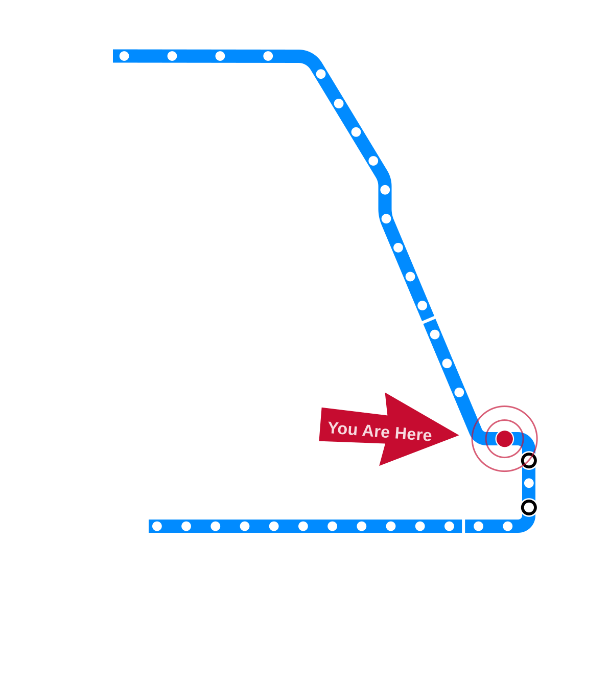
:::
::::

---

# Midpoint Check-in {.title-slide .section-header}

---

## Midpoint Check-in

---

## Table Activity: Midpoint Check-in

- Front page: where we're at
- Back page: "I like / I wish" → complete as individuals, then share as "We like / We wish"
- ~10 minutes

---

## Table Discussion: Scrap Doll Debrief

- How did you make the scrap doll? What were the materials?
- What connections did you make between data and doll?
- When was the last time you made / worked on a craft?
- Ideas for changes to this exercise?

<!-- image: example dolls from prior semesters (with permission) -->
- TODO: add image — *example dolls from prior semesters (with permission)*

---

## Connecting Some Dots

:::: columns
::: {.column width="24%"}
## 🏛
Virtue Ethics
:::

::: {.column width="24%"}
## 📖
Deontological
:::

::: {.column width="24%"}
## 📊
Utilitarian
:::

::: {.column width="24%"}
## 💟
Care Ethics
:::
::::

---

# Facial Recognition {.title-slide .section-header}

---

## Mini-lecture: Ethical Issues in Facial Recognition

---

## iClicker Check-in

"Facial recognition systems pose significant ethical issues."

- Strong disagree / Disagree / Not sure / Agree / Strong agree

---

## Facial Recognition in (Somewhat) Recent News

$**???** — Amount Facebook paid to each user after breaking the Illinois Biometric Information Privacy Act (BIPA): collecting and storing biometric data without obtaining proper consent

::: {.fragment}
$**397** per user
:::

---

## Background on Facial Recognition

---

## Categories of Tasks

::: {.incremental}
- **Detection** — is there a face in the image?
- **Classification** — what kind of face is shown in the image?
- **Identification** — whose face is shown in the image?
:::

---

## Is there a face in the image?

<!-- image: face detection examples -->
- TODO: add image — *face detection examples*

---

## What kind of face is shown in the image?

<!-- image: face classification examples (e.g. age/gender estimation) -->
- TODO: add image — *face classification examples (e.g. age/gender estimation)*

---

## Whose face is shown in the image?

<!-- image: face identification examples -->
- TODO: add image — *face identification examples*

---

## Figure from MIT Media Lab

<!-- image: Figure from MIT Media Lab showing facial recognition task types -->
- TODO: add image — *Figure from MIT Media Lab showing facial recognition task types*

---

## Example: Cameras at the UIC-Halsted Station

<!-- image: camera installation at UIC-Halsted -->
- TODO: add image — *camera installation at UIC-Halsted*

---

## Example: Market at Halsted, "Just Walk Out"

<!-- image: Amazon "Just Walk Out" technology at Market at Halsted -->
- TODO: add image — *Amazon "Just Walk Out" technology at Market at Halsted*

---

## Small Group Discussion

- Where have you seen facial recognition used?
- Which task(s) do you think it was performing, and why?
  - Is there a face in the image? (detection)
  - What are the attributes of the face shown? (classification)
  - Whose face is shown? (identification)
- What could go wrong?

---

## Where Have You Seen Facial Recognition?

Examples from a 2020 Algorithmic Justice League report:

- **Banks** — transaction security
- **Events** — concert ticket verification
- **Housing** — ring doorbells
- **Police** — searching mugshot databases
- **Schools** — attendance tracking
- **Stores** — payments, market research
- **Workplaces** — interviews

---

# Gender Shades {.title-slide .section-header}

---

## Gender Shades

- Joy Buolamwini's master's project at the MIT Media Lab
- The project began when a Halloween party mask was detected as a face, but her own face was not
- 2023 book: *Unmasking AI*

<!-- image: Joy Buolamwini / MIT Media Lab photo -->
- TODO: add image — *Joy Buolamwini / MIT Media Lab photo*

---

## Gender Shades Dataset {.figure-slide}

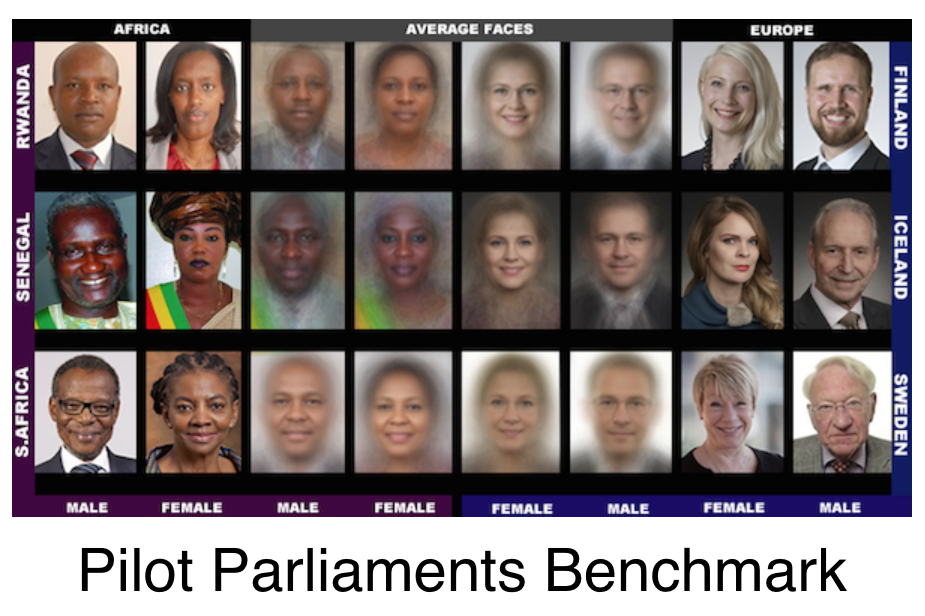

::: {.figure-caption}
Sample images and average faces from the Pilot Parliaments Benchmark. Joy Buolamwini, MIT Media Lab, [gendershades.org](http://gendershades.org) (CC BY)
:::

---

## Overall Accuracy {.figure-slide}

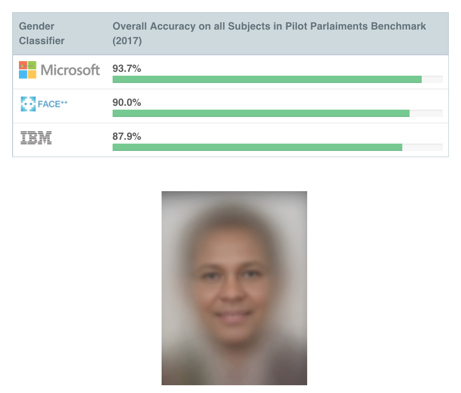

::: {.figure-caption}
Overall accuracy on all subjects in the Pilot Parliaments Benchmark (2017). Joy Buolamwini, MIT Media Lab, [gendershades.org](http://gendershades.org) (CC BY-NC-ND)
:::

---

## Accuracy by Gender {.figure-slide}

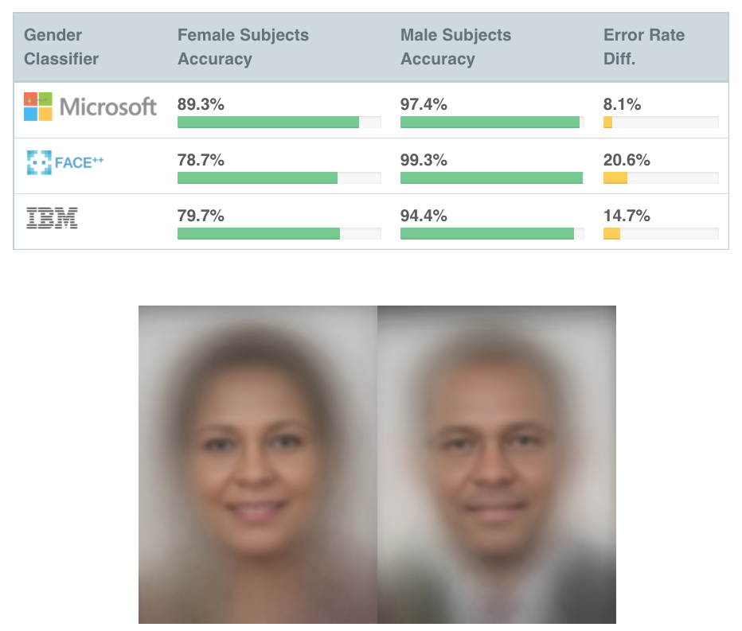

::: {.figure-caption}
Accuracy for female vs. male subjects. Joy Buolamwini, MIT Media Lab, [gendershades.org](http://gendershades.org) (CC BY-NC-ND)
:::

---

## Accuracy by Skin Tone {.figure-slide}

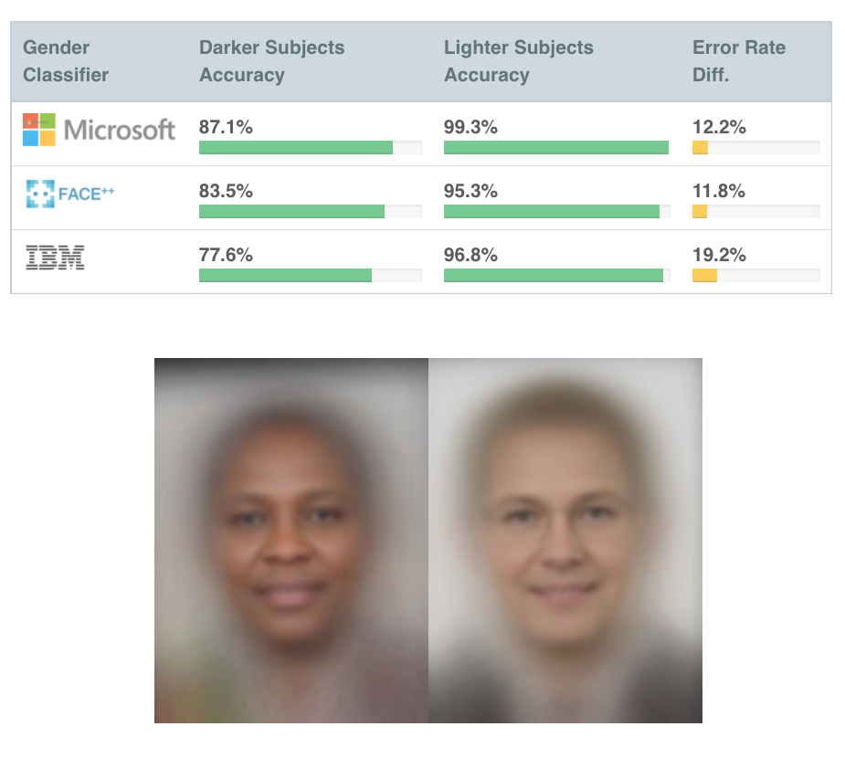

::: {.figure-caption}
Accuracy for darker vs. lighter subjects. Joy Buolamwini, MIT Media Lab, [gendershades.org](http://gendershades.org) (CC BY-NC-ND)
:::

---

## Intersectional Accuracy Rates {.figure-slide}

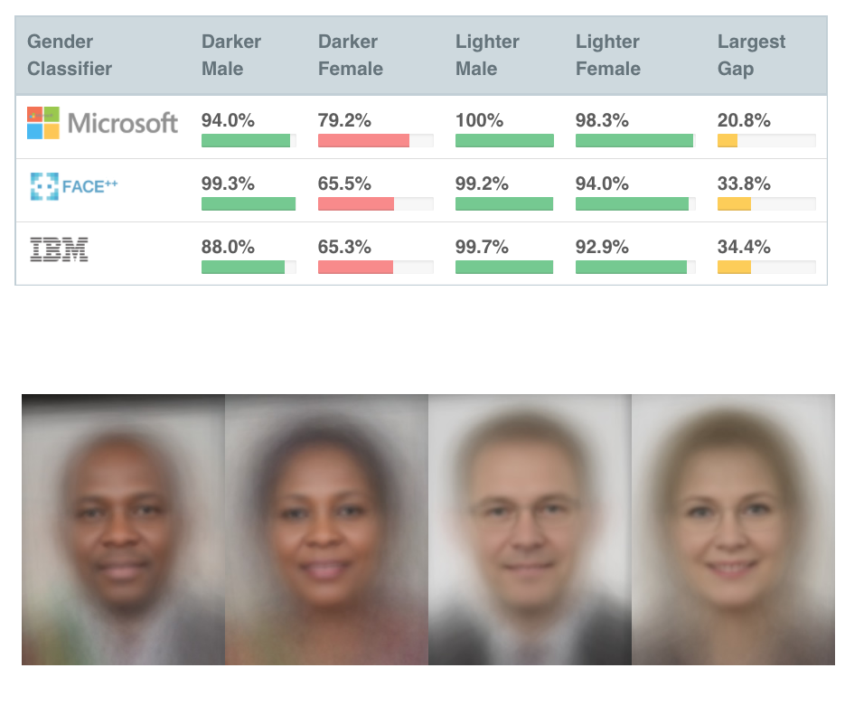

::: {.figure-caption}
Accuracy broken out by skin tone *and* gender — the largest gap reaches 34.4%. Joy Buolamwini, MIT Media Lab, [gendershades.org](http://gendershades.org) (CC BY-NC-ND)
:::

---

## Where IBM's Errors Came From {.figure-slide}

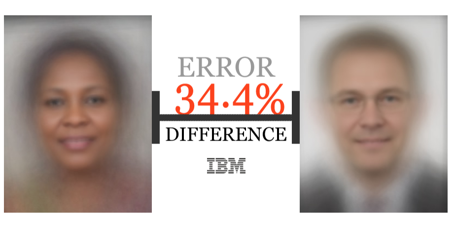

::: {.figure-caption}
The difference in error rates is greatest between darker-skinned female faces and lighter-skinned male faces in the IBM gender classifier using the PPB dataset. Joy Buolamwini, MIT Media Lab, [gendershades.org](http://gendershades.org) (CC BY)
:::

---

## Where Microsoft's Errors Came From {.figure-slide}

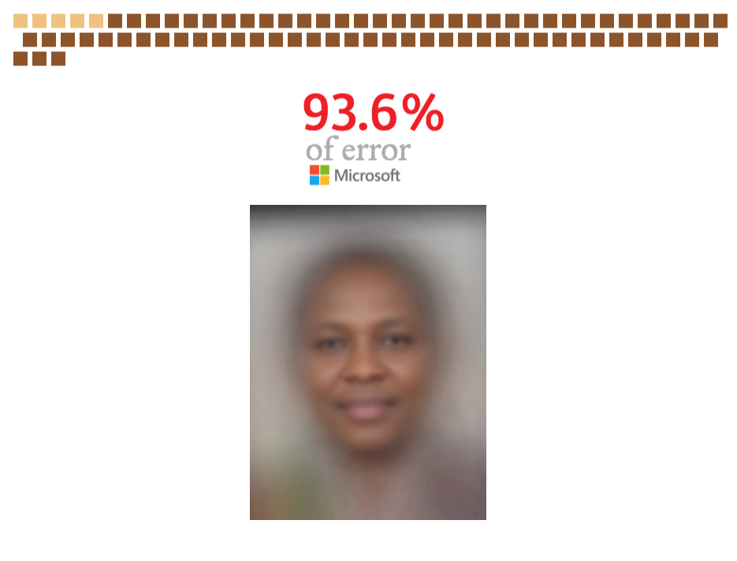

::: {.figure-caption}
93.6% of error for the Microsoft gender classifier came from the misgendering of darker-skinned (Fitzpatrick skin types IV, V, VI) faces from the PPB dataset. Joy Buolamwini, MIT Media Lab, [gendershades.org](http://gendershades.org) (CC BY)
:::

---

## Where Face++'s Errors Came From {.figure-slide}

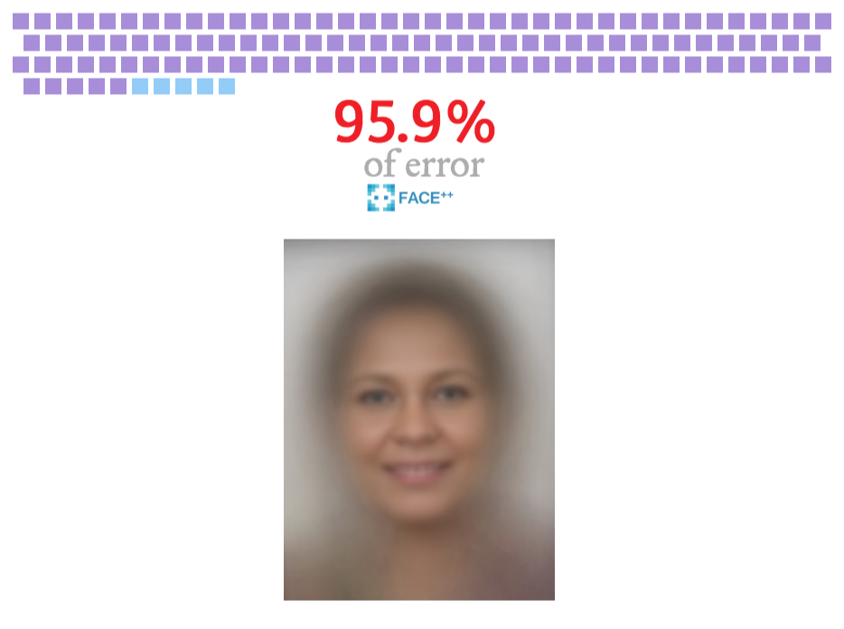

::: {.figure-caption}
95.9% of error for the Face++ gender classifier came from the misgendering of female faces from the PPB dataset. Joy Buolamwini, MIT Media Lab, [gendershades.org](http://gendershades.org) (CC BY)
:::

---

## Potential Harms from Algorithmic Decision-Making {.figure-slide}

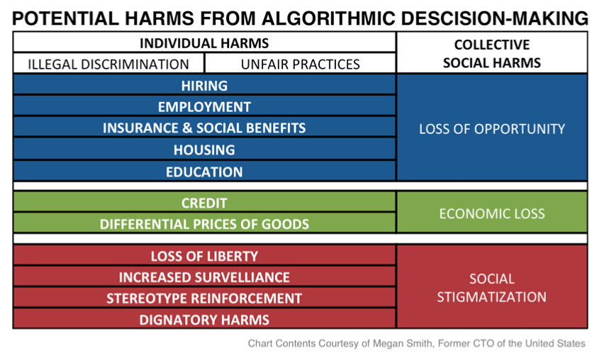

::: {.figure-caption}
Chart contents courtesy of Megan Smith, former CTO of the United States. Joy Buolamwini, MIT Media Lab, [gendershades.org](http://gendershades.org) (CC BY)
:::

---

## Recommended Reading {.figure-slide}

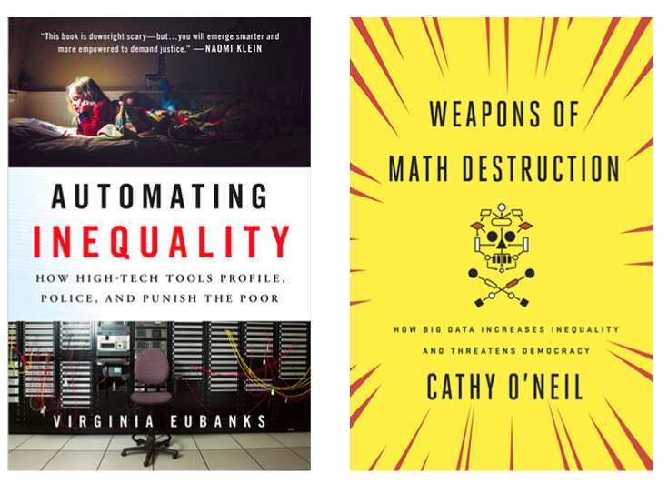

::: {.figure-caption}
Gender Shades: recommended reading. Joy Buolamwini, MIT Media Lab, [gendershades.org](http://gendershades.org) (CC BY)
:::

---

# Evaluating Systems {.title-slide .section-header}

---

## Evaluating Systems

::: {.incremental}
- **"How well does this work overall?"**
  - Singular metric of success
  - Often hides subtleties

- **"How well does this work for different groups of people?"**
  - Reveals disparities
  - Shows "compound disadvantages"
:::

---

## Connecting Some Dots (Again)

How do the four ethical frameworks apply to facial recognition?

:::: columns
::: {.column width="48%"}
- **Virtue ethics**: What character traits do responsible facial-recognition engineers cultivate?
- **Deontological**: Do we have a right not to be identified? Does BIPA reflect a duty-based framework?
:::

::: {.column width="48%"}
- **Utilitarian**: What aggregate harms vs. benefits? Whose well-being is measured?
- **Care ethics**: Who bears the burden of error? Who is most vulnerable?
:::
::::

---

## iClicker Check-in

"Facial recognition should be approached as a technical task, independent from social context."

- Strong disagree / Disagree / Not sure / Agree / Strong agree

---

## Debrief

- What did you learn?
- What stuck out to you?
- What questions do you still have?

---

## Preview: "Codename Delphi"

- Written by Linda Nagata
- Read before next class
- Discussion questions will be posted to Canvas

---

## That's all for today! See you Wednesday!

---

# Computing and War {.title-slide}

<!-- NOTICE: Draft from old-slides/pdf-versions/15 War.pdf. Review and edit before use. -->

CS 377, Week 7, Day 2 🟦 Grand 🟦

---

# Computing and War {.title-slide .photo-title data-state="photo-title" background-image="../assets/blue-line-stops/stop18-grand-a.jpg" background-size="cover"}

CS 377, Week 7, Day 2 🟦 Grand 🟦

<!-- image source: Rendering via altusworks.com -->

---

## {.photo-only data-state="photo-only" background-image="../assets/blue-line-stops/stop18-grand-a.jpg" background-size="cover"}

---

## Administrivia

:::: columns
::: {.column width="55%"}
- **Asynchronous class.** Dr. Bandy away.
- More grades released, more to come
- Some of you will receive an attendance check-in email this week
- Canvas updates
:::

::: {.column width="40%"}

:::
::::

---

## Agenda for Today

:::: columns
::: {.column width="55%"}
- Shuffle seats
- Your feedback from the midpoint check-in
- Overview of speculative fiction exercise
- Mini-lecture: computing and war
- Discuss "Codename Delphi"
:::

::: {.column width="40%"}

:::
::::

---

## 🔀 Seat Shuffle

<!-- image: room diagram — lectern "0", tables 1–8, projector screens, door -->
- TODO: add image — *room diagram — lectern "0", tables 1–8, projector screens, door*

---

## Your Feedback from the Midpoint Check-in…

<!-- image: summary of student feedback from the midpoint check-in — placeholder for instructor to add each semester -->
- TODO: add image — *summary of student feedback from the midpoint check-in — placeholder for instructor to add each semester*

---

## Invitation

Turn off phones, laptops, and other distractions

---

## Table Discussion: Book Check-in

- How much have you read?
- What helps you read? (Where? When? What else?)
- How are you taking notes / keeping track of what you're learning?
- What does your "reading schedule" look like for the next few weeks?

---

## Speculative Fiction Exercise Overview

- We've read three stories — now it's your turn to write your own!
- In brief: write more than one page; have fun with it
- See Canvas for the current deadline
- We will vote on the best stories in class next week

---

# War and Computing in the News {.title-slide .section-header}

---

## War and Computing in Recent News

<!-- image: recent news headlines on AI and military (e.g. Anthropic/Pentagon, OpenAI Pentagon deal) -->
- TODO: add image — *recent news headlines on AI and military (e.g. Anthropic/Pentagon, OpenAI Pentagon deal)*

---

## In (Very) Recent News

- Pentagon banned Anthropic on February 27, designating it a "supply-chain risk"
- OpenAI announced a Pentagon deal hours later
- February 28 – March 1: U.S.–Israel strikes on Iran
- Reports: Anthropic services were used in the attacks

---

## Anthropic's "Red Lines"

:::: columns
::: {.column width="48%"}
**Mass domestic surveillance**

"Using these systems for mass domestic surveillance is incompatible with democratic values. AI-driven mass surveillance presents serious, novel risks to our fundamental liberties."
:::

::: {.column width="48%"}
**Fully autonomous weapons**

"Frontier AI systems are simply not reliable enough to power fully autonomous weapons. We will not knowingly provide a product that puts America's warfighters and civilians at risk."
:::
::::

---

# Computing and War Before LLMs {.title-slide .section-header}

---

## Computing and War: Before LLMs

*(This was supposed to be the "stories" unit…)*

---

## ARPANET

- U.S. DoD Advanced Research Projects Agency Network
- Originally linked Pentagon-funded research computers
- Needed robust / redundant communication tools during the Cold War
- ARPANET went live in 1969
- TCP/IP protocol launched in the 1970s, standardized in 1983
- Civilian / academic networks evolved to become the Internet

---

## Alan Turing and World War II

- During WW2 (1939–1945), Turing worked at Bletchley Park to break German military ciphers
- Automated search over Enigma keys, led to large-scale computational machinery ("Colossus")
- Historians estimate this shortened the war by 2 years

---

## Project Maven (2018)

- Google provided image classification services to label objects from military drone videos
- Thousands of Google employees signed petitions; some resigned
- Google chose not to renew Project Maven; added AI ethics principles
- Changes were largely a result of sustained worker pressure

---

## Stuxnet (2009)

- Computer worm used to sabotage Iran's nuclear program
- Targeted Siemens industrial control systems (ICS) at Natanz
- Caused centrifuges to spin irregularly but report normal readings to operators
- *Countdown to Zero Day: Stuxnet and the Launch of the World's First Digital Weapon* (Kim Zetter)

---

# "Not Without Us" {.title-slide .section-header}

---

## Not Without Us {.quote-slide}

> "None of the weapon systems which today threaten murder on a genocidal scale,
> and whose design, manufacture and sale condemns countless people, especially
> children, to poverty and starvation, that none of these devices could be developed
> without the earnest, even enthusiastic, cooperation of computer professionals.
> It cannot go on without us!"
>
> — Joseph Weizenbaum, "Not Without Us" (1986)

---

## "Not Without Us": Key Arguments

- 1986 speech by MIT computer scientist Joseph Weizenbaum
- Argued that computing professionals must actively resist uses of computing that dehumanize
- Warned about dissolved responsibility for harmful outcomes
- "The machine said…" — humans must own moral decisions

---

# "Codename Delphi" {.title-slide .section-header}

---

## Switching to Fiction!

---

## "Codename Delphi" (2014)

- Written by Linda Nagata

---

## Table Discussion: "Codename Delphi"

- Imagine you had to do Karin's job for a week. What challenges do you imagine might come up?
- Why does Karin find it unacceptable that some fellow handlers describe the job as being like a video game?
- What virtues and habits has Karin cultivated in order to excel as a handler?
- What else did the story make you think about?

---

## Ethical Frameworks Applied

- **Virtue ethics**: What virtues does Karin demonstrate? Which vices does she resist?
- **Deontological**: Are there moral absolutes in warfare? (Weizenbaum says yes)
- **Care ethics**: Who bears the relational costs of automated warfare?
- **Utilitarian**: How do we weigh military effectiveness against human costs?

---

## Preview: "If an Algorithm Can Cast a Shadow"

- Written by Claire Jia-Wen
- 34-minute audio version available (link in Canvas)
- Read before Wednesday's class
- Complete the Canvas discussion by Tuesday at 11:59pm

---

## That's all for today!

See you next week!

---

# References & Credits {.sources}

1. GitHub source: <https://github.com/jackbandy/ethical-issues-in-computing-uic/blob/main/docs/slides/week7.md>.
2. Day 1 title photo: [Clark/Lake](https://commons.wikimedia.org/wiki/File:Chicago-20240927-110_(54285583882).jpg) by Nairn McWilliams, via Wikimedia Commons, CC BY-SA 2.0.
3. Buolamwini, J. & Gebru, T. (2018). ["Gender Shades: Intersectional Accuracy Disparities in Commercial Gender Classification."](https://proceedings.mlr.press/v81/buolamwini18a.html) *FAccT 2018*.
4. Joy Buolamwini, ["How I'm fighting bias in algorithms"](https://www.youtube.com/watch?v=UG_X_7g63rY), TED (2017).
5. John Oliver, ["Facial Recognition"](https://youtu.be/jZjmlJPJgug), *Last Week Tonight* (2021).
6. Algorithmic Justice League, [*Facial Recognition Technologies: A Primer*](https://global-uploads.webflow.com/5e027ca188c99e3515b404b7/5ed1002058516c11edc66a14_FRTsPrimerMay2020.pdf) (2020).
7. *New York Times*, ["Meta Plans to Add Facial Recognition Technology to Its Smart Glasses"](https://archive.ph/hwGd4).
8. Ross Andersen, ["Inside Anthropic's Killer-Robot Dispute With the Pentagon"](https://archive.is/20260301224421/https://www.theatlantic.com/technology/2026/03/inside-anthropics-killer-robot-dispute-with-the-pentagon/686200/), *The Atlantic* (2026).
9. Joseph Weizenbaum, ["Not Without Us"](https://www.jstor.org/stable/48617451) (1986).
10. Slide deck built with [Quarto](https://quarto.org/) and Reveal.js.
