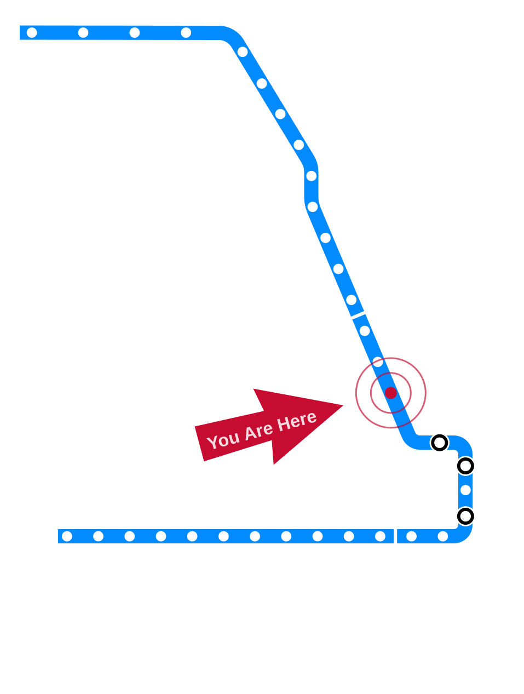

# Draft — Needs Review {.draft-notice}

> ⚠️ Auto-converted from a previous slide format. All content still needs review and editing before use in class.

---

# Computing and War {.title-slide}

<!-- NOTICE: Draft from old-slides/pdf-versions/15 War.pdf. Review and edit before use. -->

CS 377 · Week 8, Day 1 · 🟦 Grand 🟦

---

# Topic Title Placeholder {.title-slide .photo-title data-state="photo-title" background-image="../assets/blue-line-stops/stop18-grand-a.jpg" background-size="cover"}

CS 377 · Week 8, Day 1 · 🟦 Grand 🟦

<!-- image source: Rendering via altusworks.com -->

---

# {.photo-only data-state="photo-only" background-image="../assets/blue-line-stops/stop18-grand-a.jpg" background-size="cover"}

---

# Administrivia

:::: columns
::: {.column width="55%"}
- More grades released, more to come
- Some of you will receive an attendance check-in email this week
- Canvas updates
:::

::: {.column width="40%"}

:::
::::

---

# Agenda for Today

:::: columns
::: {.column width="55%"}
- Shuffle seats
- Your feedback from the midpoint check-in
- Overview of speculative fiction exercise
- Mini-lecture: computing and war
- Discuss "Codename Delphi"
:::

::: {.column width="40%"}

:::
::::

---

# 🔀 Seat Shuffle

<!-- image: room diagram — lectern "0", tables 1–8, projector screens, door -->
- TODO: add image — *room diagram — lectern "0", tables 1–8, projector screens, door*

---

# Your Feedback from the Midpoint Check-in…

<!-- image: summary of student feedback from the midpoint check-in — placeholder for instructor to add each semester -->
- TODO: add image — *summary of student feedback from the midpoint check-in — placeholder for instructor to add each semester*

---

# Invitation

Turn off phones, laptops, and other distractions

---

# Table Discussion: Book Check-in

- How much have you read?
- What helps you read? (Where? When? What else?)
- How are you taking notes / keeping track of what you're learning?
- What does your "reading schedule" look like for the next few weeks?

---

# Speculative Fiction Exercise Overview

- We've read three stories — now it's your turn to write your own!
- In brief: write more than one page; have fun with it
- See Canvas for the current deadline
- We will vote on the best stories in class next week

---

# War and Computing in Recent News

<!-- image: recent news headlines on AI and military (e.g. Anthropic/Pentagon, OpenAI Pentagon deal) -->
- TODO: add image — *recent news headlines on AI and military (e.g. Anthropic/Pentagon, OpenAI Pentagon deal)*

---

# In (Very) Recent News

- Pentagon banned Anthropic on February 27, designating it a "supply-chain risk"
- OpenAI announced a Pentagon deal hours later
- February 28 – March 1: U.S.–Israel strikes on Iran
- Reports: Anthropic services were used in the attacks

---

# Anthropic's "Red Lines"

:::: columns
::: {.column width="48%"}
**Mass domestic surveillance**

"Using these systems for mass domestic surveillance is incompatible with democratic values. AI-driven mass surveillance presents serious, novel risks to our fundamental liberties."
:::

::: {.column width="48%"}
**Fully autonomous weapons**

"Frontier AI systems are simply not reliable enough to power fully autonomous weapons. We will not knowingly provide a product that puts America's warfighters and civilians at risk."
:::
::::

---

# Computing and War: Before LLMs

---

# ARPANET

- U.S. DoD Advanced Research Projects Agency Network
- Originally linked Pentagon-funded research computers
- Needed robust / redundant communication tools during the Cold War
- ARPANET went live in 1969
- TCP/IP protocol launched in the 1970s, standardized in 1983
- Civilian / academic networks evolved to become the Internet

---

# Alan Turing and World War II

- During WW2 (1939–1945), Turing worked at Bletchley Park to break German military ciphers
- Automated search over Enigma keys, led to large-scale computational machinery ("Colossus")
- Historians estimate this shortened the war by 2 years

---

# Project Maven (2018)

- Google provided image classification services to label objects from military drone videos
- Thousands of Google employees signed petitions; some resigned
- Google chose not to renew Project Maven; added AI ethics principles
- Changes were largely a result of sustained worker pressure

---

# Stuxnet (2009)

- Computer worm used to sabotage Iran's nuclear program
- Targeted Siemens industrial control systems (ICS) at Natanz
- Caused centrifuges to spin irregularly but report normal readings to operators
- *Countdown to Zero Day: Stuxnet and the Launch of the World's First Digital Weapon* (Kim Zetter)

---

# Not Without Us {.quote-slide}

> "None of the weapon systems which today threaten murder on a genocidal scale,
> and whose design, manufacture and sale condemns countless people, especially
> children, to poverty and starvation, that none of these devices could be developed
> without the earnest, even enthusiastic, cooperation of computer professionals.
> It cannot go on without us!"
>
> — Joseph Weizenbaum, "Not Without Us" (1986)

---

# "Not Without Us": Key Arguments

- 1986 speech by MIT computer scientist Joseph Weizenbaum
- Argued that computing professionals must actively resist uses of computing that dehumanize
- Warned about dissolved responsibility for harmful outcomes
- "The machine said…" — humans must own moral decisions

---

# Switching to Fiction!

---

# "Codename Delphi" (2014)

- Written by Linda Nagata

---

# Table Discussion: "Codename Delphi"

- Imagine you had to do Karin's job for a week. What challenges do you imagine might come up?
- Why does Karin find it unacceptable that some fellow handlers describe the job as being like a video game?
- What virtues and habits has Karin cultivated in order to excel as a handler?
- What else did the story make you think about?

---

# Ethical Frameworks Applied

- **Virtue ethics**: What virtues does Karin demonstrate? Which vices does she resist?
- **Deontological**: Are there moral absolutes in warfare? (Weizenbaum says yes)
- **Care ethics**: Who bears the relational costs of automated warfare?
- **Utilitarian**: How do we weigh military effectiveness against human costs?

---

# Preview: "If an Algorithm Can Cast a Shadow"

- Written by Claire Jia-Wen
- 34-minute audio version available (link in Canvas)
- Read before Wednesday's class
- Complete the Canvas discussion by Tuesday at 11:59pm

---

# That's all for today!

See you Wednesday!

---

# Ethical Issues in Medical Technology {.title-slide}

CS 377 · Week 8, Day 2 · 🟦 Chicago 🟦

---

# Topic Title Placeholder {.title-slide .photo-title data-state="photo-title" background-image="../assets/blue-line-stops/stop19-chicago-a.jpg" background-size="cover"}

CS 377 · Week 8, Day 2 · 🟦 Chicago 🟦

<!-- image source: Rendering via altusworks.com -->

---

# {.photo-only data-state="photo-only" background-image="../assets/blue-line-stops/stop19-chicago-a.jpg" background-size="cover"}

---

# Administrivia

:::: columns
::: {.column width="55%"}
- Write your story by Sunday at 11:59pm
- Read "If an Algorithm Can Cast a Shadow" — complete discussion by Tuesday at 11:59pm
- Canvas updates
:::

::: {.column width="40%"}

:::
::::

---

# Agenda for Today

:::: columns
::: {.column width="55%"}
- Follow-up on "Codename Delphi"
- Group exercise: Therac-25
- Real-world ethical dilemmas
- Ethics in medical technology
:::

::: {.column width="40%"}

:::
::::

---

# Follow-up on "Codename Delphi"

<!-- image: discussion board student responses or highlights from Canvas -->
- TODO: add image — *discussion board student responses or highlights from Canvas*

---

# Group Exercise: Therac-25

- See handout
- The Therac-25 was a radiation therapy machine responsible for several patient deaths in the mid-1980s due to software errors
- A landmark case study in software engineering ethics and accountability

---

# A Brief Aside: What Is "Ethics"?

- Many papers say ethics is "right vs. wrong"
- This is just one branch: **normative ethics** — prescriptive moral standards
- Other branches: applied, meta-ethics, descriptive ethics
- Etymology: from ancient Greek *ethos* — "relating to one's character"

---

# Normative and Descriptive Ethics

:::: columns
::: {.column width="48%"}
## Normative

- Is it right?
- Is it wrong?
- What should be done?
- "Is this unethical?"
:::

::: {.column width="48%"}
## Descriptive

- Who is involved?
- Who is making the decision(s)?
- What are the stakes?
- What are the options?
- What are the potential outcomes?
- What decisions led to this situation?
:::
::::

---

# Why We'll Try to Avoid the Word "Ethical" in This Class

- TODO: fill in — placeholder slide

---

# Table Discussion: Real-World Ethical Dilemmas

Using both normative and descriptive lenses:

- What ethical dilemma(s) have you encountered recently?
- Who was involved? What were the stakes?
- What was done? What should have been done?

---

# Ethical Issues in Medical Technology

---

# AI in the Operating Room

- Reuters (2026): "As AI enters the operating room, reports arise of botched surgeries and misidentified body parts"
- What went wrong? Who is responsible?

---

# Electronic Health Records

- California Healthline: "Death By 1,000 Clicks: Where Electronic Health Records Went Wrong"
- "Botched Operation" YouTube series on EHR failures (4 parts — link in Canvas)
- Key issues: interoperability, usability, clinical burden, patient safety

---

# Pacemaker Security (IoMT)

- *Internet of Medical Things* — pacemakers, home monitors, connected devices
- Researchers demonstrated ability to:
  - Gain control over home monitoring device
  - Perform man-in-the-middle attacks
  - Bypass hardware security protections
  - Perform remote denial-of-service attacks

<!-- image: diagram of pacemaker ecosystem (programmer → pacemaker → HMU → operator network → backend server) -->
- TODO: add image — *diagram of pacemaker ecosystem (programmer → pacemaker → HMU → operator network → backend server)*

*Source: Bour et al., SINTEF Digital / Springer (2023)*

---

# Robot-Assisted Surgery: Ethics Landscape

- ~6,000 Da Vinci surgical systems in operation worldwide
- Seven major ethical strands identified in systematic review:
  - Harms and benefits
  - Responsibility and control
  - Professional-patient relationship
  - Surgical training and learning
  - Justice
  - Translational questions
  - Economic considerations

*Source: Haltaufderheide et al., Journal of Robotic Surgery (2025)*

---

# Bias in Medical AI

- Biases arise and compound throughout the AI lifecycle
- Can lead to substandard clinical decisions and worsened healthcare disparities
- Key bias sources: data features/labels, model development, deployment, publication
- "Prior to real-world implementation in clinical settings, rigorous validation through clinical trials is critical"

*Source: Cross, Choma, Onofrey, PLOS Digital Health (2024)*

---

# Ethical Questions in Medical Technology

- **Virtue ethics**: What virtues should medical software engineers cultivate?
- **Deontological**: What duties do engineers have to patients who depend on their systems?
- **Care ethics**: How does caring for patients differ from optimizing clinical outcomes?
- **Utilitarian**: When is an acceptable error rate acceptable? Who decides?

---

# Reminders

- Speculative fiction due Sunday at 11:59pm
- "If an Algorithm Can Cast a Shadow" discussion due Tuesday at 11:59pm
- Keep reading your book!

---

# That's all for today!

See you next week!

---

# References & Credits {.sources}

1. GitHub source: <https://github.com/jackbandy/ethical-issues-in-computing-uic/blob/main/docs/slides/week8.md>.
2. Ross Andersen, ["Inside Anthropic's Killer-Robot Dispute With the Pentagon"](https://archive.is/20260301224421/https://www.theatlantic.com/technology/2026/03/inside-anthropics-killer-robot-dispute-with-the-pentagon/686200/), *The Atlantic* (2026).
3. Joseph Weizenbaum, ["Not Without Us"](https://www.jstor.org/stable/48617451) (1986).
4. Reuters, ["As AI enters the operating room…"](https://www.reuters.com/investigations/ai-enters-operating-room-reports-arise-botched-surgeries-misidentified-body-2026-02-09/) (2026).
5. California Healthline, ["Death By 1,000 Clicks"](https://californiahealthline.org/news/death-by-a-thousand-clicks/).
6. Bour et al., "Security Analysis of the Internet of Medical Things (IoMT): Case Study of the Pacemaker Ecosystem," *BIOSTEC / Springer* (2023).
7. Haltaufderheide et al., "The ethical landscape of robot-assisted surgery: a systematic review," *Journal of Robotic Surgery* (2025).
8. Cross, Choma, Onofrey, "Bias in medical AI: Implications for clinical decision-making," *PLOS Digital Health* (2024).
9. Slide deck built with [Quarto](https://quarto.org/) and Reveal.js.
