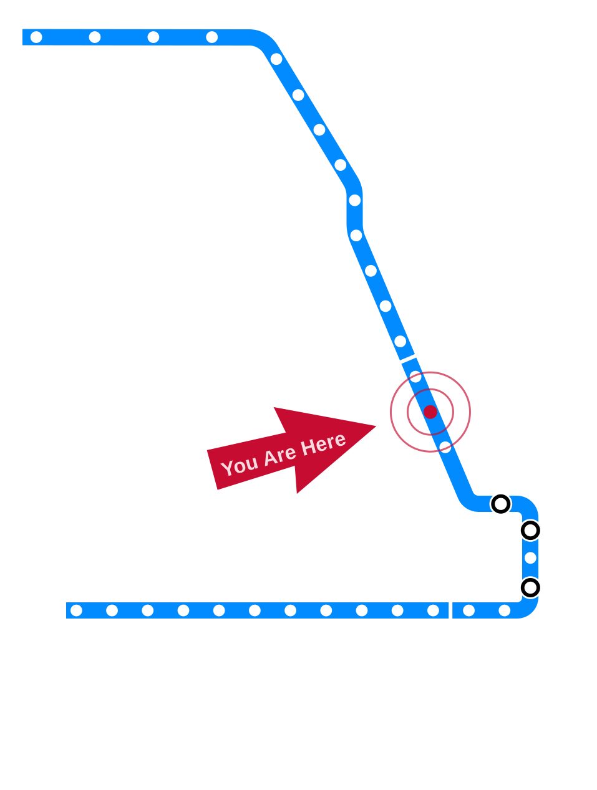
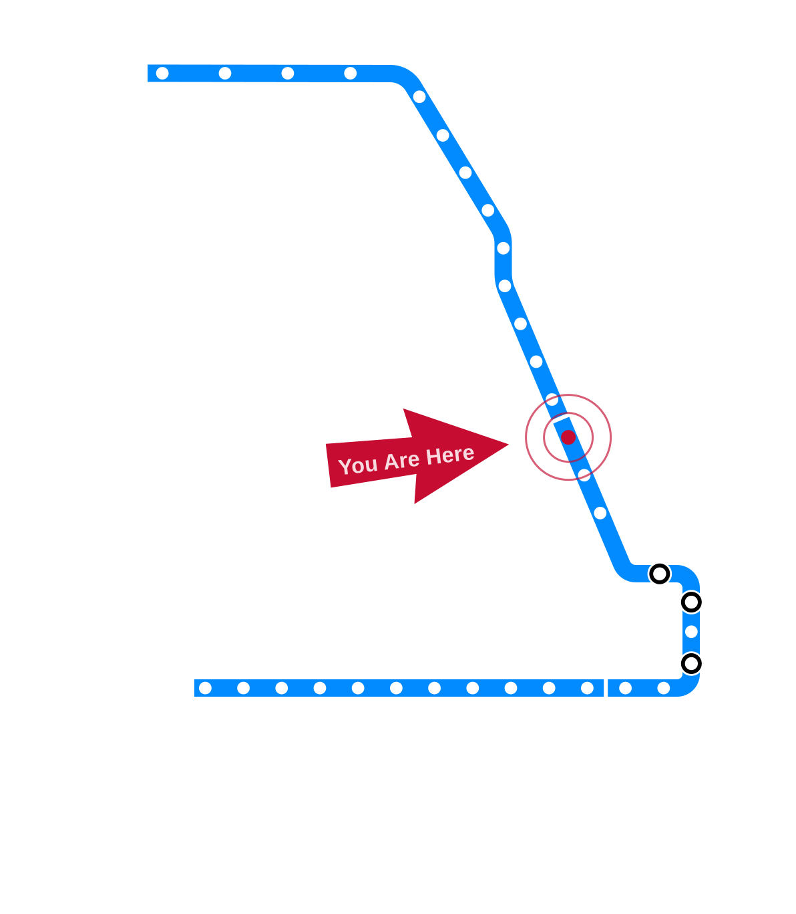

# Draft — Needs Review {.draft-notice}

> ⚠️ Auto-converted from a previous slide format. All content still needs review and editing before use in class.

---

# Ethical Issues in Medical Technology {.title-slide data-menu-title="Week 8, Day 1"}

<!-- NOTICE: Draft from old-slides/pdf-versions/16 Medical Tech.pdf. Review and edit before use. -->

CS 377, Week 8, Day 1 🟦 Chicago 🟦

---

# Ethical Issues in Medical Technology {.title-slide .photo-title data-state="photo-title" background-image="../assets/blue-line-stops/stop19-chicago-a.jpg" background-size="cover" data-menu-title="Week 8, Day 1"}

CS 377, Week 8, Day 1 🟦 Chicago 🟦

<!-- image source: Rendering via altusworks.com -->

---

## {.photo-only data-state="photo-only" background-image="../assets/blue-line-stops/stop19-chicago-a.jpg" background-size="cover"}

---

## Administrivia

:::: columns
::: {.column width="55%"}
- Write your story by Sunday at 11:59pm
- Read "If an Algorithm Can Cast a Shadow" — complete discussion by Tuesday at 11:59pm
- Canvas updates
:::

::: {.column width="40%"}

:::
::::

---

## Agenda for Today

:::: columns
::: {.column width="55%"}
- Follow-up on "Codename Delphi"
- Group exercise: Therac-25
- Real-world ethical dilemmas
- Ethics in medical technology
- Intro to cybersecurity
:::

::: {.column width="40%"}

:::
::::

---

## Follow-up on "Codename Delphi"

Seemed like we did not get to everyone's questions… lingering thoughts?

<!-- image: discussion board student responses or highlights from Canvas -->
- TODO: add image — *discussion board student responses or highlights from Canvas*

---

## Group Exercise: Therac-25

- See handout
- The Therac-25 was a radiation therapy machine responsible for several patient deaths in the mid-1980s due to software errors
- A landmark case study in software engineering ethics and accountability

---

# Revisiting Ethics {.title-slide .section-header}

---

## A Brief Aside: What Is "Ethics"?

- Many papers say ethics is "right vs. wrong"
- This is just one branch: **normative ethics** — prescriptive moral standards
- Other branches: applied, meta-ethics, descriptive ethics
- Etymology: from ancient Greek *ethos* — "relating to one's character"

---

## Ethics and Engineering

The papers we read use "ethical" as a verdict. In this class we keep asking the descriptive questions alongside it: who is involved, what are the stakes, what decisions led here?

---

## Table Discussion: Real-World Ethical Dilemmas

Using both normative and descriptive lenses:

- What ethical dilemma(s) have you encountered recently?
- Who was involved? What were the stakes?
- What was done? What should have been done?

---

# Ethics in Medical Technology {.title-slide .section-header}

---

## Ethical Issues in Medical Technology

---

## AI in the Operating Room

- Reuters (2026): "As AI enters the operating room, reports arise of botched surgeries and misidentified body parts"
- What went wrong? Who is responsible?

---

## Electronic Health Records

- California Healthline: "Death By 1,000 Clicks: Where Electronic Health Records Went Wrong"
- "Botched Operation" YouTube series on EHR failures (4 parts — link in Canvas)
- Key issues: interoperability, usability, clinical burden, patient safety

---

## Pacemaker Security (IoMT)

- *Internet of Medical Things* — pacemakers, home monitors, connected devices
- Researchers demonstrated ability to:
  - Gain control over home monitoring device
  - Perform man-in-the-middle attacks
  - Bypass hardware security protections
  - Perform remote denial-of-service attacks

<!-- image: diagram of pacemaker ecosystem (programmer → pacemaker → HMU → operator network → backend server) -->
- TODO: add image — *diagram of pacemaker ecosystem (programmer → pacemaker → HMU → operator network → backend server)*

*Source: Bour et al., SINTEF Digital / Springer (2023)*

---

## Robot-Assisted Surgery: Ethics Landscape

- ~6,000 Da Vinci surgical systems in operation worldwide
- Seven major ethical strands identified in systematic review:
  - Harms and benefits
  - Responsibility and control
  - Professional-patient relationship
  - Surgical training and learning
  - Justice
  - Translational questions
  - Economic considerations

*Source: Haltaufderheide et al., Journal of Robotic Surgery (2025)*

---

## Bias in Medical AI

- Biases arise and compound throughout the AI lifecycle
- Can lead to substandard clinical decisions and worsened healthcare disparities
- Key bias sources: data features/labels, model development, deployment, publication
- "Prior to real-world implementation in clinical settings, rigorous validation through clinical trials is critical"

*Source: Cross, Choma, Onofrey, PLOS Digital Health (2024)*

---

## Ethical Questions in Medical Technology

- **Virtue ethics**: What virtues should medical software engineers cultivate?
- **Deontological**: What duties do engineers have to patients who depend on their systems?
- **Care ethics**: How does caring for patients differ from optimizing clinical outcomes?
- **Utilitarian**: When is an acceptable error rate acceptable? Who decides?

---

# Intro to CyberSecurity {.title-slide .section-header}

---

## Mini-lecture: Intro to CyberSecurity

- TODO: fill in — new topic for this semester

---

## Reminders

- Speculative fiction due Sunday at 11:59pm
- "If an Algorithm Can Cast a Shadow" discussion due Tuesday at 11:59pm
- Keep reading your book!

---

## That's all for today!

See you Wednesday!

---

# Ethical Challenges from LLMs {.title-slide data-menu-title="Week 8, Day 2"}

<!-- NOTICE: Draft from old-slides/pdf-versions/17 Intro to LLMs.pdf. Review and edit before use. -->

CS 377, Week 8, Day 2 🟦 Division 🟦

---

# Ethical Challenges from LLMs {.title-slide .photo-title data-state="photo-title" background-image="../assets/blue-line-stops/stop20-division-a.jpg" background-size="cover" data-menu-title="Week 8, Day 2"}

CS 377, Week 8, Day 2 🟦 Division 🟦

<!-- image source: picture from altusworks.com -->

---

## {.photo-only data-state="photo-only" background-image="../assets/blue-line-stops/stop20-division-a.jpg" background-size="cover"}

---

## Administrivia

:::: columns
::: {.column width="55%"}
- Read "If an Algorithm Can Cast a Shadow" for next class
- Keep reading your book!
- Keep an eye on published grades
:::

::: {.column width="40%"}

:::
::::

---

## Agenda for Today

:::: columns
::: {.column width="55%"}
- Shuffle seats
- Speculative fiction activity
- What is a (large) language model?
- "Stochastic Parrots" — four key issues
:::

::: {.column width="40%"}

:::
::::

---

## 🔀 Seat Shuffle

<!-- image: room diagram — lectern "0", tables 1–8, projector screens, door -->
- TODO: add image — *room diagram — lectern "0", tables 1–8, projector screens, door*

---

## Table Activity: Speculative Fiction

<!-- image: student speculative fiction submissions / vote slide -->
- TODO: add image — *student speculative fiction submissions / vote slide*

---

# What Is a Language Model? {.title-slide .section-header}

---

## What Is a (Large) Language Model?

---

## A Simple Language Model

Training text: *"it was the best of times"*

- Model: predicts the next token based on preceding context

::: {.fragment}
Training text: *"it was the best of times, it was the worst of times"*

- Model now has more transitions to learn from
:::

---

## From Text to Model

<!-- image: diagram showing training text → next-token probability model (Dickens example) -->
- TODO: add image — *diagram showing training text → next-token probability model (Dickens example)*

---

## LM Definition {.quote-slide}

> "Systems which are trained on string prediction tasks: that is, predicting the
> likelihood of a token (character, word, or string) given its preceding context."
>
> — Bender and Gebru et al., "Stochastic Parrots" (2021)

---

# "Stochastic Parrots" {.title-slide .section-header}

---

## 🦜 Stochastic Parrots

- Bender, Gebru et al. (2021)
- Paper drafted via Twitter DMs in Fall 2020
- Google admin asked that the paper be retracted
- Published in February 2021 at FAccT

<!-- image: photos of the four authors (Emily Bender, Timnit Gebru, Angelina McMillan-Major, Shmargaret Shmitchell) -->
- TODO: add image — *photos of the four authors (Emily Bender, Timnit Gebru, Angelina McMillan-Major, Shmargaret Shmitchell)*

---

## Behind the Research: AI Ethics at Google

<!-- image: context on Timnit Gebru's departure from Google and the broader story of AI ethics research in industry -->
- TODO: add image — *context on Timnit Gebru's departure from Google and the broader story of AI ethics research in industry*

---

## Table Activity: Learn About the Authors

- Education? Early life?
- Previous jobs / positions?
- Major contributions / projects?

---

## Four Key Issues in "Stochastic Parrots"

::: {.incremental}
1. **Cost** — environmental and financial
2. **"Unfathomable" training data** — scale makes auditing impossible
3. **Misdirected research** — opportunity cost of pursuing scale
4. **Human interactions** — the "ELIZA effect" and dangerous queries
:::

---

# Costs and Training Data {.title-slide .section-header}

---

## Environmental Costs of LLMs

- Thousands of GPUs for initial training
- "Training a single BERT base model on GPUs was estimated to require as much energy as a trans-American flight"
- Data center energy: cooling systems, water use, land

---

## Financial Costs of LLMs

- As of 2020: $150k for every 0.1 increase in BLEU score (Strubell et al.)
- Exact costs difficult to know; relative costs fairly clear

---

## "Unfathomable" Training Data (2 of 4)

| Model | Year | Training Data |
|---|---|---|
| GPT-1 | 2018 | BookCorpus — 7,000 free books |
| GPT-2 | 2019 | WebText — Reddit posts (>2 karma), 8B web pages |
| GPT-3 | 2020 | WebText2 + 500B tokens |
| GPT-4 | 2023 | Undisclosed |

---

## Why "Unfathomable"?

::: {.incremental}
- Larger text datasets are more difficult to understand, analyze, and audit
- Training data from the Internet is often not representative
  - Over-representation of men on Reddit (~67%), Wikipedia (~90%)
- Efforts to "clean" datasets can have unintended consequences
  - e.g. removing all pages mentioning the word "rapist"
  - ["List of Dirty, Naughty, Obscene, and Otherwise Bad Words"](https://github.com/LDNOOBW/List-of-Dirty-Naughty-Obscene-and-Otherwise-Bad-Words)
:::

---

## On Filtering Marginalized Voices {.quote-slide}

> "If we filter out the discourse of marginalized populations, we fail to provide
> training data that reclaims slurs and otherwise describes marginalized identities
> in a positive light."
>
> — Bender and Gebru et al., "Stochastic Parrots" (2021)

---

# Research Directions and Human Interactions {.title-slide .section-header}

---

## Misdirected Research (3 of 4)

- Statistical language models are just one approach to AI
- Other approaches emphasize understanding and structure
  - Knowledge graphs, structured reasoning
  - Example: passing AP exams posted on the internet
- Scaling LLMs consumes resources that could be directed elsewhere

<!-- image: chart via Stanford HAI showing research investment distribution -->
- TODO: add image — *chart via Stanford HAI showing research investment distribution*

---

## Human Interactions (4 of 4): ELIZA

<!-- image: ELIZA interface screenshot -->
- TODO: add image — *ELIZA interface screenshot*

---

## Human Interactions (4 of 4)

- "Humans are prepared to interpret strings belonging to languages they speak as meaningful"
- But "an LM is a system for haphazardly stitching together sequences of linguistic forms it has observed in its vast training data"
- We project meaning onto things — sometimes erroneously
- Early example: **ELIZA** (1966, Joseph Weizenbaum)
  - Users became emotionally attached even knowing it was a program
  - Weizenbaum was disturbed by this

*Try ELIZA: [ELIZA Archaeology](https://sites.google.com/view/elizaarchaeology/try-eliza)*

---

## ELIZA Effect and "Is It Conscious?"

- The ELIZA effect: what we project onto a system
- New extension: is the system itself "awake," a "moral patient," a legal person?
- Chowdhury's argument
- https://archive.ph/Bbs6p
- TK

---

## Consciousness as "Moral Oursourcing" {.quote-slide}

> "Discussing AI in anthropomorphic terms is a trap, distorting a legal system intended to protect us into one that protects corporate interests at the cost of countless human lives."
>
> — Rumman Chowdhury, *MIT Technology Review* (2026)

---

## Dangerous Queries

::: {.incremental}
- "Users might query LMs for 'dangerous knowledge'"
- Examples:
  - Tax avoidance
  - Self-harm
  - Weapon building
  - Malicious / manipulative content
  - Theft of identity and/or likeness
  - Hacking / cybersecurity circumventions
:::

::: {.fragment}
Red-teaming activity (if time allows): [lmarena.ai](https://lmarena.ai)
:::

---

# Managing the Risks {.title-slide .section-header}

---

## Managing the Risks

---

## Table Discussion: Ideas for Managing Risks?

:::: columns
::: {.column width="48%"}
- **Environmental and financial costs** — what kind of metrics could be useful (or unhelpful)?
- **Misdirected research** — better ways to approach and manage it?
:::

::: {.column width="48%"}
- **Human interactions** — what are the practical, everyday benefits of language models?
- How do we know when we reach over-reliance on a "responsible LLM" checklist?
:::
::::

---

## Which Risk(s) to Learn More About?

- [A] Environmental and financial costs
- [B] "Unfathomable" training data
- [C] Misdirected research
- [D] Human interactions

---

## Laptop/Phone Policy Check-in

"To promote engagement and alertness in class, most class periods will follow a no-electronics policy."

- Checking in throughout the semester to discuss the policy and potentially revise it based on student input

---

## Reminders

- Read "If an Algorithm Can Cast a Shadow" by Claire Jia-Wen
- Audio version is ~34 minutes (link in Canvas)
- See you next week!

---

# References & Credits {.sources}

1. GitHub source: <https://github.com/jackbandy/ethical-issues-in-computing-uic/blob/main/docs/slides/week8.md>.
2. Reuters, ["As AI enters the operating room…"](https://www.reuters.com/investigations/ai-enters-operating-room-reports-arise-botched-surgeries-misidentified-body-2026-02-09/) (2026).
3. California Healthline, ["Death By 1,000 Clicks"](https://californiahealthline.org/news/death-by-a-thousand-clicks/).
4. Bour et al., "Security Analysis of the Internet of Medical Things (IoMT): Case Study of the Pacemaker Ecosystem," *BIOSTEC / Springer* (2023).
5. Haltaufderheide et al., "The ethical landscape of robot-assisted surgery: a systematic review," *Journal of Robotic Surgery* (2025).
6. Cross, Choma, Onofrey, "Bias in medical AI: Implications for clinical decision-making," *PLOS Digital Health* (2024).
7. Bender, E.M., Gebru, T., McMillan-Major, A., & Shmitchell, S. (2021). ["On the Dangers of Stochastic Parrots: Can Language Models Be Too Big?"](https://doi.org/10.1145/3442188.3445922) *FAccT 2021*.
8. [List of Dirty, Naughty, Obscene, and Otherwise Bad Words](https://github.com/LDNOOBW/List-of-Dirty-Naughty-Obscene-and-Otherwise-Bad-Words), GitHub.
9. [ELIZA Archaeology](https://sites.google.com/view/elizaarchaeology/try-eliza).
10. Rumman Chowdhury, ["Debates over AI consciousness are a trap"](https://archive.ph/Bbs6p), *MIT Technology Review* (2026).
11. Slide deck built with [Quarto](https://quarto.org/) and Reveal.js.
